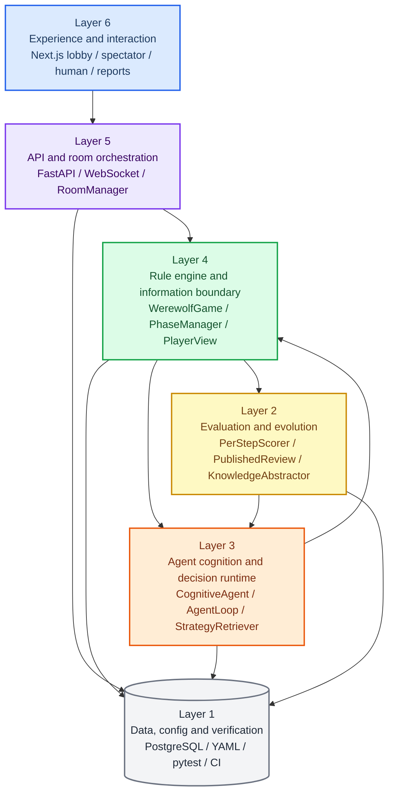

# AI Werewolf

多智能体狼人杀工程化 Demo：对局引擎、信息隔离、角色化 Agent、赛后复盘与策略自进化闭环。

[](LICENSE)
[](https://www.python.org/)
[](.github/workflows/ci.yml)
[](https://www.postgresql.org/)
[](https://nextjs.org/)

## 项目定位

AI Werewolf 是一个面向多智能体博弈研究和工程展示的狼人杀系统。项目不是把狼人杀写成单轮 Prompt，而是把规则引擎、信息隔离、Agent 决策、赛后评测和策略知识回流拆成可验证的工程模块。

主线能力：

| 主线 | 项目实现 |
|---|---|
| Play | `WerewolfGame` 负责 7-12 人对局、昼夜阶段、警徽、PK、遗言、猎人开枪、白狼王自爆和真人混战 |
| Evaluate | Track B 基于对局事件和 Agent 决策生成逐步复盘、`PublishedReview`、运行指标和 leaderboard |
| Evolve | Track C 抽取策略知识，维护 `candidate -> active -> deprecated` 生命周期，并通过 `StrategyRetriever` 回流下一局 Agent |
| Interaction | Next.js 前端提供大厅、观战、真人操作、人格配置、单局复盘和统计看板 |

最终展示报告见 [`docs/FINAL_SHOWCASE_REPORT.md`](docs/FINAL_SHOWCASE_REPORT.md)，完整工程架构图谱见 [`docs/ENGINEERING_ARCHITECTURE.md`](docs/ENGINEERING_ARCHITECTURE.md)。

## 分层架构



设计原则：

| 原则 | 工程体现 |
|---|---|
| 规则由引擎主控 | Agent 只提交 `Decision`，状态推进、行动校验和结算都由 `WerewolfGame` 完成 |
| 信息隔离在后端完成 | `GameState` 投影为 `PlayerView` 和 public snapshot，前端只渲染后端给出的视图 |
| Agent 行为可组合 | Persona、Role、Strategy 三层 Prompt 配合 Memory、BeliefTracker、SocialModel 和工具调用 |
| 复盘证据可追溯 | `GameEvent`、`AgentDecision`、`PublishedReview` 和策略知识形成可回放证据链 |
| 策略迭代有生命周期 | Track C 新策略先进入候选池，经过质量门禁和验证后进入 active 策略池，后续版本可替换旧策略并保留 lineage |

## 核心模块

| 模块 | 入口 | 说明 |
|---|---|---|
| 对局引擎 | `backend/engine/game.py` | 游戏状态、阶段推进、技能结算、胜负判定 |
| 阶段与规则 | `backend/engine/phases.py`, `backend/engine/actions.py` | 夜晚、白天、警徽、投票、特殊技能和行动合法性 |
| 信息隔离 | `backend/engine/visibility.py` | 生成玩家私有视图和观众公开视图 |
| 角色注册 | `backend/engine/roles/registry.py` | 可玩角色、模板角色和角色元数据单一事实来源 |
| Agent 运行时 | `backend/agents/cognitive/` | 角色化认知、记忆、社交判断、工具调用和 LLM 决策 |
| 复盘评测 | `backend/eval/per_step_scorer.py`, `backend/eval/track_b.py` | 逐决策复盘、报告生成、指标与排行榜 |
| 策略进化 | `backend/eval/knowledge_abstractor.py`, `backend/agents/cognitive/retrieval_prod.py` | 知识抽取、生命周期管理和下一局策略检索 |
| 前端体验 | `frontend/app/`, `frontend/components/`, `frontend/hooks/` | 大厅、观战、真人操作、复盘、人格配置 |
| 持久化 | `backend/db/models.py`, `backend/db/persist.py` | 对局、事件、决策、报告、策略知识和指标 |

## 最新结果

| 方向 | 当前结果 |
|---|---:|
| 本地数据库 games | 11,730 |
| 本地数据库 agent_decisions | 302,291 |
| 本地数据库 published_reviews | 4,955 |
| 本地数据库 strategy_knowledge_docs | 217,310 |
| 真实 LLM 完成对局 | 78 |
| 真实 LLM 决策 | 1,936 |
| strict formal completed games | 34 |
| strict formal fallback / invalid | 0 / 0 |
| Track B showcase 完成对局 | 6 |
| 单角色检索 Coverage | 100.00% |
| 单角色检索 Effective@3 | 50.00% |
| 策略使用决策质量差异 | +0.0823 |
| Target-seat Seer adjusted delta | +20.6680 |

数据口径见 [`docs/evidence/README.md`](docs/evidence/README.md)。这些结果用于展示工程链路、复盘能力和策略回流趋势；target-seat pilot 已跑通，后续可继续扩大 paired seeds 做最终效果确认。

## 与常见做法的区别

| 常见做法 | 本项目设计 |
|---|---|
| 让 LLM 同时扮演裁判和玩家 | 裁判逻辑由确定性规则引擎负责，LLM 只扮演拥有局部视角的玩家 |
| 把全量历史和身份直接塞进上下文 | 每个 Agent 只拿到后端投影后的 `PlayerView`，夜晚私有信息按角色边界传递 |
| 角色差异主要依赖台词文案 | 身份目标、技能边界、人格风格、记忆状态、社交模型和策略检索共同影响行为 |
| 赛后只展示胜负 | 系统保留逐步事件、决策理由、复盘报告、排行榜和策略知识来源 |
| 新策略直接覆盖旧策略 | Track C 使用候选、启用、废弃和版本关系管理策略知识 |

## 快速开始

### 1. 安装后端依赖

```bash
pip install -r requirements.txt
cp .env.example .env
```

编辑 `.env`，设置 `LLM_PROVIDER` 和对应 provider 的 API Key。离线测试可使用 `_TEST_ALLOW_FAKE_LLM=true LLM_PROVIDER=fake`。

### 2. 启动 PostgreSQL

```bash
docker run -d --name werewolf-pg \
  -e POSTGRES_USER=werewolf \
  -e POSTGRES_PASSWORD=werewolf_dev_password \
  -e POSTGRES_DB=werewolf \
  -p 5433:5432 postgres:16-alpine

python scripts/migrate_v2_columns.py
```

未配置 `DATABASE_URL` 时，后端会使用 SQLite fallback，适合轻量本地验证。

### 3. 启动后端

```bash
make dev
# http://localhost:8000/docs
```

### 4. 启动前端

```bash
cd frontend
npm install --legacy-peer-deps
npm run dev
# http://localhost:3001
```

如果 3001 被占用：

```bash
PORT=3002 npm run dev
```

## Demo 路线

| 入口 | 路由 | 展示内容 |
|---|---|---|
| API 文档 | `http://localhost:8000/docs` | 后端接口、房间、对局、复盘、策略知识 API |
| 大厅 | `http://localhost:3001/` | 创建房间、选择 AI/Human 席位、进入对局 |
| 对局观战 | `/room/[id]/play` | 阶段流转、玩家状态、发言、投票、事件流、观众视角 |
| 真人操作 | `/room/[id]/human` | 真人玩家身份视图、目标选择、行动提交 |
| 单局复盘 | `/games/[id]/report` | PublishedReview、关键决策、证据链和回放信息 |
| 统计看板 | `/eval/dashboard` | 多局统计、leaderboard、角色与策略对比 |
| 人格配置 | `/personas` | MBTI 人格与 Agent 行为参数 |

## 技术栈

| 层 | 技术 |
|---|---|
| 后端服务 | Python 3.8+ / FastAPI / WebSocket |
| 游戏引擎 | dataclass + Enum 纯逻辑规则引擎 |
| Agent | `CognitiveAgent` / AgentLoop / Memory / SocialModel / StrategyRetriever |
| LLM 接入 | `backend.llm.create_client()`，支持 doubao / dsv4flash / ark / deepseek / anthropic / weapi / mimo |
| 数据库 | SQLAlchemy；PostgreSQL 优先，SQLite fallback |
| 前端 | Next.js 14 / React 18 / TypeScript / Tailwind CSS |
| 测试与质量 | pytest / ruff / frontend lint / build / GitHub Actions |

## 验证命令

| 目标 | 命令 |
|---|---|
| 离线后端测试 | `_TEST_ALLOW_FAKE_LLM=true LLM_PROVIDER=fake python -m pytest tests/test_api.py tests/test_cognitive_offline.py -q` |
| 信息隔离专项 | `python scripts/verify_visibility_strict.py` |
| 后端 E2E smoke | `python scripts/e2e_smoke.py` |
| 严格模式验收 | `python scripts/run_backend_full_strict.py` |
| 后端 lint | `ruff check backend/ scripts/ tests/ configs/` |
| 前端构建 | `cd frontend && npm run build` |

## 项目结构

```text
AIwerewolf/
├── backend/
│   ├── app.py                 # FastAPI / REST / WebSocket
│   ├── engine/                # WerewolfGame、规则、阶段、信息隔离
│   ├── agents/cognitive/      # CognitiveAgent、AgentLoop、Memory、Retriever
│   ├── eval/                  # Track B/C 复盘评测与知识进化
│   ├── db/                    # SQLAlchemy models 和持久化
│   └── protocols/             # Room schema 和 RoomManager
├── frontend/
│   ├── app/                   # Next.js App Router 页面
│   ├── components/            # UI 和 game 组件
│   ├── hooks/                 # 对局流和真人操作 hooks
│   └── types/                 # 后端契约 TS 镜像
├── scripts/                   # smoke、实验、迁移、报告和验证脚本
├── tests/                     # pytest 和 UI smoke
├── configs/                   # 规则、策略和实验配置
├── docs/                      # 架构、模块、验收、交付和图表文档
└── docs/assets/               # 小型 SVG/HTML 展示资产
```

## 交付物索引

| 交付物 | 当前位置 |
|---|---|
| 代码仓库 | `backend/`, `frontend/`, `scripts/`, `tests/`, `configs/` |
| 产品原型 | Next.js 前端：大厅、观战、真人操作、复盘、人格配置 |
| Demo 链接 | 本地后端 `http://localhost:8000/docs`，本地前端 `http://localhost:3001` |
| 技术文档 | `docs/FINAL_SHOWCASE_REPORT.md`, `docs/ENGINEERING_ARCHITECTURE.md`, `docs/PROJECT_MODULE_DESIGN.md` |
| 数据与结果 | `docs/evidence/README.md`, `docs/evidence/*.json`, `docs/evidence/*.md` |
| 展示资产 | `docs/assets/final_report/*.svg`, `docs/assets/closure/*.svg` |

## 文档导航

| 文档 | 说明 |
|---|---|
| [`docs/README.md`](docs/README.md) | 文档阅读顺序和归档说明 |
| [`docs/FINAL_SHOWCASE_REPORT.md`](docs/FINAL_SHOWCASE_REPORT.md) | 最终展示用精简报告和最新关键结果 |
| [`docs/ENGINEERING_ARCHITECTURE.md`](docs/ENGINEERING_ARCHITECTURE.md) | 分层架构图、运行时序图、信息隔离图、数据闭环图、Track C 生命周期图 |
| [`docs/PROJECT_MODULE_DESIGN.md`](docs/PROJECT_MODULE_DESIGN.md) | 核心模块设计与实现说明 |
| [`docs/evidence/README.md`](docs/evidence/README.md) | 最新数据结果和证据文件索引 |
| [`docs/FINAL_DELIVERY_PACKAGE.md`](docs/FINAL_DELIVERY_PACKAGE.md) | 最终交付包、展示路线和仓库边界 |

## GitHub 仓库边界

应进入仓库的是源码、测试、配置模板、CI、正式文档和小型展示资产；不应进入仓库的是 `.env`、真实 API Key、本地数据库、运行日志、`data/`、`references/`、`.venv/`、`node_modules/` 和 `.next/`。

提交前可检查：

```bash
git status --short --ignored
git ls-files | rg '(^|/)(\.env$|__pycache__/|node_modules/|\.next/|data/|models/|references/)|\.(db|log|jsonl)$'
```

## License

MIT © 2026 wxhfy
