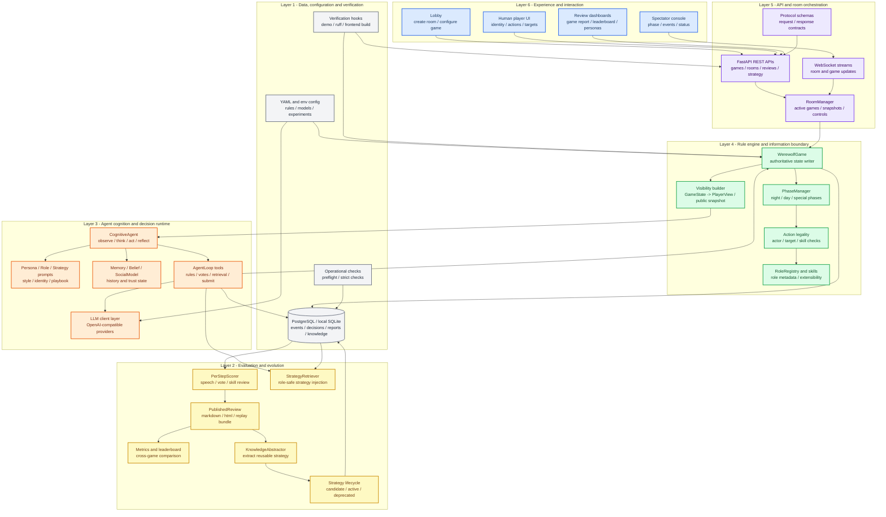
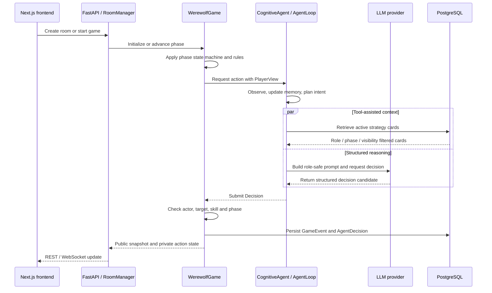
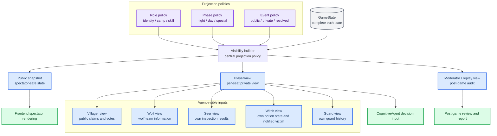
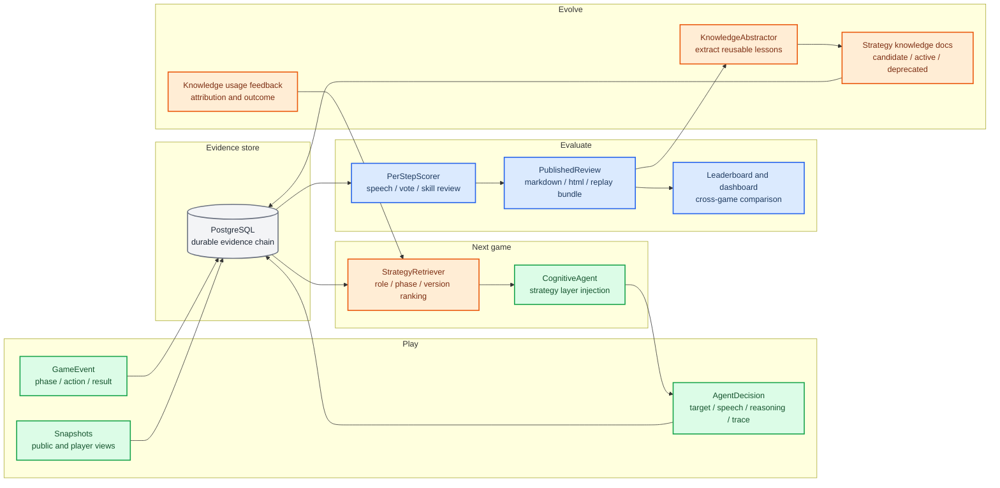
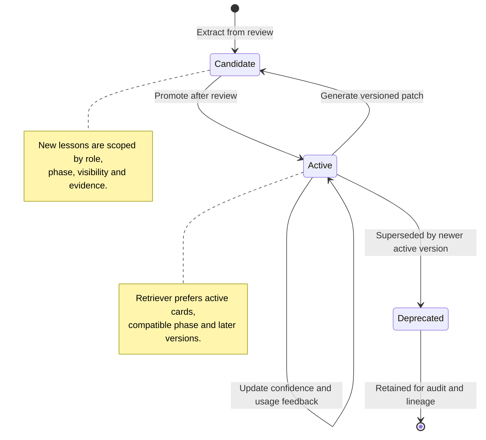
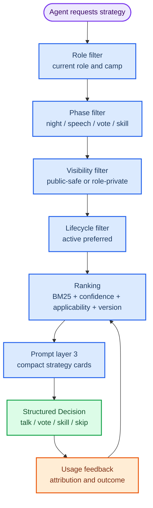

# 工程架构图谱

## 1. 系统分层架构图

这张图回答”项目整体按哪些工程层次组织、每一层负责什么、层与层之间如何依赖”。

分层说明：

| 层级 | 职责 | 代表模块 |
|---|---|---|
| Layer 6 Experience | 给玩家、观众和评委看的产品入口 | `frontend/app/` |
| Layer 5 API and room orchestration | 房间、WebSocket、REST API、快照缓存和控制流 | `backend/app.py`, `backend/protocols/rooms.py` |
| Layer 4 Rule engine and information boundary | 对局状态、规则流转、行动合法性、信息隔离 | `backend/engine/` |
| Layer 3 Agent cognition and decision runtime | 角色化认知、工具调用、LLM 决策和策略注入 | `backend/agents/cognitive/`, `backend/llm/` |
| Layer 2 Evaluation and evolution | 赛后复盘、指标看板、策略知识抽取与回流 | `backend/eval/` |
| Layer 1 Data, configuration and verification | 持久化、配置、demo smoke、ruff、前端构建和专项验证 | `backend/db/`, `configs/`, `backend.ops`, `scripts/`, `tests/` |

关键设计原则：

- 上层只通过稳定接口调用下层，前端不直接接触游戏真相状态。
- `WerewolfGame` 控制规则和写状态，Agent 只接收 `PlayerView` 并返回 `Decision`。
- Track B/C 不干扰当局裁决，只消费证据链并把可用策略回流给下一局。
- 数据层同时服务运行、复盘、检索和验收，不把临时日志当正式交付物。

## 2. 系统容器视图

这张图回答“系统由哪些可部署/可维护单元组成、每个单元负责什么、数据如何回流”。

```mermaid
flowchart LR
    accTitle: AI Werewolf System View
    accDescr: Container-level architecture of AI Werewolf showing frontend, API service, rule engine, agent runtime, persistence, evaluation and strategy evolution loops.

    operator["Human player / spectator<br/>operator / judge"]

    subgraph client_layer ["Client layer"]
        frontend["Next.js frontend<br/>lobby / play / human / reports"]
    end

    subgraph service_layer ["Service layer"]
        api["FastAPI application<br/>REST / WebSocket"]
        rooms["RoomManager<br/>rooms / snapshots / controls"]
    end

    subgraph play_layer ["Play layer"]
        engine["WerewolfGame<br/>phase state machine / rules"]
        visibility["Visibility builder<br/>GameState -> PlayerView"]
        agents["CognitiveAgent team<br/>persona / role / strategy"]
        loop["AgentLoop tools<br/>memory / rules / votes / retrieval"]
    end

    subgraph data_layer ["Data layer"]
        db[(PostgreSQL / local SQLite<br/>games / events / decisions / reviews / knowledge)]
        llm["LLM-compatible providers<br/>doubao / deepseek / ark / weapi / anthropic"]
    end

    subgraph eval_layer ["Evaluate and evolve layer"]
        review["Track B review<br/>PerStepScorer / PublishedReview"]
        knowledge["Track C knowledge<br/>KnowledgeAbstractor / strategy cards"]
        retriever["StrategyRetriever<br/>BM25 + policy filters"]
    end

    operator -->|browser| frontend
    frontend -->|REST / WebSocket| api
    api --> rooms
    rooms --> engine
    engine --> visibility
    visibility --> agents
    agents --> loop
    loop -->|structured decision| engine
    loop --> llm
    loop --> retriever
    engine -->|events and decisions| db
    db --> review
    review --> knowledge
    knowledge --> db
    db --> retriever
    review -->|reports and dashboards| api
    retriever -->|active strategy cards| loop

    classDef client fill:#dbeafe,stroke:#2563eb,stroke-width:2px,color:#1e3a5f
    classDef service fill:#ede9fe,stroke:#7c3aed,stroke-width:2px,color:#3b0764
    classDef play fill:#dcfce7,stroke:#16a34a,stroke-width:2px,color:#14532d
    classDef data fill:#f3f4f6,stroke:#6b7280,stroke-width:2px,color:#1f2937
    classDef eval fill:#ffedd5,stroke:#ea580c,stroke-width:2px,color:#7c2d12

    class frontend,operator client
    class api,rooms service
    class engine,visibility,agents,loop play
    class db,llm data
    class review,knowledge,retriever eval
```

关键边界：

| 边界 | 设计含义 | 代码入口 |
|---|---|---|
| 状态边界 | `WerewolfGame` 是游戏状态唯一写入者，Agent 只提交 `Decision` | `backend/engine/game.py` |
| 视图边界 | `GameState` 不直接进入 Agent，必须投影为 `PlayerView` | `backend/engine/visibility.py` |
| 决策边界 | Agent 通过工具和结构化动作表达意图，引擎负责校验与结算 | `backend/agents/cognitive/agent_loop.py` |
| 审计边界 | 对局事件、Agent 决策、复盘报告和策略知识独立落库 | `backend/db/models.py`, `backend/db/persist.py` |
| 回流边界 | Track C 产出的 active 策略卡通过 Retriever 回到下一局 | `backend/eval/knowledge_abstractor.py`, `backend/agents/cognitive/retrieval_prod.py` |

## 3. 单次决策运行时序

这张图回答“从前端启动对局到某个 Agent 产生行动，系统内部按什么顺序协作”。

实现要点：

| 步骤 | 工程重点 | 代码入口 |
|---|---|---|
| 房间控制 | 支持大厅、AI 局、真人混战、观战视角 | `backend/protocols/rooms.py`, `frontend/app/page.tsx` |
| 阶段推进 | 夜晚、白天、警徽、PK、遗言、特殊技能统一由引擎推进 | `backend/engine/phases.py`, `backend/engine/phase_manager.py` |
| Agent 决策 | Persona / Role / Strategy 三层 prompt，配合 Memory、Belief、SocialModel | `backend/agents/cognitive/` |
| 工具调用 | 规则检查、记忆检索、投票分析、策略检索和最终提交分离 | `backend/agents/cognitive/tools.py` |
| 持久化 | 事件、决策、复盘、知识和指标保留为可审计数据 | `backend/db/` |

## 4. 信息隔离架构

这张图回答“为什么 Agent 只能看到自己应该知道的信息，以及前端观战视角如何保持公开边界”。

项目把信息隔离放在后端中心位置，而不是交给前端或 prompt 临时处理。公开观战只使用 public snapshot；Agent 决策只使用对应席位的 `PlayerView`；完整真相只服务引擎结算、持久化和赛后复盘。

## 5. Play -> Evaluate -> Evolve 数据闭环

这张图回答“对局产生的数据如何变成可复盘报告和下一局可用的策略知识”。

闭环设计的优势在于：对局不是一次性输出，而是生成可回放证据、可展示复盘、可检索知识和可比较版本。后续新增角色、规则变体或策略版本时，可以沿着同一条数据链路扩展。

## 6. Track C 策略知识生命周期

这张图回答“策略为什么不是一次生成后永久覆盖，而是有候选、启用、替换和版本优先级”。

对应实现：

| 生命周期概念 | 工程实现 | 作用 |
|---|---|---|
| `candidate` | 新复盘抽取出的候选策略 | 保留新经验，但不直接压过稳定策略 |
| `active` | 当前可被 Retriever 注入的策略 | 服务下一局 Agent 决策 |
| `deprecated` | 被后续版本替换的策略 | 保留 lineage 和审计记录 |
| `doc_version` / `version_group` | 版本排序和同族策略关系 | 让后续版本在检索排序中具备更清晰的位置 |
| `supersedes_doc_ids` | 新策略替换旧策略的关联 | 避免多版策略同时表达相同意图 |

## 7. StrategyRetriever 检索策略

这张图回答“下一局 Agent 如何选择更适合当前身份、阶段和版本的策略卡”。

这个策略检索链路对应“越往后的策略版本应更精炼”的产品叙事：候选策略先进入生命周期管理，稳定后成为 active；检索阶段再结合角色、阶段、可见性、置信度和版本信息，选择更适合当前局面的策略卡。

## 8. 模块索引

| 架构模块 | 主要文件 | 说明 |
|---|---|---|
| 对局引擎 | `backend/engine/game.py` | 阶段推进、行动结算、胜负判定 |
| 阶段与动作 | `backend/engine/phases.py`, `backend/engine/actions.py` | 夜晚、白天、技能、投票和特殊阶段 |
| 角色注册 | `backend/engine/roles/registry.py` | 可玩角色、模板角色和角色元数据 |
| 信息隔离 | `backend/engine/visibility.py` | `GameState` 到 `PlayerView` / public snapshot 的投影 |
| Agent 主体 | `backend/agents/cognitive/agent.py` | Observe -> Think -> Act -> Reflect |
| Agent 工具 | `backend/agents/cognitive/agent_loop.py`, `backend/agents/cognitive/tools.py` | 工具调用、策略检索、最终决策提交 |
| 策略检索 | `backend/agents/cognitive/retrieval_prod.py` | BM25、策略过滤、版本排序和反馈 |
| 复盘评测 | `backend/eval/per_step_scorer.py`, `backend/eval/track_b.py` | 逐决策复盘、PublishedReview 和报告输出 |
| 知识抽取 | `backend/eval/knowledge_abstractor.py` | 从复盘数据抽取可复用策略知识 |
| 持久化 | `backend/db/models.py`, `backend/db/persist.py` | 对局、事件、决策、报告、策略知识和指标 |
| 后端服务 | `backend/app.py`, `backend/protocols/rooms.py` | REST、WebSocket、房间和对局控制 |
| 前端体验 | `frontend/app/`, `frontend/components/`, `frontend/hooks/` | 大厅、观战、真人操作、复盘和人格配置 |
