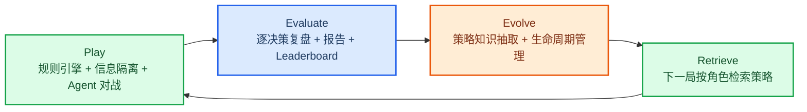

# AI 狼人杀多智能体对战与自进化系统成果展示报告

> 日期：2026-06-09
> 定位：最终展示用精简报告。本文只保留当前可展示、可追溯、能支撑项目叙事的结果；历史过程材料已从 GitHub 默认文档集移除。

## 1. 一句话概述

AI Werewolf 是一个工程化的多智能体狼人杀系统：确定性规则引擎负责对局裁决，信息隔离层保证每个 Agent 只能看到合法视图，角色化 CognitiveAgent 负责发言、投票和技能决策，赛后 Track B 生成结构化复盘，Track C 将复盘经验沉淀为可检索策略并回流到后续对局。

## 2. 展示主线

| 能力 | 当前实现 |
|---|---|
| 可玩对局 | 支持 7-12 人配置、昼夜流程、警徽、PK、遗言、猎人开枪、白狼王自爆、真人混战 |
| 信息隔离 | `GameState -> PlayerView -> public snapshot` 分层投影，Agent 不接触完整真相状态 |
| Agent 决策 | `CognitiveAgent + AgentLoop + Memory + SocialModel + StrategyRetriever` |
| 前端展示 | 大厅、观战页、真人操作页、单局复盘页、统计看板、人格配置页 |
| 赛后复盘 | Track B 将发言、投票、技能和过程行为拆成可解释记录 |
| 策略回流 | Track C 使用 `candidate -> active -> deprecated` 生命周期管理策略知识 |

## 3. 最新数据快照

### 3.1 本地数据库规模

来源：当前本地数据库快照，查询时间为 2026-06-09。

| 数据项 | 当前数量 |
|---|---:|
| games | 11,730 |
| players | 103,773 |
| game_events | 737,267 |
| game_snapshots | 4,963 |
| agent_decisions | 302,291 |
| evaluations | 126,003 |
| published_reviews | 4,955 |
| strategy_knowledge_docs | 217,310 |
| knowledge_usage_feedback | 195,859 |
| leaderboard_entries | 35 |

策略知识状态分布：

| 状态 | 数量 |
|---|---:|
| active | 387 |
| candidate | 216,906 |
| deprecated | 17 |

运行时策略反馈：

| 指标 | 数量/比例 |
|---|---:|
| retrieved | 195,859 |
| used | 78,410 |
| helpful | 63,932 |
| used / retrieved | 40.03% |
| helpful / used | 81.54% |

### 3.2 真实 LLM 对局与决策健康

来源：`docs/evidence/PROJECT_REAL_LLM_FRAMEWORK_EVIDENCE.json`、`docs/evidence/PROJECT_METHOD_EFFECTIVENESS_FACTS.json`。

| 指标 | 结果 |
|---|---:|
| 汇总真实 LLM run | 24 |
| 完成对局 | 78 |
| 真实 LLM 决策 | 1,936 |
| strict formal completed games | 34 |
| strict formal LLM decisions | 1,059 |
| fallback decisions | 0 |
| invalid decisions | 0 |
| 模块验收 | 14 / 14 |

这组结果用于展示系统已从“能跑通”收敛到“能稳定产生可审计样本”：真实 LLM 决策进入数据库和复盘链路，决策健康口径保持干净。

## 4. Track B：复盘与 Leaderboard

来源：`docs/evidence/PROJECT_TRACK_B_LEADERBOARD_SHOWCASE.json`。

| 指标 | 结果 |
|---|---:|
| Track B showcase 完成真实 LLM 对局 | 6 |
| 整局真实决策 | 216 |
| fallback / invalid | 0 / 0 |
| 展示面板 | 对局层、模型/版本层、角色席位层、行为维度层、能力映射层、决策健康层、复盘产物层 |

Track B 的展示价值不只是“谁赢了”，而是把一局对战拆成可解释的证据面板：每局是否完整、每个席位是什么角色、投票/发言/技能表现如何、复盘产物是否可展示、决策输出是否健康。它让非技术评审也能看到 Agent 的行为过程和对局质量。

## 5. Track C：策略知识与自进化闭环

### 5.1 单角色策略检索

来源：`docs/evidence/PROJECT_ROLE_RETRIEVAL_FACTS.json`。

| 指标 | 结果 |
|---|---:|
| query set | 26 |
| retriever size | 374 |
| 默认策略 | `hybrid_role_mbti_global` |
| Coverage | 100.00% |
| Effective@3 | 50.00% |
| P@3 | 25.64% |
| RoleBucketShare | 99.23% |
| GlobalBucketShare | 0.77% |

分角色 Effective@3：

| 角色 | Effective@3 |
|---|---:|
| Guard | 100.00% |
| Hunter | 100.00% |
| Seer | 60.00% |
| Villager | 50.00% |
| Werewolf | 28.57% |
| Witch | 25.00% |

结论口径：默认检索策略能覆盖 6 个核心角色，且几乎全部来自本角色策略桶；精确 role+MBTI 适合作为优先桶，不适合作为唯一检索范围。

### 5.2 策略使用与逐决策质量

来源：`docs/evidence/PROJECT_STRATEGY_USAGE_DECISION_SCORE_ANALYSIS.json`。

| 指标 | 结果 |
|---|---:|
| 联表决策行 | 170,399 |
| distinct games | 2,482 |
| distinct players | 19,834 |
| used decisions | 3,088 |
| used vs unused mean delta | +0.0823 |
| strict role/action/tier/day/phase weighted delta | +0.0967 |
| strict positive / negative strata | 48 / 10 |

角色内控制后的 weighted delta：

| 角色 | Weighted delta |
|---|---:|
| Seer | +0.1272 |
| Villager | +0.1220 |
| Guard | +0.1006 |
| Werewolf | +0.0899 |
| Hunter | +0.0779 |
| Witch | +0.0670 |

结论口径：策略被实际使用的决策，在当前数据快照中与更高的逐决策质量表现相关；该结论是观测性关联，适合展示策略回流链路价值。

### 5.3 Candidate 生命周期说明

Track C 中的 candidate 不是直接注入下一局的运行策略，而是候选池。新知识由 `KnowledgeAbstractor` 抽取后默认写入 `candidate`，再通过质量、聚类和版本验证进入 `active`；生产检索索引只加载 `active` 策略，避免单局噪声直接污染 Agent Prompt。当前 candidate 数量大，说明抽取层在持续积累候选经验；active 数量小，说明运行时注入走稳定门禁。

### 5.4 Target-seat Track C Pilot

来源：`docs/evidence/PROJECT_TARGET_SEAT_TRACKC_PILOT.json`。

| 指标 | 结果 |
|---|---:|
| 目标角色 | Seer |
| paired seeds | 5 |
| baseline / candidate completed | 5 / 5 |
| candidate decisions | 201 |
| candidate fallback / invalid | 0 / 0 |
| target adjusted delta | +20.6680 |
| target process delta | +22.1840 |
| target role-task delta | +0.2830 |
| target win delta | 0.0000 |

结论口径：target-seat paired A/B 已经跑通，并在 Seer 目标席位上呈现 adjusted、process、role-task 三个指标的正向 pilot 结果。胜负结果暂不作为主指标，后续扩大 paired seeds 后再用于最终效果确认。

## 6. 产品与演示入口

| 入口 | 路由/文件 | 展示重点 |
|---|---|---|
| API 文档 | `http://localhost:8000/docs` | 房间、对局、复盘、策略知识 API |
| 前端大厅 | `http://localhost:3001/` | 创建房间、配置玩家、进入对局 |
| 对局观战 | `/room/[id]/play` | 阶段流转、玩家状态、发言、投票、事件流 |
| 真人操作 | `/room/[id]/human` | 真人玩家与 AI 混合对局 |
| 单局复盘 | `/games/[id]/report` | PublishedReview、关键决策、证据链 |
| 统计看板 | `/eval/dashboard` | 多局结果、Leaderboard、角色/策略对比 |
| 架构图谱 | `docs/ENGINEERING_ARCHITECTURE.md` | 分层架构图、运行时序图、信息隔离图、数据闭环图 |

## 7. 推荐展示图表

| 图表 | 适用章节 | 数据来源 |
|---|---|---|
| 分层架构图 | 系统总体架构 | `docs/ENGINEERING_ARCHITECTURE.md` |
| Play -> Evaluate -> Evolve 闭环图 | 项目主线 | `docs/ENGINEERING_ARCHITECTURE.md` |
| Track B 多面板流程图 | 赛后复盘 | `docs/evidence/PROJECT_TRACK_B_LEADERBOARD_SHOWCASE.md` |
| 单角色检索柱状图 | Track C 策略检索 | `docs/evidence/PROJECT_ROLE_RETRIEVAL_FACTS.json` |
| 策略使用质量差异图 | 策略回流效果 | `docs/evidence/PROJECT_STRATEGY_USAGE_DECISION_SCORE_ANALYSIS.json` |
| Target-seat paired delta 图 | Track C pilot | `docs/evidence/PROJECT_TARGET_SEAT_TRACKC_PILOT.json` |
| 分角色胜率趋势图 | 展示补充 | 从 leaderboard / published review 数据按角色聚合 |

## 8. 交付物状态

| 交付物 | 状态 |
|---|---|
| 代码仓库 | 已具备，源码、测试、配置和 CI 均在仓库内 |
| 产品原型 | 已具备，Next.js 前端覆盖大厅、观战、真人操作和复盘 |
| Demo 链接 | 已具备，本地后端和前端可启动 |
| 技术文档 | 已收敛到 `docs/README.md`、`docs/ENGINEERING_ARCHITECTURE.md`、`docs/PROJECT_MODULE_DESIGN.md` |
| 数据结果 | 已收敛到 `docs/evidence/` |
| 展示材料 | 已具备，`docs/presentations/` 与 `docs/assets/` 保留 |

## 9. 后续优化建议

1. 将 target-seat paired A/B 从 5 对扩展到 20 对作为稳定 pipeline pilot，再扩到 80+ 对作为正式效果确认。
2. 为 Seer、Werewolf、Witch 等命中率较低角色补充高质量 active 策略卡，优先覆盖发言、投票和关键技能阶段。
3. 在前端复盘页加入角色胜率趋势图、策略使用质量差异图和 target-seat delta 图，让非技术评审更快理解效果。
4. 对 Track B 的高光决策、关键转折和策略命中进行抽样人工复核，增强复盘可信度。
5. 保持 `docs/` 默认目录短而清楚；正式结果放入 evidence，历史过程材料只保留在 Git history 或本地副本中。

## 10. 最终结论

当前项目已经具备成熟工程化 Demo 的核心形态：可运行的狼人杀引擎、严格信息隔离、角色化 Agent 决策、前端观战与真人混战、可追溯复盘、策略知识回流和真实 LLM 数据证据。最终展示时建议突出架构设计、证据链和 Play -> Evaluate -> Evolve 闭环，而不是展开所有中间实验过程。
