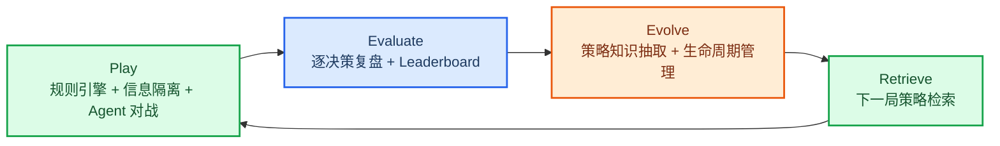
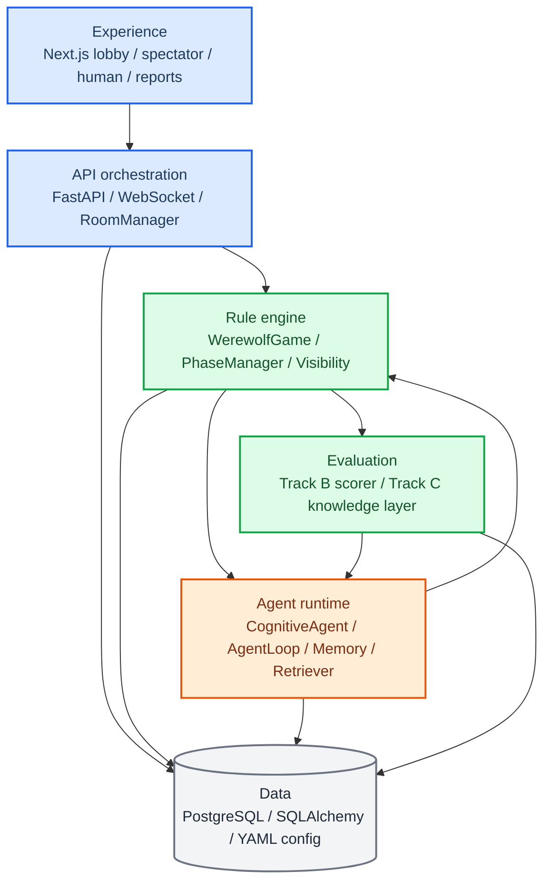

# AI Werewolf 系统展示

## 1. 项目概述

系统将狼人杀对局拆成确定性规则引擎、严格信息隔离、角色化 Agent 决策、赛后复盘评测和策略知识回流五个部分，形成 Play -> Evaluate -> Evolve 的闭环。

## 2. 核心能力

| 能力 | 当前实现 |
|---|---|
| 可玩对局 | 支持 7-12 人配置、昼夜流程、警徽、PK、遗言、猎人开枪、白狼王自爆和真人混战 |
| 信息隔离 | 后端将 `GameState` 投影为 `PlayerView` 和 public snapshot，Agent 不接触完整真相状态 |
| Agent 决策 | `CognitiveAgent` 组合角色目标、人格、记忆、社交判断、工具调用和策略检索 |
| Track B 复盘 | 将发言、投票、夜间技能和关键转折拆成可解释记录，支持报告和 leaderboard 聚合 |
| Track C 回流 | 从复盘中抽取策略知识，经过 candidate/active/deprecated 生命周期后回流到后续对局 |
| 前端演示 | Next.js 前端覆盖大厅、观战、真人操作、单局复盘、统计看板和人格配置 |

## 3. 系统架构

## 4. 关键模块

| 模块 | 入口 | 展示重点 |
|---|---|---|
| 对局引擎 | `backend/engine/game.py` | 阶段推进、技能结算、胜负判定、审计记录 |
| 信息隔离 | `backend/engine/visibility.py` | 玩家私有视图和观众公开视图分离 |
| Agent 运行时 | `backend/agents/cognitive/` | 角色化认知、记忆、社交判断、工具调用和 LLM 决策 |
| Track B | `backend/eval/per_step_scorer.py`, `backend/eval/track_b.py` | 逐决策复盘、报告生成、指标聚合和 leaderboard |
| Track C | `backend/eval/knowledge_abstractor.py`, `backend/agents/cognitive/retrieval_prod.py` | 策略抽取、生命周期治理和下一局检索 |
| 前端 | `frontend/app/`, `frontend/components/`, `frontend/hooks/` | 大厅、观战、真人操作、复盘和统计看板 |

## 5. 量化概览（LLM 对局）

以下统计 LLM provider 的对局数据，fake provider 不计入。

| 方向 | 当前概览 |
|---|---:|
| LLM 完成对局 | 292 |
| LLM 决策 | 10,253 |
| 决策有效率 | 100%（10,253 / 10,253） |
| published reviews | 4,971 |
| strategy knowledge docs | 219,558（active 386 / candidate 1,695 / deprecated 217,477） |

### 对局胜率

| 维度 | 狼胜 | 村民胜 | 总对局 |
|---|---:|---:|---:|
| LLM 对局 | 193（66.1%） | 99（33.9%） | 292 |

## 6. 演示入口

| 入口 | 路由/文件 | 展示内容 |
|---|---|---|
| API 文档 | `http://localhost:8000/docs` | 房间、对局、复盘、策略知识 API |
| 前端大厅 | `http://localhost:3001/` | 创建房间、配置玩家、进入对局 |
| 对局观战 | `/room/[id]/play` | 阶段流转、玩家状态、发言、投票、事件流 |
| 真人操作 | `/room/[id]/human` | 真人玩家与 AI 混合对局 |
| 单局复盘 | `/games/[id]/report` | PublishedReview、关键决策和回放信息 |
| 统计看板 | `/eval/dashboard` | 多局结果、leaderboard、角色和策略对比 |
