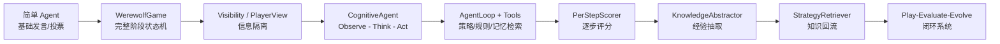

# 项目设计历程

## 1. 阶段总览

| 阶段 | 目标 | 核心改进 | 解决的问题 | 当前证据 |
|---|---|---|---|---|
| 基础对局 | 跑通一局狼人杀 | WerewolfGame、阶段状态机、角色动作、投票和胜负判定 | 从零散脚本走向完整对局流程 | `backend/engine/game.py`、`docs/DEVELOPMENT_ISSUES.md` A1-A6 |
| 信息隔离 | 让每个 Agent 只看到合法信息 | Visibility / PlayerView、private_events、legal_targets | 防止上帝视角和非法目标兜底 | `backend/engine/visibility.py`、A11 |
| 决策审计 | 让每一步行为可追溯 | AgentDecision、GameEvent、GameSnapshot | 对局结束后无法复盘 | `backend/db/models.py`、PostgreSQL 当前快照 |
| CognitiveAgent | 让 Agent 具备角色化认知 | Observe -> Think -> Act、Memory、BeliefTracker、SocialModel、Planner、WolfTeamView | 简单 Agent 行为单薄、不可解释 | `backend/agents/cognitive/` |
| 三层 Prompt | 分离表达、身份和策略 | Persona / Role / Strategy | 人设层和策略层混乱 | `README.md`、`backend/agents/cognitive/prompts.py` |
| 策略检索 | 让策略动态进入决策 | AgentLoop、Tools、StrategyRetriever、RetrievalPolicy、4-filter | 策略写死在 Prompt、无法回流 | `backend/agents/cognitive/agent_loop.py`、`retrieval_prod.py` |
| Track B | 对每步决策做赛后评分 | PerStepScorer、DecisionScore、ScoredStep、PublishedReview | 胜负无法解释行为质量 | `backend/eval/per_step_scorer.py`、`backend/eval/track_b.py` |
| Track C | 将复盘经验转为知识 | KnowledgeAbstractor、strategy_knowledge_docs、candidate/active/deprecated | 复盘不能进入下一局 | `backend/eval/knowledge_abstractor.py`、`backend/eval/evolution.py` |
| strict mode | 收敛端到端验收 | `run_backend_full_strict.py`、REQUIRE_*、ALLOW_FALLBACK=false | 分散测试不能证明闭环完整 | `scripts/run_backend_full_strict.py`、`docs/backend_acceptance_criteria.md` |

## 2. 各阶段详细说明

### 2.1 基础对局

最初阶段的目标是让系统能够完成一局狼人杀。核心工作包括建立 `WerewolfGame`、定义阶段流转、初始化玩家和角色、收集夜晚动作、组织白天发言、处理投票、结算死亡并判定胜负。

该阶段暴露出的问题集中在规则细节和阶段边界。例如猎人夜间死亡未触发开枪、放逐后缺遗言、发言顺序混乱、警长阶段在 day2/day3 重复触发、警长死亡时警徽自动消失、递归 PK 投票导致 KeyError 等。这些问题记录在 `docs/DEVELOPMENT_ISSUES.md` A1-A5。

阶段结果是：对局引擎成为规则主控，Agent 不再直接操纵状态。后续所有信息隔离、审计、评分和知识回流都建立在引擎事件和决策记录之上。

### 2.2 信息隔离

基础对局跑通后，项目进入信息隔离阶段。狼人杀的关键约束是每个玩家只知道身份允许知道的信息。系统因此引入 `Visibility.for_player()` 和 `PlayerView`，把完整真实状态裁剪成 Agent 的局部观察。

信息隔离阶段还引入了合法目标集合。`docs/DEVELOPMENT_ISSUES.md` A11 记录了“LLM 无效目标被引擎兜底”的问题：如果 LLM 给出非法目标，引擎静默选择第一个合法目标，会掩盖 LLM-only 验收问题。修复方向是将合法目标显式进入 PlayerView 和 Observation，并在 strict 模式下对非法决策报错。

阶段结果是：每条 Agent 决策都能和它当时可见的事实边界对应起来。这样既保护了对局公平性，也为 Track B 评分提供上下文。

### 2.3 决策审计

当信息隔离和对局流程基本稳定后，项目开始建立决策审计链。`agent_decisions` 表记录 day、phase、observation、legal_actions、raw_output、parsed_action、is_valid、latency、tokens、model、provider 和 metadata。`game_events` 保存事件流，`game_snapshots` 保存主持视角和公开视角快照。

当前 PostgreSQL 快照显示：22 张表，`agent_decisions=250603`，`game_events=598582`，`game_snapshots=3835`。来源：PostgreSQL 查询，2026-06-07 13:55:01 UTC。该快照是当前数据库状态，不等价于单次 strict 实验。

阶段结果是：对局不再只是运行时日志，而是具备可追溯证据链。

### 2.4 CognitiveAgent

早期 Agent 难以体现角色差异和推理过程。项目随后引入 `CognitiveAgent`，采用 Observe -> Think -> Act 架构。Observe 将 PlayerView 转成 Observation；Think 结合 Memory、BeliefTracker、SocialModel、Planner、WolfTeamView 和工具调用；Act 输出结构化 Decision。

该阶段也处理了多个 LLM 行为问题，例如 Agent 像在背台词、输出场外知识、警长归票按普通发言生成、预言家查验未进认知观察等，见 `docs/DEVELOPMENT_ISSUES.md` C2、C3、C9、C22。

阶段结果是：Agent 从单次文本生成升级为可记录、可解释、可反思的认知决策单元。

### 2.5 三层 Prompt

项目进一步将 Prompt 拆成 Persona / Role / Strategy 三层。Persona 控制语言风格和认知风格；Role Identity 定义身份、技能和胜利条件；Strategy + Tools 提供动态策略和检索结果。

这一阶段的关键取舍是：策略只允许进入 Strategy 层，不能混入 Persona 或 Role 层。`docs/DEVELOPMENT_ISSUES.md` C19、C24、C28 记录了“非策略层混入硬玩法”的问题和修正，说明三层 Prompt 是经过反复收敛形成的。

阶段结果是：人设、身份和经验知识可以独立演进，便于做检索策略对比和 Track C 回流。

### 2.6 策略检索

随着 Track C 的引入，策略不再适合写死在 Prompt 中。项目实现了 `StrategyRetriever`，底层使用 BM25、倒排索引和狼人杀领域词，支持多个 RetrievalPolicy。

当前代码中的工具入口为 `search_strategies`，支持 `global_only`、`self_mbti_only`、`same_role_all_mbti`、`same_role_same_mbti`、`hybrid_role_mbti_global` 和 `hybrid_role_alignment_phase`。检索结果经过 confidence、visibility、privacy、applicability 四类过滤后进入 Agent。

阶段结果是：策略知识从静态文本变为可筛选、可审计、可回流的知识库。

### 2.7 Track B

Track B 的引入解决了“胜负不足以解释行为”的问题。系统将每一步 Agent 行为转为 `DecisionScore` 和 `ScoredStep`，再生成 `PlayerReviewReport` 和 `PublishedReview`。

评分链路采用三级级联：确定性规则优先覆盖明确场景，Light LLM 处理模糊决策，Heavy LLM / judge panel 处理高影响或争议较大的决策。需要注意：85%/12%/3% 是设计说明和代码注释口径，正式报告若要写成实际比例，需要重新统计当前实验输出。

阶段结果是：系统能够标记高光与失误，为知识抽取提供结构化输入。

### 2.8 Track C

Track C 将赛后复盘推进到知识回流。`KnowledgeAbstractor` 从 ScoredStep 中抽取 AbstractedLesson：高光转为正向策略，失误转为规避建议，策略使用转为经验反馈。

知识进入 `strategy_knowledge_docs` 后默认状态为 candidate，后续才能晋级 active 或降级 deprecated。`docs/backend_acceptance_criteria.md` 记录 strict 验收中 active 池 1065 -> 1065，candidate +194，说明新知识没有自动污染 active 池。

阶段结果是：系统形成“对局 -> 复盘 -> lesson -> candidate -> active -> 检索 -> 下一局”的自进化闭环。

### 2.9 strict mode 收敛

最后阶段是严格验收。`scripts/run_backend_full_strict.py` 设置了 `REQUIRE_DB`、`REQUIRE_LLM`、`REQUIRE_TRACK_B`、`REQUIRE_TRACK_C`、`ALLOW_FALLBACK=false`、`AUTO_PROMOTE_LESSONS=false` 等环境约束，目标是避免模块被跳过或静默降级。

`docs/backend_acceptance_criteria.md` 记录 strict mode 已通过，覆盖 DB、LLM、Game Engine、Agent Decision、Information Isolation、Strategy Retrieval、Track B、Track C、Report Export、Preflight、Error Handling、Configuration 和 Concurrency 等模块。

阶段结果是：项目从“功能堆叠”收敛为可验收的端到端系统。

## 3. 设计演进图

## 4. 设计历程总结

项目从“让 AI 能跑一局狼人杀”开始，逐步补齐信息隔离、决策审计、角色化认知、工具调用、策略检索、赛后评分和知识回流。每一步演进都对应明确问题：流程混乱需要引擎主控，信息泄露需要 PlayerView，行为不可解释需要 AgentDecision 和 Track B，复盘无法复用需要 Track C，分散测试无法证明闭环则需要 strict mode。

最终系统已经形成产品级主线：Play 阶段完成对局，Evaluate 阶段解释行为，Evolve 阶段沉淀知识。当前仍需补充的是更严格的多局平衡实验、Track B 评分有效性验证、Track C 晋级后效果验证和前端展示验收。

