# 报告图表素材

本文件整理项目结项报告可直接使用的图表素材。SVG 图位于 `docs/assets/final_report/`，可直接嵌入 Markdown 并进入 GitHub；PNG 导出版位于本地 `docs/assets/final_report/png/`，适合直接放入 PPT 或普通文档，但按仓库清洁规则不作为必须入库资产。占位图表已明确标注，不能作为真实结论。

说明：本轮曾尝试通过本机环境变量 `OPENAI_API_KEY` 调用 `gpt-image-2` 生成 PNG 版信息图，但服务端返回 `PermissionDeniedError: Your request was blocked`。因此当前交付以可审计、可编辑、适合报告/PPT 的 SVG 图表为主。

## 图 1 系统总体架构图

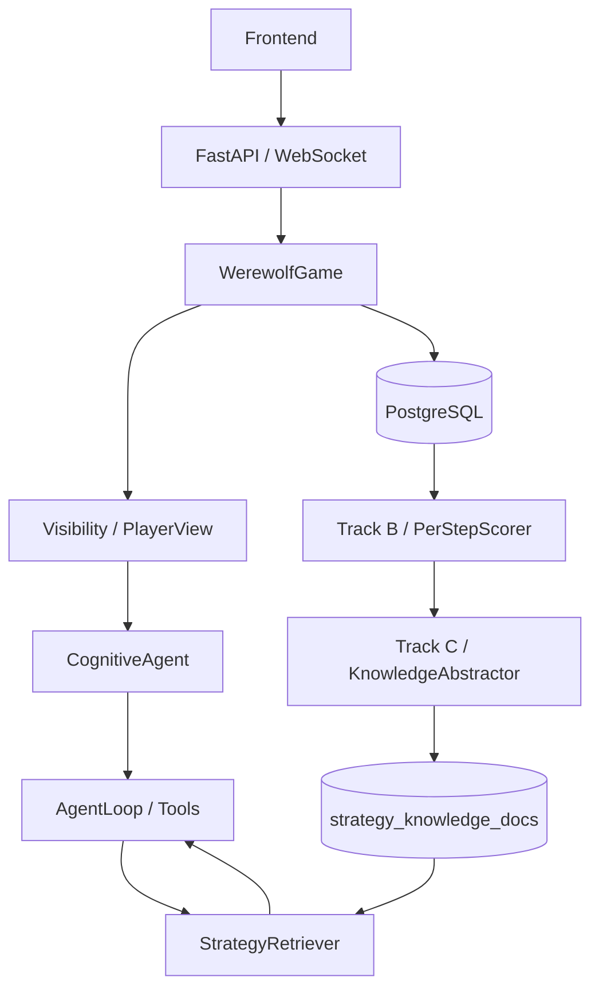

说明：该图展示系统从前端到后端引擎、Agent 决策、数据库证据链、Track B 复盘分析和 Track C 知识回流的总体结构。它强调 Agent 不直接控制游戏状态，而是通过 PlayerView 获得合法信息，通过 Decision 向引擎提交行动。PostgreSQL 是 Play、Evaluate、Evolve 三阶段之间的证据链中枢。

## 图 2 Play-Evaluate-Evolve 闭环图

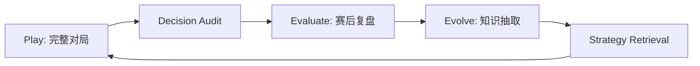

说明：该图是项目主线。Play 阶段生成事件和 Agent 决策；Evaluate 阶段通过 PerStepScorer 和 PublishedReview 对每一步进行复盘；Evolve 阶段把高光和失误转化为策略知识，并通过 StrategyRetriever 回到下一局 Agent 的策略层。

## 图 3 单局对局流程图

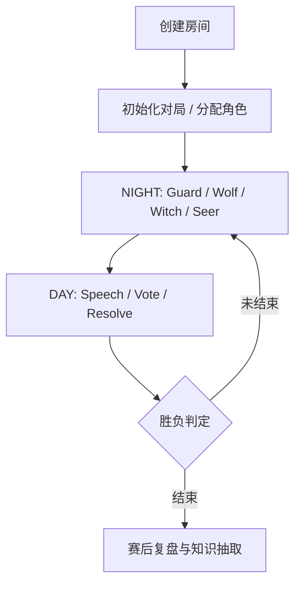

说明：该图描述单局从创建房间到终局再到赛后处理的操作路径。运行中每次 Agent 行动都经过 Visibility 生成 PlayerView，再由 CognitiveAgent 和 AgentLoop 决策，最后由引擎审计并结算。终局后进入 Track B 和 Track C。

## 图 4 Agent 决策流程图

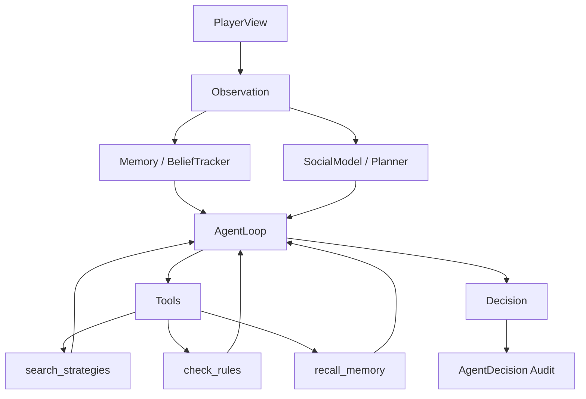

说明：Agent 决策不是一次性生成文本，而是先接收合法视图，再结合记忆、信念、社交关系和工具调用。当前代码中的主要工具包括 `search_strategies`、`recall_memory`、`check_rules`、`get_social_info`、`analyze_votes`、`set_strategic_intent` 和 `submit_decision`。

## 图 5 信息隔离示意图

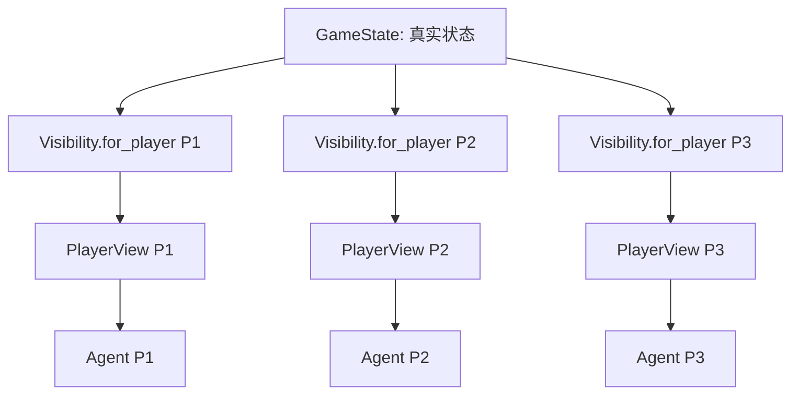

说明：GameState 是主持视角，包含所有真实身份和私有事件；PlayerView 是每个 Agent 的局部视角。普通玩家、狼人和神职获得的信息不同。该设计将信息隔离放在代码层，而不是依赖 Prompt 要求 Agent “不要偷看”。

## 图 6 决策证据链图

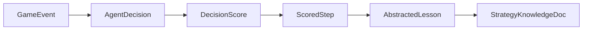

说明：证据链展示一条决策如何从局内事件和 Agent 输出，进入赛后复盘分析，再变成知识文档。这个链路支撑项目的核心展示点：系统不只知道输赢，还能追溯“当时看到了什么、做了什么、复盘结论如何、产生了什么经验”。

## 图 7 设计演进路线图

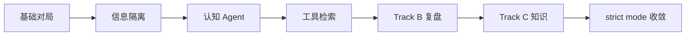

说明：该图展示项目从“能跑一局”到“能对局、能复盘、能沉淀知识”的演进过程。每一阶段都解决了具体工程问题：基础流程、信息不对称、决策解释、动态策略、赛后复盘、知识回流和全链路验收。

## 图 8 Track B 复盘分析流程图

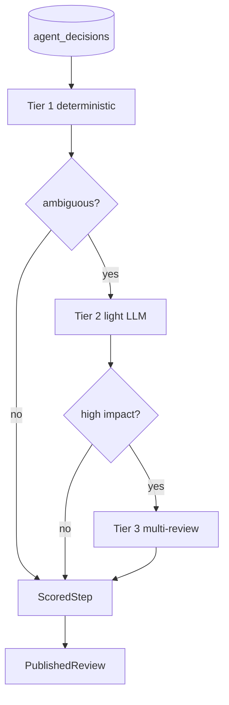

说明：Track B 用三级分析级联处理发言、投票和技能行为。确定性规则处理明确场景，轻量 LLM 处理模糊场景，多路复核用于高影响决策。正式报告如需写实际 Tier 触发比例，必须重新统计实验输出，不能直接使用代码注释中的设计比例。

## 图 9 Track C 知识回流流程图

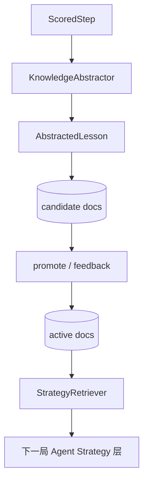

说明：Track C 将复盘经验变成可检索策略。高光决策转为正向策略，失误转为规避建议。新知识默认进入 candidate，避免直接污染 active 策略池。只有经过晋级或反馈确认后，active 知识才进入下一局检索。

## 图 10 各阶段改进效果表

| 改进项 | 改进前问题 | 改进后方案 | 当前证据状态 |
|---|---|---|---|
| Game Engine | 流程易乱 | 引擎统一阶段与结算 | strict 文档记录 |
| PlayerView | 信息可能泄露 | Visibility 裁剪视图 | 92 检查文档记录 |
| AgentDecision | 无法复盘 | 决策审计入库 | 当前 DB 快照 |
| CognitiveAgent | 简单 Agent 难解释 | Observe -> Think -> Act | 代码 + strict 文档 |
| AgentLoop | 单 Prompt 压力大 | 工具调用循环 | tool_trace 文档记录 |
| StrategyRetriever | 策略写死 | BM25 + policy + 4-filter | 检索报告 |
| PerStepScorer | 胜负解释不足 | 逐步复盘 | strict 文档记录 |
| KnowledgeAbstractor | 经验无法复用 | lessons -> candidate | strict 文档记录 |

说明：该表适合放在“改进效果展示”章节。注意“当前证据状态”区分了当前可查 DB、项目验收文档记录和设计证据。

## 图 11 多局实验占位图表

以下为占位图表，待真实实验替换。

| 实验方案 | 局数 | 完成率 | 平均天数 | 平均事件数 | 平均决策数 | 平均 lessons | fallback 次数 | 胜方分布 |
|---|---:|---:|---:|---:|---:|---:|---:|---|
| baseline（占位） | 20 | 95% | 2.8 | 58 | 30 | 0 | 0 | V9 / W11 |
| anti_only（占位） | 20 | 96% | 2.7 | 57 | 29 | 0 | 0 | V8 / W12 |
| trackc_only（占位） | 20 | 96% | 2.9 | 61 | 31 | 80 | 0 | V10 / W10 |
| both（占位） | 20 | 95% | 3.0 | 63 | 32 | 85 | 0 | V11 / W9 |
| hybrid_retrieval（占位） | 20 | 96% | 2.9 | 62 | 32 | 82 | 0 | V10 / W10 |

说明：该表仅展示未来多局稳定性实验的报告结构。真实数据应由 `scripts/run_winrate_experiment.py` 或 `scripts/multi_tier_experiment.py` 输出后替换。

## 图 12 检索策略对比占位图表

以下为占位图表，待真实在线实验替换。

| Policy | 平均决策质量 | P@3 | nDCG@5 | 策略命中率 | 策略使用率 | 平均检索延迟 |
|---|---:|---:|---:|---:|---:|---:|
| global_only（占位） | 0.62 | 0.42 | 0.50 | 40% | 25% | 25ms |
| same_role_all_mbti（占位） | 0.68 | 0.76 | 0.81 | 75% | 45% | 30ms |
| same_role_same_mbti（占位） | 0.70 | 0.78 | 0.83 | 78% | 48% | 32ms |
| hybrid_role_mbti_global（占位） | 0.71 | 0.80 | 0.85 | 80% | 50% | 35ms |
| hybrid_role_alignment_phase（占位） | 0.69 | 0.76 | 0.82 | 76% | 46% | 37ms |

说明：该图表用于展示检索策略在线对比应包含哪些指标。当前可引用的检索结果主要来自 `docs/experiments/retrieval_policy_results.md` 的离线弱标注和 LLM 复核，不能直接写成真实对局提升。

## 图 13 单角色检索路径与量化结果

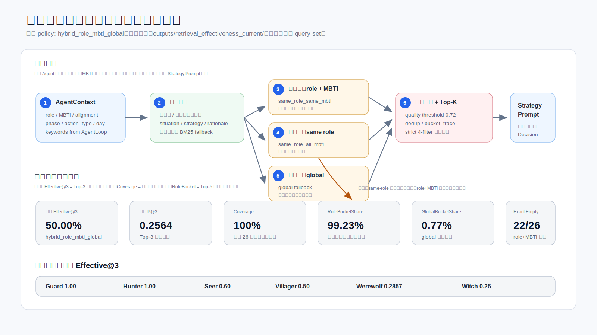

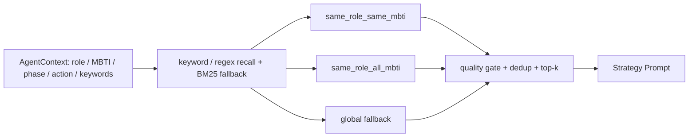

说明：该图回答“单个角色到底怎么检索”。默认 `hybrid_role_mbti_global` 先查精确 role+MBTI，再查本角色通用策略，最后才使用 global 兜底。当前离线量化结果为 Effective@3=50.00%、Coverage=100.00%、RoleBucketShare=99.23%、GlobalBucketShare=0.77%。这些是真实离线检索指标，来源为 `outputs/retrieval_effectiveness_current/`，不能写成在线胜率提升结论。

## 附：新增 SVG 素材清单

| 文件 | 用途 |
|---|---|
| `docs/assets/final_report/system-architecture.svg` | 系统总体架构 |
| `docs/assets/final_report/play-evaluate-evolve.svg` | 闭环主线 |
| `docs/assets/final_report/evidence-chain.svg` | 决策证据链 |
| `docs/assets/final_report/design-evolution.svg` | 设计演进 |
| `docs/assets/final_report/module-map.svg` | 功能模块图 |
| `docs/assets/final_report/game-operation-flow.svg` | 单局操作流程 |
| `docs/assets/final_report/track-bc-flow.svg` | Track B/C 流程 |
| `docs/assets/final_report/single-role-retrieval.svg` | 单角色检索路径与量化 |
| `docs/assets/final_report/placeholder-stability.svg` | 多局稳定性占位可视化 |
| `docs/assets/final_report/placeholder-retrieval-policy.svg` | 检索策略占位可视化 |

## 附：本地 PNG 导出版清单

以下 PNG 是本地导出版，默认被 `.gitignore` 的 `*.png` 规则排除；需要 PPT 时可从对应 SVG 重新导出。

| 文件 | 来源 SVG | 用途 |
|---|---|---|
| `docs/assets/final_report/png/system-architecture.png` | `system-architecture.svg` | 系统总体架构 |
| `docs/assets/final_report/png/module-map.png` | `module-map.svg` | 功能模块图 |
| `docs/assets/final_report/png/play-evaluate-evolve.png` | `play-evaluate-evolve.svg` | Play-Evaluate-Evolve 闭环 |
| `docs/assets/final_report/png/game-operation-flow.png` | `game-operation-flow.svg` | 单局操作流程 |
| `docs/assets/final_report/png/evidence-chain.png` | `evidence-chain.svg` | 决策证据链 |
| `docs/assets/final_report/png/design-evolution.png` | `design-evolution.svg` | 设计演进路线 |
| `docs/assets/final_report/png/track-bc-flow.png` | `track-bc-flow.svg` | Track B/C 流程 |
| `docs/assets/final_report/png/placeholder-stability.png` | `placeholder-stability.svg` | 多局稳定性占位图 |
| `docs/assets/final_report/png/placeholder-retrieval-policy.png` | `placeholder-retrieval-policy.svg` | 检索策略对比占位图 |
