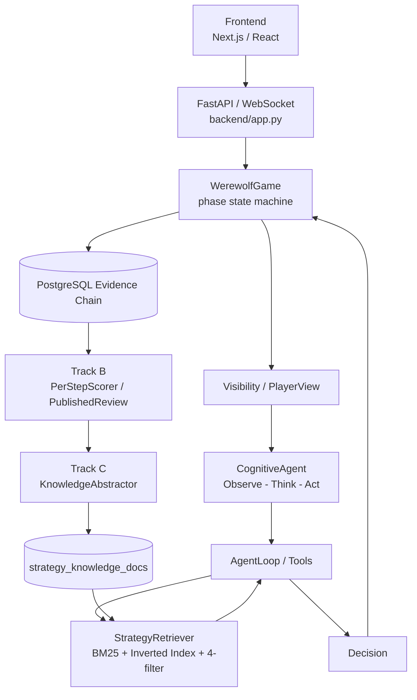

# 《AI 狼人杀多智能体对战与自进化系统项目结项报告》

## 摘要

本项目实现了一个 AI 狼人杀多智能体对战与自进化系统。系统能够创建一局完整狼人杀对局，由多个 AI Agent 在严格信息隔离下完成发言、投票和夜间技能行动；对局结束后，系统将每一步 Agent 决策落库审计，通过 Track B 进行赛后评分与复盘，再由 Track C 将高光经验和失误教训抽象为策略知识，进入 candidate / active / deprecated 生命周期，并回流到下一局 Agent 的策略检索层。

系统核心能力包括：完整 AI 对局、角色配置、前端观战、后端规则引擎、Visibility / PlayerView 信息隔离、CognitiveAgent 认知决策、AgentLoop 工具调用、StrategyRetriever 策略检索、PostgreSQL 决策证据链、PerStepScorer 赛后评分、PublishedReview 复盘报告、KnowledgeAbstractor 知识抽取和 strict mode 端到端验收。

根据 `docs/backend_acceptance_criteria.md`，后端 strict mode 验收命令 `python scripts/run_backend_full_strict.py` 的最新文档记录为 **STRICT MODE: PASSED**，Game `edbde010`，7 人 1 天，Village 胜，耗时 1553 秒；Active 池 1065 -> 1065，Candidate 池 +194，知识 lessons 99 条。该数据属于“项目已有验收报告记录”。当前仓库根目录未找到 `outputs/` 原始输出目录，因此正式提交前建议重新运行 strict 脚本并冻结 `outputs/backend_e2e_report.json`。

当前本地 PostgreSQL 快照可查询，查询时间为 2026-06-07 13:55:01 UTC：public schema 有 22 张表，`games=10429`，`agent_decisions=250603`，`evaluations=95790`，`published_reviews=3827`，`strategy_knowledge_docs=4258`。该数据是“当前数据库快照”，包含历史实验、运行中对局和不同 provider 记录，正式统计应按实验 ID 或时间窗口过滤。

多局实验和方案对比已有部分材料：`data/experiment/batch_summary.json` 记录 20/20 局成功，平均 3.05 天，Village 8 局、Wolf 12 局；`data/experiment/multi_tier/formal_dsv4flash_7p_tier_6x_v2/summary.json` 记录四层级实验，但各 tier 完成数不均、失败数较多，因此只能作为“受限实验记录”，不能写成稳定提升结论。检索策略对比已有 `docs/experiments/retrieval_policy_results.md`，但仍需在线对局补充。

## 1 项目概览

### 1.1 系统定位

AI Werewolf 是一个 AI 狼人杀多智能体对战与自进化系统。它面向的是“会玩、能复盘、可积累策略”的完整产品形态，而不是单一聊天机器人或静态规则演示。系统中的每个 AI 玩家都有自己的角色身份、人格设定、局内可见信息和决策过程，需要在狼人杀的信息不对称条件下完成公开发言、投票放逐、狼人刀人、预言家查验、女巫用药、守卫守护、猎人开枪等行为。

系统定位可以概括为四层：

| 层次 | 说明 |
|---|---|
| AI 狼人杀 | 支持狼人杀标准流程、角色能力、投票和胜负判定 |
| 多智能体对战 | 每个玩家由独立 Agent 决策，存在协作、对抗和信息不对称 |
| 过程可审计 | 每一步 observation、legal actions、raw output、parsed action、tool trace 和评分可追溯 |
| 知识可回流 | 赛后经验转化为策略知识，经过生命周期管理后回到下一局 Agent Prompt |

因此，本项目的核心不是单局胜负，而是完整闭环：AI Agent 在局内行动，系统在赛后评价每一步行为，再将复盘结果转化为可检索策略。

### 1.2 项目完成内容

项目已完成的产品能力如下。

| 能力 | 当前实现 | 主要证据 |
|---|---|---|
| 完整 AI 对局 | 标准 7 人局可从夜晚行动、白天发言、投票走到终局 | `backend/engine/game.py`，`docs/backend_acceptance_criteria.md` |
| 多角色配置 | Villager / Werewolf / Seer / Witch / Hunter / Guard 可运行，WhiteWolfKing / Idiot 已进入部分配置 | `backend/engine/roles/*`，`configs/rule_variant_standard.yaml` |
| 前端观战 | 大厅、房间、对局页、玩家卡片、事件时间线、行动面板 | `frontend/app/`，`frontend/components/game/` |
| 后端游戏引擎 | 阶段推进、动作校验、技能结算、投票、死亡、胜负判定 | `backend/engine/game.py` |
| 信息隔离 | GameState 到 PlayerView 的裁剪；公开、私有、狼队信息分离 | `backend/engine/visibility.py` |
| CognitiveAgent | Observe -> Think -> Act；支持角色动作、记忆、信念、社交模型和反思 | `backend/agents/cognitive/agent.py` |
| AgentLoop 工具调用 | 工具包括 `search_strategies`、`recall_memory`、`check_rules`、`get_social_info`、`analyze_votes`、`set_strategic_intent`、`submit_decision` | `backend/agents/cognitive/agent_loop.py`，`backend/agents/cognitive/tools.py` |
| 策略检索 | BM25 + 倒排索引 + RetrievalPolicy + 4-filter 安全管线 | `backend/agents/cognitive/retrieval_prod.py` |
| 决策审计 | `agent_decisions` 记录观察、合法动作、原始输出、解析动作、metadata | `backend/db/models.py` |
| 赛后评分 | PerStepScorer 输出 DecisionScore 和 ScoredStep | `backend/eval/per_step_scorer.py` |
| 复盘报告 | PublishedReview 保存结构化复盘结果 | `backend/eval/track_b.py`，`backend/db/models.py` |
| 知识抽取 | KnowledgeAbstractor 从 ScoredStep 中抽取 AbstractedLesson | `backend/eval/knowledge_abstractor.py` |
| 策略回流 | `strategy_knowledge_docs` 管理 candidate / active / deprecated | `backend/eval/evolution.py` |
| strict mode 验收 | 将 DB、LLM、对局、评分、知识、报告导出连成端到端检查 | `scripts/run_backend_full_strict.py`，`docs/backend_acceptance_criteria.md` |

### 1.3 项目主线

项目主线是 Play -> Evaluate -> Evolve。

Play：前端创建房间或触发对局，FastAPI / WebSocket 将请求交给 `WerewolfGame`。引擎按狼人杀阶段推进，每次需要 Agent 行动时，通过 `Visibility.for_player()` 生成 PlayerView，再交给 `CognitiveAgent` 决策。Agent 只返回行动意图，不直接修改游戏真实状态。

Evaluate：每个 Agent 行为由 `_record_decision()` 审计并写入 `agent_decisions`。赛后 Track B 读取决策、事件和终局状态，由 `PerStepScorer` 对发言、投票和技能进行逐步评分，形成 `DecisionScore`、`ScoredStep`、`PlayerReviewReport` 和 `PublishedReview`。

Evolve：Track C 读取评分后的步骤和 Agent 赛后反思，由 `KnowledgeAbstractor` 抽象出 `AbstractedLesson`，写入 `strategy_knowledge_docs`。新知识默认进入 candidate 池，后续通过 `promote.py`、usage feedback 或 tournament 流程晋级为 active，最终由 `StrategyRetriever` 回流到下一局 Agent 的 Strategy 层。

## 2 系统整体设计

### 2.1 总体架构



系统整体架构以后端游戏引擎为规则核心，以 Agent 为决策主体，以数据库为证据链中枢。前端并不直接操纵规则，而是展示房间、玩家、阶段、事件和快照。策略知识的回流也不是直接修改模型参数，而是通过数据库知识文档和检索策略进入 Agent 的策略层。

### 2.2 系统分层

| 层次 | 主要职责 | 输入 | 输出 | 上下游关系 | 系统价值 |
|---|---|---|---|---|---|
| 前端展示与交互层 | 创建房间、观战、展示阶段/玩家/事件/投票/行动 | WebSocket snapshot、REST API | UI 状态、人类操作 | 上接用户，下接 FastAPI | 让对局可演示、可调试、可交互 |
| 后端 API 与房间管理层 | 房间、快照、WebSocket 流、报告接口 | 前端请求 | 房间状态、游戏流、报告 | 前端与引擎之间 | 将产品操作转换为后端任务 |
| 对局引擎层 | 阶段推进、动作校验、技能结算、胜负判定 | 规则配置、Agent action | GameState、GameEvent、AgentDecision | 上接 API，下接 Visibility/Agent/DB | 保证规则统一与流程可验收 |
| 信息隔离层 | 裁剪真实状态为局部视图 | GameState、player_id | PlayerView | 引擎与 Agent 之间 | 防止上帝视角，保持信息不对称 |
| Agent 决策层 | 观察、推理、工具调用、输出决策 | PlayerView、记忆、策略、LLM | Decision | 上接 Visibility，下回引擎 | 形成角色化、可解释 AI 行为 |
| 策略检索层 | 按角色/阶段/MBTI/可见性检索知识 | query、role、phase、mbti、alignment | strategy docs | AgentLoop 与知识库之间 | 动态引入可审计策略 |
| 数据持久化与证据链层 | 保存对局、事件、决策、评分、复盘、知识和反馈 | 运行时记录 | PostgreSQL 表 | 连接 Play/Evaluate/Evolve | 支持复盘、统计、实验和回放 |
| 赛后评分层 | 对每步决策评分并生成复盘 | agent_decisions、events、state | DecisionScore、ScoredStep、PublishedReview | 数据库到知识抽取 | 解释行为质量并定位失误 |
| 知识自进化层 | 从复盘抽取经验并管理生命周期 | ScoredStep、reflection、review | StrategyKnowledgeDoc | Track B 到 StrategyRetriever | 让经验可沉淀、可回流、可审计 |

### 2.3 端到端运行流程

```text
Frontend
  -> FastAPI / WebSocket
  -> WerewolfGame
  -> Visibility.for_player()
  -> CognitiveAgent
  -> AgentLoop
  -> Decision
  -> agent_decisions
  -> PerStepScorer
  -> PublishedReview
  -> KnowledgeAbstractor
  -> strategy_knowledge_docs
  -> StrategyRetriever
  -> 下一局 Agent Prompt
```

一局游戏从创建房间开始。前端进入房间后，后端准备或启动 `WerewolfGame`。引擎在每个阶段决定哪些玩家需要行动，并对每个玩家生成 PlayerView。Agent 收到观察后进入 AgentLoop，可以检索策略、回忆历史、查询规则或分析票型，最后提交统一 Decision。引擎校验并结算动作，同时记录事件和决策。

对局结束后，系统进入后处理。Track B 将 `agent_decisions` 与 `game_events` 结合，按发言、投票和夜间技能形成逐步评分。Track C 再从评分结果中抽取策略知识，写入 `strategy_knowledge_docs`。下一局 Agent 在行动前通过 `search_strategies` 或自动策略注入读取 active 策略，由此形成闭环。

### 2.4 决策证据链

```text
GameEvent
  -> AgentDecision
  -> DecisionScore
  -> ScoredStep
  -> AbstractedLesson
  -> StrategyKnowledgeDoc
```

证据链的意义在于：系统不只知道“谁赢了”，还知道“某个 Agent 当时看到了什么、调用了什么工具、输出了什么、该决策得分如何、是否产生 lesson、lesson 是否进入策略库”。

| 节点 | 记录内容 | 主要位置 |
|---|---|---|
| GameEvent | 阶段、事件类型、actor、target、visibility、payload | `game_events` |
| AgentDecision | observation、legal_actions、raw_output、parsed_action、metadata | `agent_decisions` |
| DecisionScore | correctness、reasoning_quality、timeliness、impact、overall_score | Track B 内部对象 |
| ScoredStep | step_score、is_highlight、is_mistake、retrieved_strategies | `backend/eval/per_step_scorer.py` |
| AbstractedLesson | recommended_action、avoid_action、rationale、source_event_ids | `backend/eval/knowledge_abstractor.py` |
| StrategyKnowledgeDoc | role、phase、status、confidence、visibility_scope、applicability | `strategy_knowledge_docs` |

## 3 核心模块设计

### 3.1 WerewolfGame 对局引擎

模块定位：`WerewolfGame` 是系统规则核心，负责把一局狼人杀从 SETUP 推进到 GAME_END。

设计目标：游戏流程必须由确定性引擎控制，Agent 只输出行动意图。这样可以避免 LLM 用自然语言控制流程导致阶段错乱、重复结算或非法胜负判定。

设计方案：引擎按 Phase 状态机组织夜晚、白天和特殊阶段。夜晚包括守卫、狼人、女巫、预言家和结算；白天包括警长竞选、发言、投票和放逐；特殊阶段包括猎人开枪、白狼王自爆、警徽移交和终局。所有 Agent 行动先被收集，再由引擎统一校验和结算。

运行流程：引擎初始化玩家与角色；进入阶段；为行动玩家生成 PlayerView；调用 Agent；记录 AgentDecision；校验 action；更新 GameState；写入 GameEvent；检查胜负；终局后触发后处理。

解决的问题：将狼人杀规则从 LLM 输出中剥离出来，避免 Agent 越权修改状态，也避免前端或脚本直接驱动规则。

带来的好处：规则统一、可回放、可验收、便于扩展角色和测试特殊分支。`docs/DEVELOPMENT_ISSUES.md` 中 A1-A16 记录了多个引擎演进问题，例如猎人夜间死亡未触发开枪、警徽重复触发、刷新重开局、递归 PK KeyError、LLM 无效目标兜底、快速终局未生成每日摘要等，说明引擎化设计是在问题修复中逐步收敛的。

当前完成状态：标准对局链路已接入 strict mode。`docs/backend_acceptance_criteria.md` 记录 Game Engine verified，全流程跑通且无死循环。当前数据库快照显示 `games=10429`，其中 `finished=10189`、`running=240`，来源：PostgreSQL 查询，2026-06-07 13:55:01 UTC。

验收或实验依据：`backend/engine/game.py`、`scripts/run_backend_full_strict.py`、`docs/backend_acceptance_criteria.md`、PostgreSQL 当前快照。

### 3.2 Visibility / PlayerView 信息隔离

模块定位：Visibility 是真实状态和 Agent 输入之间的安全边界。

设计目标：狼人杀的核心是信息不对称。村民不能看到狼人身份，普通玩家不能看到预言家查验结果，非狼人不能看到狼队友，公开事件和私有事件必须分开。

设计方案：`GameState` 保存完整真实状态；`Visibility.for_player()` 根据 player_id 裁剪出 PlayerView。PlayerView 包含当前玩家自身信息、公开玩家信息、公开事件、合法目标，以及该玩家身份允许看到的 private events。狼人阵营额外获得狼队信息；预言家、女巫、守卫等神职只看到自己的能力结果。

运行流程：引擎请求 Agent 行动前调用 Visibility；Agent 永远只消费 PlayerView；Agent 的 observation 会被写入 `agent_decisions`，从而在赛后审计时知道该 Agent 当时“合法看见了什么”。

解决的问题：防止 Agent 拿到上帝视角，也防止赛后评分时把 Agent 当时不可见的信息作为当时应该知道的事实。

带来的好处：信息隔离在代码层完成，不依赖 prompt 自律；每条决策都有可见事实边界；公开视角和主持视角可以共存。

当前完成状态：`docs/backend_acceptance_criteria.md` 和 `docs/DATA_FLOW.md` 记录信息隔离 92 项检查通过。当前仓库根目录未找到 `outputs/visibility_strict_report.log`，因此该数字在本素材包中标记为“已有验收文档记录”。

验收或实验依据：`backend/engine/visibility.py`、`scripts/verify_visibility_strict.py`、`docs/backend_acceptance_criteria.md`。

### 3.3 CognitiveAgent 认知决策

模块定位：CognitiveAgent 是每个 AI 玩家在局内的决策主体。

设计目标：Agent 不只是生成一句话，而要能够根据局势观察、角色身份、长期/短期记忆、社交信任、狼人队友和策略工具做出动作。

设计方案：CognitiveAgent 采用 Observe -> Think -> Act。Observe 将 PlayerView 转成 Observation；Think 结合 Memory、BeliefTracker、SocialModel、Planner、WolfTeamView 和 AgentLoop；Act 输出统一 Decision。不同角色通过同一个 Agent 框架暴露不同动作入口，例如 talk、vote、attack、divine、guard、witch_act。

运行流程：Agent 收到 PlayerView 后更新观察与记忆；根据当前 phase 和 action type 构建上下文；AgentLoop 允许检索策略或查询规则；最终通过 `submit_decision` 或解析 LLM 输出得到结构化动作。

解决的问题：简单 heuristic 或单 Prompt Agent 难以表现角色差异，也难以记录为什么这么发言、投票或使用技能。

带来的好处：支持多轮记忆、角色差异、狼人协作、发言与投票、夜间技能和赛后反思；决策记录可解释。

当前完成状态：代码已接入后端对局。`docs/backend_acceptance_criteria.md` 记录 strict mode 中 Agent Decision verified，决策入库包含 metadata 和 tool trace。

验收或实验依据：`backend/agents/cognitive/agent.py`、`backend/agents/cognitive/observe.py`、`backend/agents/cognitive/memory.py`、`backend/agents/cognitive/social_model.py`、`backend/agents/cognitive/planner.py`。

### 3.4 Persona / Role / Strategy 三层 Prompt

模块定位：三层 Prompt 是 Agent 输入组织方式，分别控制表达、身份和策略。

设计目标：将“怎么表达”“我是谁”“怎么赢”分开，避免人设层夹带玩法，避免角色规则被经验知识污染，也让策略层可以独立实验和回流。

设计方案：

| 层 | 内容 | 职责 |
|---|---|---|
| Persona / MBTI | MBTI、语言风格、性格倾向 | 控制表达方式和认知风格 |
| Role Identity | 角色、阵营、技能、胜利条件、规则边界 | 定义身份和合法能力 |
| Strategy + Tools | 静态策略、反模式、动态检索结果、工具输出 | 提供局势相关策略建议 |

运行流程：Agent 生成决策前先加载人格和角色身份，再从策略库或工具检索中获取策略层内容。Track C 的回流知识只进入 Strategy 层，不直接改 Persona 或 Role 层。

解决的问题：早期 Prompt 容易把硬玩法塞入非策略层，导致策略来源不可审计。`docs/DEVELOPMENT_ISSUES.md` 中 C19、C24、C28 记录了相关问题。

带来的好处：表达风格和玩法策略分离；策略层可独立演进；便于做 AB 实验；也便于报告中说明系统如何自进化。

当前完成状态：README 已将三层架构列为项目核心结构，代码在 `backend/agents/cognitive/prompts.py` 和 AgentLoop 中落地。

验收或实验依据：`README.md`、`backend/agents/cognitive/prompts.py`、`docs/archive/PROJECT_CLOSURE_DESIGN_SELECTIONS.md`。

### 3.5 AgentLoop 与工具调用

模块定位：AgentLoop 是认知 Agent 的工具调用和决策提交循环。

设计目标：Agent 不应只靠一次性 Prompt 输出答案，而应能按局势主动查询策略、记忆、规则、社交信息和投票模式。

设计方案：`AgentLoop.run()` 组织系统提示、Observation、工具 schema、工具结果和最终决策。当前代码中的工具以 `backend/agents/cognitive/tools.py` 为准，包括：

| 工具 | 作用 |
|---|---|
| `search_strategies` | 检索策略知识库，支持 retrieval_policy |
| `recall_memory` | 查询自身记忆、判断、近期行动和角色状态 |
| `check_rules` | 查询规则 FAQ |
| `get_social_info` | 查询信任网络和欺骗信号 |
| `analyze_votes` | 分析当前投票模式 |
| `set_strategic_intent` | 记录跨阶段战略意图 |
| `submit_decision` | 提交最终结构化决策 |

旧文档中出现过 `review_public_events`、`review_my_history`、`get_private_info` 等名称，但当前代码以以上工具为准；这些旧名称应标注为历史表述或待核对，不应作为当前事实写入正式报告。

运行流程：AgentLoop 根据 action type 限制工具轮数；LLM 可以选择工具；工具返回结构化文本；循环结束后输出 Decision。工具调用 trace 会进入 metadata，用于后续审计。

解决的问题：一次性 Prompt 上下文压力大，且无法证明策略是否真的被用过。

带来的好处：减少上下文压力；让 Agent 按需检索；tool_trace 可审计；可评估工具和策略是否真正参与决策。

当前完成状态：已接入 CognitiveAgent。`docs/backend_acceptance_criteria.md` 记录 strict mode 中 26/27 决策带完整工具追踪。

验收或实验依据：`backend/agents/cognitive/agent_loop.py`、`backend/agents/cognitive/tools.py`、`docs/backend_acceptance_criteria.md`。

### 3.6 StrategyRetriever 策略检索

模块定位：StrategyRetriever 是 Track C 知识进入 Agent 的检索入口。

设计目标：策略不应全部写死在 Prompt 中，而应根据角色、阶段、MBTI、阵营、可见性和适用条件动态检索。

设计方案：代码中 `RetrievalPolicy` 支持 `global_only`、`self_mbti_only`、`same_role_all_mbti`、`same_role_same_mbti`、`hybrid_role_mbti_global`、`hybrid_role_alignment_phase`。底层采用 BM25、倒排索引和领域词分词，配合 4-filter 安全管线：

| filter | 作用 |
|---|---|
| confidence | 屏蔽低可信或 rejected 知识 |
| visibility | 按 public / self_private / wolf_team_private / postgame 等范围过滤 |
| privacy | 防止当前局私有信息泄漏 |
| applicability | 按角色、阶段、规则、人数等适用条件过滤 |

运行流程：Agent 通过 `search_strategies` 传入关键词和 retrieval_policy；检索器先按 policy 过滤候选，再排序并返回 top-k；结果进入 Agent Prompt 的 Strategy 层并记录到 tool_trace。

解决的问题：静态策略无法随赛后知识增长而变化；纯相似度检索可能引入私有信息、不适用策略或 candidate 污染。

带来的好处：无需 GPU；检索结果可解释；支持按角色、阶段、MBTI 和阵营筛选；支撑策略回流。

当前完成状态：已实现并有离线评估材料。`docs/experiments/retrieval_policy_results.md` 记录 2026-06-06 检索策略对比：离线弱标注中 `hybrid_role_mbti_global` 与 `hybrid_role_alignment_phase` 并列第一；在线 LLM Judge 中 `same_role_all_mbti` 排名第一，`hybrid_role_mbti_global` 排名第二。该结果可作为检索评估记录，但不能直接写成真实对局胜率提升。

验收或实验依据：`backend/agents/cognitive/retrieval_prod.py`、`docs/archive/retrieval_policy_design.md`、`docs/experiments/retrieval_policy_results.md`。

### 3.7 PostgreSQL 数据与证据链

模块定位：PostgreSQL 是系统证据链中枢。

设计目标：数据库不仅保存游戏结果，还保存完整过程记录，包括玩家、事件、快照、决策、评分、复盘、策略知识和使用反馈。

设计方案：`backend/db/models.py` 定义核心表。当前 PostgreSQL 快照查询显示 public schema 有 22 张表，核心记录数如下：

| 表 | 记录数 | 来源 |
|---|---:|---|
| games | 10429 | PostgreSQL 当前快照，2026-06-07 13:55:01 UTC |
| players | 92479 | 同上 |
| game_events | 598582 | 同上 |
| game_snapshots | 3835 | 同上 |
| agent_decisions | 250603 | 同上 |
| evaluations | 95790 | 同上 |
| published_reviews | 3827 | 同上 |
| strategy_knowledge_docs | 4258 | 同上 |
| knowledge_usage_feedback | 127537 | 同上 |
| leaderboard_entries | 34 | 同上 |

运行流程：游戏运行时写入 games、players、game_events、game_snapshots、agent_decisions 和 votes；Track B 写入 evaluations、published_reviews 和 leaderboard_entries；Track C 写入 strategy_knowledge_docs 和 knowledge_usage_feedback。

解决的问题：没有数据库时，对局只是一段临时日志，无法做复盘、统计、实验比较和知识回流。

带来的好处：可审计、可复盘、可统计、可做实验分析，并支撑 Track B 和 Track C。

当前完成状态：数据库可查询。需要注意：当前快照包含历史实验、运行中对局和不同 provider 记录；不能直接作为“所有都是真实 LLM 严格对局”的结论。

验收或实验依据：`backend/db/models.py`、PostgreSQL 查询、`docs/archive/PROJECT_CLOSURE_DATA_AUDIT.md`。

### 3.8 Track B 赛后评分

模块定位：Track B 负责将每一步 Agent 行为转化为可解释的过程评分和复盘报告。

设计目标：胜负只能说明阵营结果，不能解释每一步决策质量。系统需要知道哪次发言有证据、哪次投票方向正确、哪次技能目标合理。

设计方案：`PerStepScorer` 使用三级评分级联：确定性规则先覆盖明确决策，light LLM 处理模糊决策，heavy LLM / judge panel 处理高影响或争议较大的决策。核心对象包括 `DecisionScore`、`ScoredStep`、`PlayerReviewReport` 和 `PublishedReview`。

运行流程：赛后读取 agent_decisions、speech acts、state 和 events；按 action type 评分；生成高光/失误标记；组织成玩家报告和可发布复盘。

解决的问题：只看胜负无法定位关键失误，也无法为知识抽取提供结构化输入。

带来的好处：能定位关键决策；能评估 Agent 行为质量；能生成展示报告；能为 Track C 提供 lesson 来源。

当前完成状态：`docs/backend_acceptance_criteria.md` 记录 Track B Scoring verified，Tier 1 对 27/27 决策覆盖，Track B Review 产出 1 份 PublishedReview、21 条 Evaluation、34 条 LeaderboardEntry。当前 PostgreSQL 快照显示 `evaluations=95790`、`published_reviews=3827`。

验收或实验依据：`backend/eval/per_step_scorer.py`、`backend/eval/track_b.py`、`docs/backend_acceptance_criteria.md`、PostgreSQL 当前快照。

### 3.9 Track C 知识自进化

模块定位：Track C 负责将赛后复盘经验转化为可检索策略知识，并管理知识生命周期。

设计目标：系统不能只在赛后指出错误，还要把“如何避免同类错误”沉淀下来，在未来对局中被 Agent 检索使用。

设计方案：`KnowledgeAbstractor` 从 `ScoredStep` 中抽取经验：高光决策转为正向策略，失误决策转为规避建议，策略使用记录转为策略效果反馈。知识写入 `strategy_knowledge_docs`，默认状态为 candidate。`evolution.py` 和 `promote.py` 管理 candidate -> active -> deprecated。

运行流程：PublishedReview 或 PlayerReviewReport 生成后，抽象出 AbstractedLesson；写入 `strategy_knowledge_docs`；candidate 经过质量、聚类、反馈或人工流程晋级 active；StrategyRetriever 只检索允许进入局内的知识；使用效果进入 `knowledge_usage_feedback`。

解决的问题：复盘报告如果不进入下一局，就只能作为展示材料，无法形成自进化闭环。

带来的好处：对局经验可沉淀；新知识不会直接污染 active 策略池；支持策略持续演进；支持后续多局验证。

当前完成状态：`docs/backend_acceptance_criteria.md` 记录 Track C Knowledge verified，赛后提取 lessons 并写入 candidate，Active 池零污染。当前 PostgreSQL 快照显示 `strategy_knowledge_docs` 状态分布为 active 401、candidate 3856、deprecated 1。该快照与历史验收报告中的 1065/19456 口径不同，说明数据库状态已变化，正式报告需选定冻结口径。

验收或实验依据：`backend/eval/knowledge_abstractor.py`、`backend/eval/evolution.py`、`scripts/promote.py`、`docs/backend_acceptance_criteria.md`、PostgreSQL 当前快照。

### 3.10 前端观战与交互

模块定位：前端是 AI Werewolf 的观战控制台和产品展示入口。

设计目标：让对局过程可视化，便于调试、演示和验收，并为后续人机混战保留交互入口。

设计方案：Next.js 前端提供大厅、房间、游戏页、评测看板和进化面板。游戏页通过 WebSocket 接收 snapshot，展示玩家卡片、阶段、发言、事件、投票结果、胜负结果和行动面板。组件包括 `PlayerCard`、`ActionPanel`、`EventTimeline`、`VotePanel`、`GameEndPanel` 等。

运行流程：用户进入大厅创建或进入房间；前端请求后端房间与快照；WebSocket 推送对局进展；前端按公开视角或主持视角渲染事件和玩家信息；如果存在人类玩家，则 ActionPanel 提供操作入口。

解决的问题：纯后端日志不便演示，也不便非开发人员理解多 Agent 对局。

带来的好处：对局过程可视化；方便展示；便于调试和验收；为 replay viewer 和人机混战扩展打基础。

当前完成状态：前端代码实现存在，`docs/assets/closure/screenshots/` 有上一轮结项截图素材。本轮未重新运行 Playwright 视觉验收，因此前端指标应作为“代码能力与展示素材”，不作为“本轮视觉验收已通过”。

验收或实验依据：`frontend/app/room/[id]/play/page.tsx`、`frontend/hooks/useRoomStream.ts`、`frontend/components/game/*`、`docs/assets/closure/screenshots/`。

## 4 设计历程与版本演进

项目不是一开始就形成 Play -> Evaluate -> Evolve 闭环，而是在基础对局、信息隔离、认知 Agent、策略检索、评分复盘和知识回流中逐步收敛。

### 4.1 第一阶段：基础对局跑通

初始目标是让 7 人标准狼人杀能跑完一局。主要实现包括规则流程、角色动作、投票放逐、死亡结算、胜负判定和基础事件日志。

早期不足是阶段分支不完整，例如猎人夜间死亡未触发开枪、遗言阶段缺失、警长竞选在 day2/day3 重复触发、刷新页面直接开新局等。对应修复记录见 `docs/DEVELOPMENT_ISSUES.md` A1-A6。

### 4.2 第二阶段：信息隔离与决策审计

第二阶段引入 PlayerView、private_events / visibility、legal_targets 和 agent_decisions。系统从“能跑完一局”进入“能解释每个 Agent 当时看到什么、能做什么、实际做了什么”的阶段。

这一阶段解决了上帝视角、非法目标被引擎静默兜底、决策缺失审计等问题。对应记录见 `docs/DEVELOPMENT_ISSUES.md` A11、A16。

### 4.3 第三阶段：CognitiveAgent 与三层 Prompt

第三阶段从简单 Agent 走向 CognitiveAgent。系统引入 Memory、BeliefTracker、SocialModel、Planner、WolfTeamView 和 Humanization，并将 Prompt 分为 Persona / Role / Strategy 三层。

这一阶段解决了 Agent 像背台词、非策略层混入硬玩法、反例优化污染 Prompt 等问题。对应记录见 `docs/DEVELOPMENT_ISSUES.md` C3、C19、C24、C28。

### 4.4 第四阶段：策略检索与工具调用

第四阶段引入 AgentLoop 和工具调用。Agent 不再只靠一次性 Prompt，而是可以通过 `search_strategies` 检索策略，通过 `recall_memory` 查询记忆，通过 `check_rules` 查询规则，通过 `analyze_votes` 分析票型。

检索策略从静态文本走向 RetrievalPolicy，形成 `hybrid_role_mbti_global`、`hybrid_role_alignment_phase` 等策略，并配合 4-filter 防止低可信、越权或不适用知识进入 Agent。

### 4.5 第五阶段：Track B 赛后评分

第五阶段解决“只看胜负不足”的问题。系统引入 `PerStepScorer`，将发言、投票、技能行动转为 `DecisionScore` 和 `ScoredStep`，并由 PublishedReview 生成复盘报告。

这一阶段让项目能够展示“哪一步好、哪一步差、证据是什么、可替代行动是什么”，为后续知识抽取提供结构化输入。

### 4.6 第六阶段：Track C 知识回流

第六阶段将复盘从“报告”推进到“知识”。`KnowledgeAbstractor` 从 ScoredStep 和 reflection 中抽取 AbstractedLesson，写入 `strategy_knowledge_docs`。新知识先进入 candidate，后续再由 promotion、usage feedback 和 tournament 晋级或降级。

这一阶段解决了复盘经验无法进入下一局的问题，也通过 candidate / active 隔离降低了策略污染风险。

### 4.7 第七阶段：后端收敛与 strict mode 验收

第七阶段将 DB、LLM、对局、评分、知识、报告导出整合到 `scripts/run_backend_full_strict.py`。strict mode 设置 `REQUIRE_DB=true`、`REQUIRE_LLM=true`、`REQUIRE_TRACK_B=true`、`REQUIRE_TRACK_C=true`、`ALLOW_FALLBACK=false`、`AUTO_PROMOTE_LESSONS=false` 等约束，目标是避免 silent fallback 和半实现通过。

`docs/backend_acceptance_criteria.md` 记录 strict mode 已通过，并列出 DB、LLM、Game Engine、Agent Decision、Information Isolation、Strategy Retrieval、Track B、Track C、Report Export、Preflight、Error Handling、Configuration、Concurrency 等模块状态。

### 4.8 阶段总表

| 阶段 | 目标 | 主要改进 | 解决的问题 | 结果 | 证据 |
|---|---|---|---|---|---|
| 基础对局 | 跑完一局 | 阶段状态机、角色动作、胜负判定 | 流程不可控 | 标准局可结束 | `backend/engine/game.py`、A1-A6 |
| 信息隔离与审计 | 限制视图并记录决策 | PlayerView、agent_decisions、legal_targets | 上帝视角、不可复盘 | 有可见事实边界 | `visibility.py`、`AgentDecision` |
| CognitiveAgent | 角色化认知决策 | Memory、BeliefTracker、Planner、WolfTeamView | 单 Prompt 表现单薄 | Agent 行为更可解释 | `backend/agents/cognitive/` |
| 策略检索与工具 | 动态获取策略和规则 | AgentLoop、Tools、RetrievalPolicy、4-filter | 静态 Prompt 不可演进 | 工具 trace 可审计 | `agent_loop.py`、`retrieval_prod.py` |
| Track B | 过程评分 | DecisionScore、ScoredStep、PublishedReview | 胜负解释不足 | 可定位高光/失误 | `per_step_scorer.py`、`track_b.py` |
| Track C | 知识回流 | AbstractedLesson、candidate/active 生命周期 | 复盘经验无法复用 | 形成策略知识池 | `knowledge_abstractor.py`、`evolution.py` |
| strict mode | 端到端收敛 | 严格环境变量、单局全链路验收 | 分散测试无法证明闭环 | 文档记录 PASS | `run_backend_full_strict.py`、验收文档 |

## 5 改进效果展示

### 5.1 已有真实验收结果

| 指标 | 数值 | 数据状态 | 来源 |
|---|---:|---|---|
| strict mode | PASSED | 项目已有验收报告记录 | `docs/backend_acceptance_criteria.md` |
| strict 验收命令 | `python scripts/run_backend_full_strict.py` | 项目已有验收报告记录 | `docs/backend_acceptance_criteria.md` |
| strict game_id | `edbde010` | 项目已有验收报告记录 | `docs/backend_acceptance_criteria.md` |
| 玩家数 | 7 | 项目已有验收报告记录 | `docs/backend_acceptance_criteria.md` |
| 天数 | 1 | 项目已有验收报告记录 | `docs/backend_acceptance_criteria.md` |
| 胜方 | Village | 项目已有验收报告记录 | `docs/backend_acceptance_criteria.md` |
| duration | 1553s | 项目已有验收报告记录 | `docs/backend_acceptance_criteria.md` |
| AgentDecision tool trace | 26/27 | 项目已有验收报告记录 | `docs/backend_acceptance_criteria.md` |
| ScoredStep 覆盖 | 27/27 | 项目已有验收报告记录 | `docs/backend_acceptance_criteria.md` |
| lessons | 99 | 项目已有验收报告记录 | `docs/backend_acceptance_criteria.md` |
| candidate 增量 | +194 | 项目已有验收报告记录 | `docs/backend_acceptance_criteria.md` |
| active 前后变化 | 1065 -> 1065 | 项目已有验收报告记录 | `docs/backend_acceptance_criteria.md` |
| 信息隔离检查 | 92 项通过 | 项目已有验收报告记录 | `docs/backend_acceptance_criteria.md` |
| 当前 DB 表数量 | 22 | 当前 PostgreSQL 快照 | PostgreSQL 查询，2026-06-07 13:55:01 UTC |
| 当前 DB agent_decisions | 250603 | 当前 PostgreSQL 快照 | 同上 |
| 当前 DB evaluations | 95790 | 当前 PostgreSQL 快照 | 同上 |
| 当前 DB published_reviews | 3827 | 当前 PostgreSQL 快照 | 同上 |

说明：strict mode 原始 `outputs/` 目录当前未在仓库根目录找到；上述 strict 数字来自项目已有验收报告。当前数据库快照与验收报告中的 active/candidate 数量不同，说明两者不是同一冻结时间点，正式报告应选定一个最终冻结口径。

### 5.2 各阶段改进效果表

| 改进项 | 改进前问题 | 改进后方案 | 效果指标 | 当前数据 | 数据状态 |
|---|---|---|---|---|---|
| Game Engine 独立化 | LLM 或脚本流程易导致状态混乱 | `WerewolfGame` 统一阶段和结算 | 对局完成、无死循环、事件完整 | strict PASS 文档记录 | 文档记录 |
| PlayerView 信息隔离 | Agent 可能获得上帝视角 | `Visibility.for_player()` 裁剪视图 | 信息隔离检查通过率 | 92 项通过 | 文档记录 |
| CognitiveAgent | 简单 Agent 行为单薄 | Observe -> Think -> Act | 合法决策数、角色动作覆盖 | strict AgentDecision verified | 文档记录 |
| 三层 Prompt | 人设、身份、策略混写 | Persona / Role / Strategy 分层 | 策略来源可审计 | 代码与文档已落地 | 设计证据 |
| AgentLoop 工具调用 | 单次输出上下文压力大 | 工具调用循环 | tool_trace 覆盖 | 26/27 文档记录 | 文档记录 |
| StrategyRetriever | 策略写死在 Prompt | BM25 + policy 检索 | Coverage、P@3、nDCG@5 | 有检索评估报告 | 真实/文档混合 |
| hybrid_role_mbti_global | global_only 覆盖不足 | 角色/MBTI/全局分层 | 覆盖率、相关性 | `docs/experiments/retrieval_policy_results.md` | 实验报告 |
| 4-filter | 纯相似度可能泄露或不适用 | confidence/visibility/privacy/applicability | candidate 泄露、active 污染 | strict active delta=0 文档记录 | 文档记录 |
| PerStepScorer | 胜负无法解释每步行为 | DecisionScore / ScoredStep | ScoredStep 覆盖 | 27/27 文档记录 | 文档记录 |
| KnowledgeAbstractor | 复盘不能进入下一局 | lessons -> candidate docs | lessons 增量 | 99 lessons 文档记录 | 文档记录 |
| candidate/active 隔离 | 新知识可能直接污染策略池 | candidate 默认隔离 | active delta | 1065->1065 文档记录 | 文档记录 |
| strict mode | 分散测试不能证明闭环 | 全链路严格脚本 | PASS/FAIL | PASS | 文档记录 |

### 5.3 多局实验展示

`data/experiment/batch_summary.json` 是当前可直接读取的 20 局批量实验摘要。

| 实验方案 | 局数 | 完成率 | 平均天数 | 平均决策数 | 平均知识产出 | fallback 次数 | 胜方分布 | 数据状态 |
|---|---:|---:|---:|---:|---:|---:|---|---|
| batch_summary seeds 300-319 | 20 | 100% | 3.05 | 待补 SQL 关联 | 待补 SQL 关联 | 文件未提供 | Village 8 / Wolf 12 | 真实数据，来源：`data/experiment/batch_summary.json` |

该表可写入“系统能连续完成 20 局”的材料，但不能直接证明 Track C 提升，因为该 summary 未包含统一实验开关、策略使用、fallback、AgentDecision 和 lessons 逐局统计。

### 5.4 方案对比展示

当前可用的多 Tier 结果来自 `data/experiment/multi_tier/formal_dsv4flash_7p_tier_6x_v2/summary.json`，但各 tier 完成数不均。

| Tier | 完成局 | 失败数 | Village 胜率 | Wolf 胜率 | LLM 决策 | Fallback | Invalid | 数据状态 |
|---|---:|---:|---:|---:|---:|---:|---:|---|
| baseline | 18 | 4 | 33.3% | 66.7% | 580 | 0 | 0 | 受限真实数据 |
| anti_only | 20 | 2 | 20.0% | 80.0% | 573 | 0 | 0 | 受限真实数据 |
| trackc_only | 13 | 13 | 30.8% | 69.2% | 363 | 0 | 0 | 受限真实数据 |
| both | 13 | 20 | 23.1% | 76.9% | 392 | 0 | 0 | 受限真实数据 |

结论边界：该表只能说明“已有一次多 Tier 运行记录，并且完成局中 fallback 与 invalid 为 0”；不能写成“Track C 稳定提升整体胜率”，因为 tier 完成数不均且失败数差异较大。

### 5.5 多局实验占位模板

以下为多局实验展示模板，数值为占位示例，后续需用真实实验替换，不能写入最终结论。

| 实验方案 | 局数 | 完成率 | 平均天数 | 平均决策数 | 平均知识产出 | fallback 次数 | 胜方分布 |
|---|---:|---:|---:|---:|---:|---:|---|
| baseline（占位） | 20 | 95% | 2.8 | 30 | 0 | 0 | Village 9 / Wolf 11 |
| trackc_only（占位） | 20 | 95% | 2.9 | 31 | 80 | 0 | Village 10 / Wolf 10 |
| both（占位） | 20 | 95% | 3.0 | 32 | 85 | 0 | Village 11 / Wolf 9 |

占位说明：上表仅展示未来实验报告结构。后续应通过 `scripts/multi_tier_experiment.py` 或 `scripts/run_winrate_experiment.py` 重新运行，并输出 JSON/JSONL 后替换。

### 5.6 方案对比展示模板

以下为检索策略对比展示模板，数值为占位示例，后续需用真实在线实验替换，不能写入最终结论。

| 方案 | 平均决策分 | 策略命中率 | 策略使用率 | 平均知识产出 | 对局完成率 | 平均检索延迟 | 备注 |
|---|---:|---:|---:|---:|---:|---:|---|
| global_only（占位） | 0.62 | 40% | 25% | 20 | 90% | 25ms | 仅全局策略 |
| same_role_all_mbti（占位） | 0.68 | 75% | 45% | 35 | 92% | 30ms | 同角色策略 |
| same_role_same_mbti（占位） | 0.70 | 78% | 48% | 36 | 88% | 32ms | 可能受 MBTI 稀疏影响 |
| hybrid_role_mbti_global（占位） | 0.71 | 80% | 50% | 38 | 92% | 35ms | 角色 + MBTI + 全局兜底 |
| hybrid_role_alignment_phase（占位） | 0.69 | 76% | 46% | 34 | 90% | 37ms | 约束更细 |

### 5.7 可写结论与不可写结论

| 可以写入正式报告的结论 | 数据来源 |
|---|---|
| 系统实现了 Play -> Evaluate -> Evolve 闭环 | 代码结构、README、`docs/DATA_FLOW.md` |
| 后端 strict mode 在项目验收报告中记录为 PASSED | `docs/backend_acceptance_criteria.md` |
| 当前数据库包含完整证据链相关表和大量记录 | PostgreSQL 快照，2026-06-07 13:55:01 UTC |
| `data/experiment/batch_summary.json` 记录 20/20 局成功 | `data/experiment/batch_summary.json` |
| Track B/C 链路有代码实现和验收记录 | `backend/eval/*`，`docs/backend_acceptance_criteria.md` |
| 检索策略已有离线/LLM Judge 对比报告 | `docs/experiments/retrieval_policy_results.md` |

| 暂不能写入正式报告的结论 | 原因 | 后续补充实验 |
|---|---|---|
| Track C 显著提升整体胜率 | 多 Tier 完成数不均，失败数差异大 | 重新跑平衡 paired seed 多局实验 |
| 某个检索策略在线最优 | 当前主要是离线/LLM Judge 或受限记录 | 跑在线对局 A/B |
| Track B 评分与人工判断高度一致 | 缺本轮人工抽样一致性统计 | 抽样人工标注并计算 agreement |
| 前端观战体验已完整验收 | 本轮未跑 Playwright 视觉验证 | 补 WebSocket + UI smoke + 截图 |
| 所有数据库记录均为真实 strict LLM | 数据库含历史、运行中和不同 provider 记录 | 按 experiment_id/provider/strict 标记过滤 |

## 6 参考工作与设计借鉴

本项目在设计过程中参考了若干已有 Agent、狼人杀系统与信息检索相关思想，例如工具调用式推理、检索增强生成、赛后反思和 LLM 评审等。项目并未直接复现某一论文方法，而是结合狼人杀信息不对称对局场景，将这些思想工程化为 AgentLoop、StrategyRetriever、PerStepScorer 和 KnowledgeAbstractor 等模块。

| 参考方向 | 代表工作 | 项目中借鉴的思想 | 对应模块 | 引用信息完整度 |
|---|---|---|---|---|
| AI 狼人杀产品 | oil-oil/wolfcha | 阶段枚举、Persona、双层扮演、产品体验 | Phase、Persona、Frontend | GitHub 信息完整 |
| 房间与 WebSocket | xiong35/werewolf | 房间系统、事件表、断线重连 | FastAPI/WebSocket、Frontend | GitHub 信息完整 |
| 多模型评测 | Char-lotte-Xia/WereWolfPlus | Prompt 分层、动作 schema、批量评测 | Prompt、Track B、Experiment | GitHub 信息完整 |
| Agent 接口 | AIWolfPy | Agent 生命周期方法 | Agent 接口 | GitHub 信息完整 |
| 规则角色库 | werewolf-brain | 角色库、夜晚序列、权重平衡 | RoleRegistry、规则配置 | GitHub 信息待补许可 |
| 事件驱动引擎 | open_mafia_engine | 事件系统、阶段循环、可扩展引擎 | WerewolfGame、GameEvent | GitHub 信息待补许可 |
| 工具调用式推理 | ReAct / Tool Calling / Building Effective Agents | 推理过程中主动调用工具 | AgentLoop | 待补全正式引用 |
| 反思与终身学习 | Reflexion / Voyager | 从失败中提取经验并回流 | Track C | 待补全正式引用 |
| 检索增强生成 | RAG / BM25 / IR | 外部知识检索注入上下文 | StrategyRetriever | 待补全正式引用 |
| LLM 评审 | LLM-as-a-Judge / multi-judge panel | 对复杂决策评分和校准 | PerStepScorer / LLMJudgePanel | 待补全正式引用 |

## 7 实验补充计划

### 7.1 多局稳定性实验

目标：验证系统是否能连续跑多局，并验证 AgentDecision、Track B、Track C 链路是否稳定。

建议命令：

```bash
python scripts/run_winrate_experiment.py --games 20 --start-seed 3001
python scripts/run_full_llm_pipeline.py --seeds 3001 3002 3003
```

输入：固定 seed、7P 配置、真实 LLM provider、strict fallback 关闭。

输出文件：`outputs/winrate_report.json`、`outputs/winrate_report.md`、PostgreSQL 过滤查询结果。

统计方式：完成率、平均天数、平均事件数、平均决策数、fallback 次数、lessons 产出、candidate/active 变化、报错数。

预期图表：胜方分布、对局天数箱线图、每局决策数、每局 lessons 数、fallback 柱状图。

注意事项：不得混入 fake、heuristic、dry_run；必须记录 provider、model、experiment_id。

### 7.2 检索策略对比实验

对比：`global_only`、`same_role_all_mbti`、`same_role_same_mbti`、`hybrid_role_mbti_global`、`hybrid_role_alignment_phase`。

建议命令：

```bash
python scripts/evaluate_retrieval_policies.py
python scripts/evaluate_retrieval_policies_llm_judge.py
python scripts/run_retrieval_policy_ablation.py --games 20
```

输入：固定 active 策略池快照、固定 query set、paired seeds。

输出文件：retrieval eval JSON/CSV/MD、per-query JSONL、在线对局 JSONL。

统计方式：策略命中率、决策评分、检索延迟、tool_trace 覆盖、strategy_usage_feedback、胜率作为参考。

预期图表：P@3/nDCG@5 对比、coverage 对比、在线 process score 对比、检索延迟分布。

注意事项：胜率只作参考，不作为主要指标；candidate 不得进入对局检索。

### 7.3 Track B 评分有效性实验

目标：验证评分结果是否稳定、可解释，并与人工判断大体一致。

建议命令：

```bash
python scripts/analyze_score_distributions.py
python scripts/evaluate_track_b_vnext.py
python scripts/evaluate_human_pairwise_agreement.py
```

输入：PublishedReview、agent_decisions、人工抽样标签。

输出文件：score distribution JSON/MD、agreement JSON、人工抽样 CSV/JSONL。

统计方式：Tier1/Tier2/Tier3 触发比例、judge agreement、highlight/mistake 数量、人工抽样一致性。

预期图表：评分分布、tier 触发比例、judge agreement 箱线图、人工一致性表。

注意事项：不要把文档设计比例 85/12/3 当成实际统计，必须用当前结果重新计算。

### 7.4 Track C 知识回流实验

目标：验证 lessons 产出、candidate 晋级、active 池变化和策略使用反馈。

建议命令：

```bash
python scripts/promote.py --mode quality
python scripts/promote.py --mode feedback
python scripts/multi_tier_experiment.py --games-per-tier 20
```

输入：固定 active snapshot、candidate pool、paired seeds、真实 LLM provider。

输出文件：strategy snapshot、promotion summary、multi-tier JSONL、knowledge_usage_feedback 查询结果。

统计方式：lessons 产出、candidate 晋级率、active 池变化、deprecated 数量、策略使用反馈、回流前后决策评分趋势。

预期图表：knowledge pool 状态变化、晋级漏斗、策略使用反馈分布、回流前后 score 趋势。

注意事项：新抽取 lessons 不得自动污染 active；所有实验需记录 TIER_EXPERIMENT_ID。

### 7.5 前端展示验证

目标：验证 WebSocket 稳定性、snapshot 延迟、对局可视化完整性和公开/主持视角正确性。

建议命令：

```bash
cd frontend && npm run dev
python -m backend.app
node tests/ui_smoke.mjs
```

输入：固定 game_id 或新建房间，包含公开视角和主持视角。

输出文件：截图、UI smoke log、WebSocket 延迟统计。

统计方式：WebSocket 断线次数、snapshot 平均延迟、阶段显示正确率、视角泄露检查、UI 错误数。

预期图表：snapshot 延迟折线图、页面截图矩阵、视角字段差异表。

注意事项：前端不应泄露主持视角信息给公开视角；需要移动端和桌面双视口截图。

## 8 结项材料结论边界

可以直接进入正式报告的内容包括：系统定位、Play -> Evaluate -> Evolve 架构、核心模块设计、端到端证据链、strict mode 文档验收、当前 PostgreSQL 快照、20 局 batch_summary、检索策略已有评估、设计演进和问题修复历程。

必须等真实实验后替换的内容包括：多 Tier 稳定提升结论、Track C 对胜率或过程分的因果提升、在线检索策略最优结论、Track B 与人工评审的一致性、前端 WebSocket 延迟和视觉验收指标。

