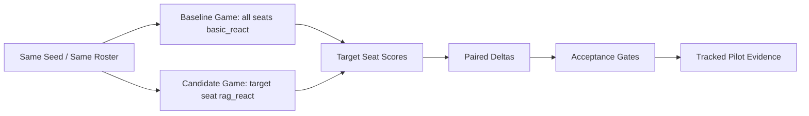

# Target-seat Track C 真实 LLM Pilot 证据

生成时间：2026-06-09T17:15:35+08:00

本文档汇总当前可用的 target-seat Track C 真实 LLM paired A/B pilot。它是 Track C 因果验证的阶段性证据，不是最终因果证明。

## 1. 实验定位

| 项目 | 值 |
| --- | --- |
| Source | outputs/target_seat_trackc_ab_seer_ark_pilot_20260609/target_seat_ab_Seer_20260609T082838Z.json |
| Raw source tracked | False |
| Claim scope | real_llm_pilot_only |
| Runner | target_seat_trackc_ab_experiment.py |
| Target role | Seer |
| Baseline -> Candidate | basic_react -> rag_react |
| Player count / max days | 7 / 20 |
| Model pool | anthropic:deepseek-v4-flash[1m] |

## 2. 核心结果

| Metric | Value | Interpretation |
| --- | --- | --- |
| Paired seeds | 5 | 5-pair pilot，未达到 20-pair pipeline pilot 或 80+ formal 建议规模。 |
| Completed baseline/candidate | 5 / 5 | 两侧均完成。 |
| Adjusted delta | 20.6680 | 目标席位均值正向趋势。 |
| Role-task delta | 0.2830 | 目标角色任务分均值正向趋势。 |
| Process delta | 22.1840 | 过程分均值正向趋势。 |
| Target win delta | 0.0000 | 本 pilot 中胜率没有变化，胜率只作辅助指标。 |
| Candidate decisions | 201 | candidate 侧真实决策数。 |
| Fallback / invalid | 0 / 0 | 健康门禁通过。 |
| Accepted | False | ci_not_positive |

## 3. Bootstrap CI 与验收门禁

| Delta | Mean | CI95Low | CI95High | CI crosses zero |
| --- | --- | --- | --- | --- |
| adjusted_final_score | 20.6680 | -3.9000 | 44.3080 | True |
| role_task_score | 0.2830 | -0.0790 | 0.6450 | True |
| process_score | 22.1840 | -4.3657 | 51.0840 | True |
| target_win_rate | 0.0000 | 0.0000 | 0.0000 | True |

| Gate | Passed |
| --- | --- |
| enough_samples | True |
| strict_health | True |
| score_gate | True |
| role_task_gate | True |
| win_gate | True |
| ci_gate | False |
| improvement_gate | True |

解释：score、role-task、health 和 improvement gate 均通过，但 CI gate 未通过，因此 `accepted=false`，`claim_level=ci_not_positive`。

## 4. Paired Seed 明细

| Seed | Seat | BaseWinner | CandWinner | AdjustedDelta | RoleTaskDelta | ProcessDelta | CandDecisions | CandFallback | CandInvalid |
| --- | --- | --- | --- | --- | --- | --- | --- | --- | --- |
| 9801 | 4 | wolf | wolf | 36.8200 | -0.1750 | 40.9100 | 34 | 0 | 0 |
| 9802 | 4 | wolf | wolf | -2.8800 | -0.1750 | -3.2000 | 35 | 0 | 0 |
| 9803 | 7 | wolf | wolf | 58.9000 | 0.7300 | 65.4400 | 37 | 0 | 0 |
| 9804 | 1 | wolf | wolf | 30.1000 | 0.7300 | 29.5500 | 62 | 0 | 0 |
| 9805 | 4 | wolf | wolf | -19.6000 | 0.3050 | -21.7800 | 33 | 0 | 0 |

## 5. 可写结论与边界

可以写入报告：

| 结论 |
| --- |
| 真实 LLM target-seat paired A/B runner 已在 Seer 目标席位上跑通。 |
| 本 pilot 中 baseline/candidate 各完成 5 局，candidate fallback/invalid 为 0。 |
| candidate 相对 baseline 的目标席位 adjusted/process/role-task 指标呈正向均值趋势。 |

暂不能写入报告：

| 结论 |
| --- |
| 不能写成 Track C 已经获得单目标席位因果增益。 |
| 不能写成 Track C 已经提升最终胜率。 |
| 不能把 5 paired seeds pilot 替代 80-120 paired seeds 的正式验证。 |

边界说明：

| 说明 |
| --- |
| 该 pilot 是真实 LLM target-seat A/B 阶段性证据。由于 bootstrap CI 下界仍跨 0，acceptance.accepted=false，只能写成正向趋势和链路健康，不能写成 causal_supported。 |
| 先扩到 20 paired seeds 作为 pipeline pilot；若趋势和健康门禁保持，再按功效计划扩到 80-120 paired seeds，并轮换 Seer/Witch/Guard/Werewolf/Hunter/Villager。 |
