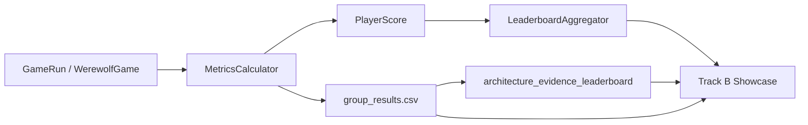

# Track B Leaderboard 多层展示实验

生成时间：2026-06-09T16:19:56+08:00

本文档汇总当前真实 LLM 输出中可用于展示 Track B 的材料。它的定位是“多层复盘与 leaderboard 展示”，不是 Track C 因果增益报告。

## 1. 证据定位

| 项目 | 说明 |
| --- | --- |
| 证据类型 | Track B 多层评分与 leaderboard 展示；不是 Track C 因果增益证明 |
| 完成真实 LLM 对局 | 6 |
| 失败局 | 0 |
| 整局真实决策数 | 216 |
| fallback / invalid | 0 / 0 |
| 总决策口径 | 以 game_runs.jsonl 为准；模型分组行的 decision_count 不相加 |

## 2. Provider 与模型可用性

| 检查 | 状态 | Safe | 可用模型 | 失败模型 | 来源 |
| --- | --- | --- | --- | --- | --- |
| 单模型 preflight | ok | True | anthropic:deepseek-v4-flash[1m] |  | outputs/final_showcase_report/real_llm_ark_userkey_preflight.json |
| 多模型 preflight | unsafe | False | anthropic:deepseek-v4-flash[1m], anthropic:deepseek-v4-pro[1m] | anthropic:glm-5.1[1m], anthropic:kimi-k2.6[1m] | outputs/final_showcase_report/real_llm_ark_multi_model_preflight.json |

## 3. Track B 多层分析框架

| 层级 | 说明 | 来源 |
| --- | --- | --- |
| game_level | 完整对局层：胜方、天数、事件数、耗时、provider/model 追踪。 | game_runs.jsonl |
| version_or_model_level | 版本/模型层：按 framework 或 model 分组的平均分、胜率、榜单排名。 | group_results.csv / leaderboard.json |
| player_role_level | 席位/角色层：不同模型分到的角色、阵营、席位样本和角色胜率。 | summary.json role_distribution_audit / role_win_rates |
| score_dimension_level | 评分维度层：adjusted、vote、speech、skill 和 rubric 维度拆解。 | group_results.csv / architecture_evidence_leaderboard.csv |
| decision_health_level | 决策健康层：真实决策数、fallback、invalid、完成/失败。 | game_runs.jsonl / group_results.csv |
| knowledge_auxiliary_level | 知识命中辅助层：knowledge_hit_rate 用于展示 Track C 信息注入痕迹，但不作为 Track B 主结论。 | group_results.csv / game_runs.jsonl |

## 4. Framework Pilot：baseline 层展示

本批次完成了 basic_react 的 5 局真实火山 Ark 对局；后续 rag_react/full_cognitive 未完成，因此只能作为 Track B baseline 分层展示和运行健康证据，不能作为完整三框架排行榜。

| Framework | Seed | Players | WinRate | Adjusted | Vote | Speech | Skill | KnowledgeHit |
| --- | --- | --- | --- | --- | --- | --- | --- | --- |
| framework:basic_react | 9601 | 7 | 0.2857 | 36.2900 | 0.2952 | 0.6230 | 0.5333 | 0.0612 |
| framework:basic_react | 9602 | 7 | 0.2857 | 45.5700 | 0.3571 | 0.5834 | 0.5214 | 0.0000 |
| framework:basic_react | 9603 | 7 | 0.7143 | 69.1414 | 0.8286 | 0.6060 | 0.7393 | 0.0571 |
| framework:basic_react | 9604 | 7 | 0.2857 | 54.3143 | 0.2857 | 0.4065 | 0.6786 | 0.1304 |
| framework:basic_react | 9605 | 7 | 0.2857 | 40.1386 | 0.3333 | 0.7383 | 0.5964 | 0.0222 |

framework pilot 整局健康：

| Games | RawDecisions | Fallback | Invalid | AvgDays | AvgEvents | AvgElapsedS | WinnerCounts |
| --- | --- | --- | --- | --- | --- | --- | --- |
| 5 | 182 | 0 | 0 | 2.0000 | 140.8000 | 148.3254 | {"wolf": 4, "village": 1} |

## 5. Model Leaderboard Pilot：模型层展示

本模型榜单是 1 局 pilot，席位角色分布并不均衡；可展示 Track B 多层评分和模型分组能力，不能写成正式模型优劣结论。

| Model | SeatSamples | WinRate | Adjusted | Vote | Speech | Skill | KnowledgeHit | Fallback | Invalid |
| --- | --- | --- | --- | --- | --- | --- | --- | --- | --- |
| model:anthropic:deepseek-v4-flash[1m] | 4 | 0.2500 | 31.4325 | 0.5000 | 0.5813 | 0.4375 | 0.9118 | 0 | 0 |
| model:anthropic:deepseek-v4-pro[1m] | 3 | 0.3333 | 42.4267 | 0.3333 | 0.4975 | 0.6083 | 0.9118 | 0 | 0 |

模型 pilot 的角色席位分布：

| Model | SeatSamples | Roles | Alignments | MacroRoleWinRate |
| --- | --- | --- | --- | --- |
| model:anthropic:deepseek-v4-flash[1m] | 4 | {"Hunter": 1, "Seer": 1, "Villager": 1, "Werewolf": 1} | {"village": 3, "wolf": 1} | 0.2500 |
| model:anthropic:deepseek-v4-pro[1m] | 3 | {"Guard": 1, "Werewolf": 1, "Witch": 1} | {"village": 2, "wolf": 1} | 0.3333 |

## 6. Rubric 维度展示

| Rank | Group | RubricTotal | SingleAgent | MultiAgent | Engineering | AdvancedBC | SeatSamples |
| --- | --- | --- | --- | --- | --- | --- | --- |
| 1 | model:anthropic:deepseek-v4-pro[1m] | 76.6458 | 11.3333 | 16.0000 | 24.0000 | 25.3125 | 3 |
| 2 | model:anthropic:deepseek-v4-flash[1m] | 66.4792 | 12.6667 | 8.0000 | 28.0000 | 17.8125 | 4 |

## 7. 可写结论与边界

可以写入报告：

| 结论 |
| --- |
| 火山 Ark 真实 LLM 对局可以进入 Track B leaderboard 流程并产出多层评分。 |
| 当前完成的真实 LLM 对局 fallback/invalid 均为 0，可作为决策健康证据。 |
| Track B 可以按模型/版本、角色席位、评分维度和 rubric 维度拆解对局质量。 |

暂不能写入报告：

| 结论 |
| --- |
| 不能写成 deepseek-v4-pro[1m] 正式优于 deepseek-v4-flash[1m]。 |
| 不能写成 full_cognitive 已在本轮 framework leaderboard 中超过 basic_react。 |
| 不能把 knowledge_hit_rate 写成 Track C 对胜率的因果提升。 |

边界说明：

| 边界 |
| --- |
| 模型 pilot 只有 1 局，且模型分到的角色不同，不能写成正式模型优劣结论。 |
| framework g5 批次只完成 basic_react 5 局；rag_react/full_cognitive 未完成，不能写成完整三框架对比。 |
| Track B leaderboard 展示的是评分、复盘和可区分能力；Track C 因果增益仍需 target-seat paired A/B。 |
| group_results 中的 decision_count 来自整局 metadata，模型分组行不可简单相加；总决策数以 game_runs.jsonl 为准。 |

## 8. 后续补充建议

| 补充项 | 建议 |
| --- | --- |
| 模型 leaderboard | 将通过 preflight 的模型扩展到每模型 5-20 局，并按角色/阵营平衡席位。 |
| framework leaderboard | 继续完成 rag_react 与 full_cognitive 的同 seed 对比，补齐三框架榜单。 |
| Track B 逐步评分 | 从 PerStepScorer 导出 speech/vote/skill step 级 score，用于展示高光、失误和 judge agreement。 |
| 角色层展示 | 按 Seer/Witch/Guard/Werewolf 等角色生成 role-normalized leaderboard。 |
