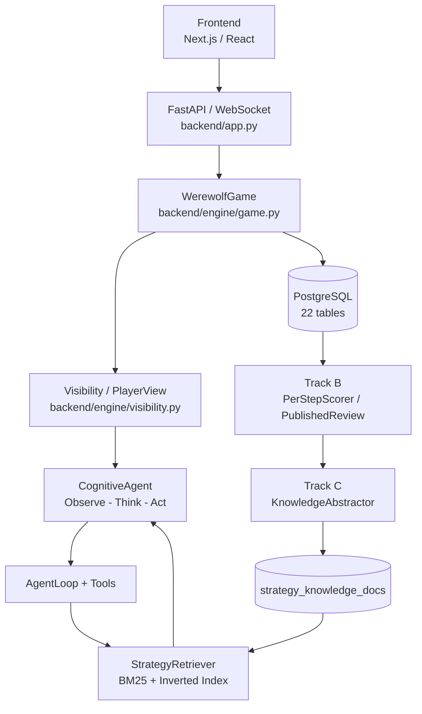
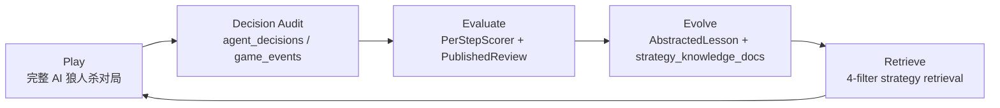
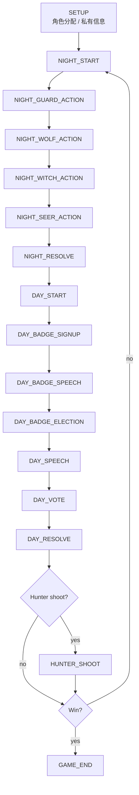
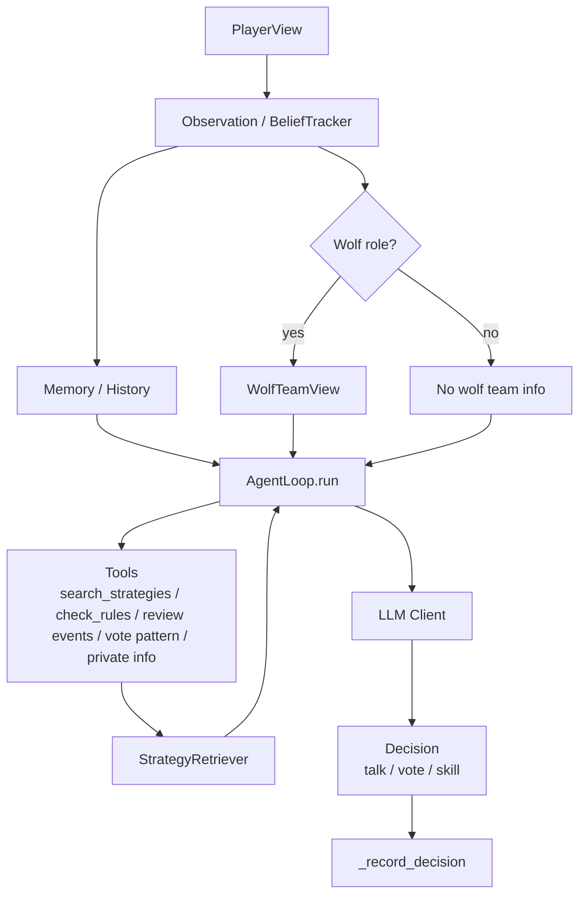
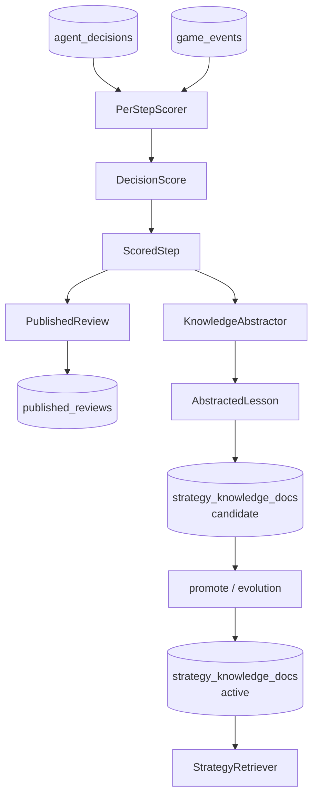
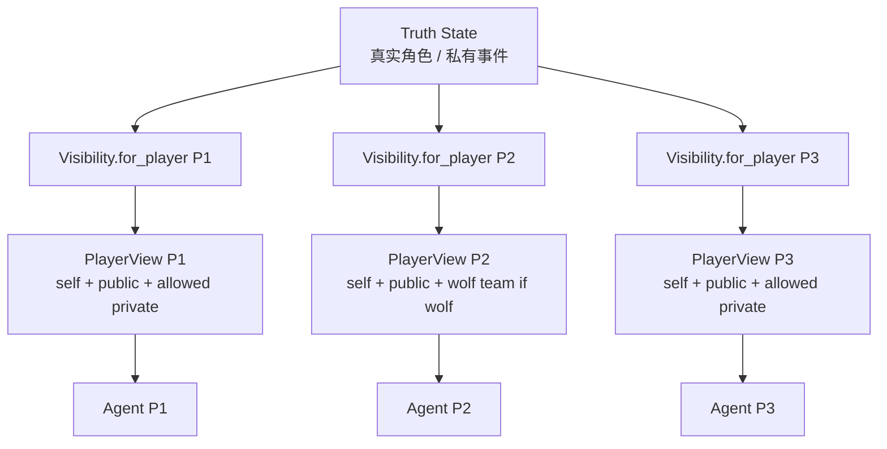
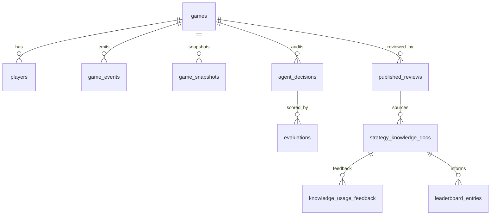

# 报告图表素材

## 图 0 可直接引用的图片资产

所有图片都保存在 `docs/assets/closure/`，其中 SVG 为可编辑源文件，PNG 为可直接放入报告或答辩 PPT 的截图版本。

| 素材 | SVG / HTML 源 | PNG 截图 | 数据来源 |
|---|---|---|---|
| 项目图标 | `docs/assets/closure/ai-werewolf-icon.svg` | `docs/assets/closure/screenshots/ai-werewolf-icon.png` | deterministic SVG |
| 产品总体架构图 | `docs/assets/closure/architecture.svg` | `docs/assets/closure/screenshots/architecture.png` | 当前系统模块 |
| Play-Evaluate-Evolve 闭环图 | `docs/assets/closure/play-evaluate-evolve.svg` | `docs/assets/closure/screenshots/play-evaluate-evolve.png` | `outputs/backend_e2e_report.json` |
| 数据库证据链图 | `docs/assets/closure/database-evidence-chain.svg` | `docs/assets/closure/screenshots/database-evidence-chain.png` | 数据库模型 / 证据链 |
| 真实对局总览 | `docs/assets/closure/real-game-snapshot.html` | `docs/assets/closure/screenshots/real-game-overview.png` | replay API + strict report |
| 真实复盘报告 | `docs/assets/closure/strict-game-review.html` | `docs/assets/closure/screenshots/strict-game-review.png` | backend Track B review HTML |

说明：图标是确定性 SVG 资产，不依赖随机图片生成。它可以作为报告封面、PPT 页眉或项目徽标使用。

## 图 1 产品总体架构图

说明：该图展示产品运行层次。前端通过 FastAPI / WebSocket 接收房间和对局快照；后端引擎统一推进流程；Agent 只通过 PlayerView 接收合法信息；决策进入 PostgreSQL 后由 Track B 评分复盘，再由 Track C 抽取策略知识，最终回流到检索器。

## 图 2 Play-Evaluate-Evolve 闭环图

说明：闭环不是抽象口号，而是对应真实表和代码路径。strict mode 单局已验证 Play 产生 26 条决策和 68 条事件，Evaluate 产生 21 条 evaluation 和 1 条 review，Evolve 产生 102 条 candidate lessons。

## 图 3 单局对局流程图

说明：流程图按当前引擎阶段组织。严格验收局实际触发了夜晚行动、警长竞选、白天发言、投票、猎人开枪和 GAME_END。

## 图 4 Agent 决策流程图

说明：Agent 决策先由 Visibility 裁剪输入，再进入认知层和工具层。strict 单局报告显示 23 条决策带 tool trace，可追踪策略检索和工具使用。

## 图 5 赛后评分与知识回流流程图

说明：该图对应 Track B/C 的数据链。strict 单局生成 21 条 evaluation、1 条 published review 和 102 条 candidate lessons，active pool 未变化。

## 图 6 信息隔离示意图

说明：Agent 不直接读取 Truth State。`outputs/visibility_strict_report.log` 中 92 项检查覆盖自身份、狼人队友、预言家结果、公开事件不泄露等边界。

## 图 7 数据库证据链图

说明：证据链从原始对局延伸到复盘和知识。PostgreSQL 快照显示 `games=9001`、`game_events=442880`、`agent_decisions=188248`、`evaluations=63129`、`strategy_knowledge_docs=20575`。查询时刻为 `2026-06-06 10:45:50 UTC`。

## 图 8 模块验收结果表

| 模块 | 状态 | 核心证据 |
|---|---|---|
| DB | 通过 | PostgreSQL 22 表可查询 |
| LLM | 通过 | strict provider=doubao |
| Game Engine | 通过 | strict PASS，GAME_END |
| Agent Decision | 通过 | strict 26 decisions |
| Information Isolation | 通过 | 92/92 |
| Strategy Retrieval | 通过 | retrieval eval 935 docs / 26 queries |
| Track B Scoring | 通过 | strict 21 evaluations |
| Track B Review | 通过 | strict 1 approved review |
| Track C Knowledge | 通过 | strict 102 candidate lessons |
| Track C Evolution | 部分 | DB 有 rounds/tournaments，multi-tier 原始数据不足 |
| Experiment | 部分 | 20 局 batch 有数据，multi-tier 不可用 |
| Frontend | 部分 | 代码实现存在，本轮未视觉验收 |

说明：表格区分“链路通过”和“效果充分验证”。Track C 的知识抽取链路通过，但晋级后胜率提升尚不能正式宣称。

## 图 9 多局实验图表

### 9.0 真实对局截图

说明：该截图不是前端 mock 页面，而是由 strict 对局 `f8933174-01f9-409d-8bff-c15c0576761b` 的 `/api/replay/{game_id}`、`outputs/backend_e2e_report.json` 生成，展示玩家、胜方、决策、事件、Track B/C 指标和关键事件时间线。

说明：该截图来自后端 `/api/games/{game_id}/reviews/html` 返回的真实 PublishedReview HTML，展示同一 strict 对局的 Track B 复盘页面。

### 9.1 胜方分布

| Winner | Games | Bar |
|---|---:|---|
| village | 8 | ######## |
| wolf | 12 | ############ |

来源：`data/experiment/batch_summary.json`。

### 9.2 成功 / 失败

| Result | Games | Bar |
|---|---:|---|
| successful | 20 | #################### |
| failed | 0 |  |

来源：`data/experiment/batch_summary.json`。

### 9.3 每局天数

逐局天数来自 `data/experiment/batch_summary.json` 的 `results[*].days`。聚合图表数据：

| Metric | Value |
|---|---:|
| avg_days | 3.05 |
| min_days | 2 |
| max_days | 5 |

### 9.4 每局决策数

不生成正式逐局决策数图。`data/experiment/batch_summary.json` 没有逐局 AgentDecision 数；PostgreSQL 可查全库决策，但不能可靠映射到该 20 局 summary。

### 9.5 每局 lessons 数

不生成正式逐局 lessons 图。20 局 summary 未包含逐局 lessons；strict 单局有 102 lessons，可作为单局链路图表。

## 图 10 设计取舍证据等级表

| 设计点 | 证据等级 | 证据 |
|---|---|---|
| Game Engine 独立控制流程 | A | strict PASS + code |
| PlayerView 信息隔离 | A | 92/92 + code |
| CognitiveAgent | B | strict 决策 + code |
| 三层 Prompt | C | code + docs |
| AgentLoop 工具调用 | B | tool trace + code |
| BM25 + 倒排索引 | A | retrieval eval + code |
| `hybrid_role_mbti_global` | A | retrieval eval + code |
| 4-filter | B | active delta 0 + code |
| 三级评分 | B | strict evaluations + code |
| candidate / active 隔离 | A | active delta 0 + candidate +102 |
| 前端观战控制台 | C | frontend code |
| strict mode | A | strict PASS + outputs |

说明：A 级设计点可以直接写入正式报告并配表；B/C 级可以写为工程设计和链路能力；D 或数据不足的点不应写成效果结论。
