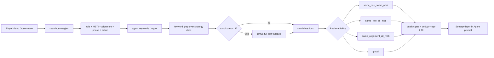

# 单角色检索机制与量化报告

生成时间：2026-06-09T11:56:17+08:00

数据来源：

- `outputs/retrieval_effectiveness_current/results.json`
- `outputs/retrieval_effectiveness_current/per_role_results.csv`
- `outputs/retrieval_effectiveness_current/role_corpus_stats.csv`
- `outputs/retrieval_effectiveness_current/per_query_details.jsonl`
- 代码依据：`backend/agents/cognitive/retrieval_prod.py`、`backend/agents/cognitive/tools.py`、`scripts/evaluate_retrieval_policies.py`

可追溯性说明：`outputs/retrieval_effectiveness_current/` 是本地实验输出目录，按仓库规则不进入 GitHub；本报告对应的可提交机器可读摘要保存在 `docs/evidence/PROJECT_ROLE_RETRIEVAL_FACTS.json`，方法总览同时汇总到 `docs/evidence/PROJECT_METHOD_EFFECTIVENESS_FACTS.json`。

## 1. 单角色检索是如何运行的

当前单角色检索不是简单按角色查表，而是“关键词候选召回 + RetrievalPolicy 分桶 + 质量门禁 + Top-K 填充”的组合流程。Agent 调用 `search_strategies` 时会带入自己的角色、MBTI、阵营、阶段、动作类型和关键词；`StrategyRetriever.search_with_keywords` 先用关键词在策略知识字段中召回候选，如果候选不足会走 BM25 全文搜索兜底，然后由 `RetrievalPolicy` 决定候选对该角色是否可见。

默认策略 `hybrid_role_mbti_global` 的单角色路径为：优先 exact role+MBTI，其次 same-role 通用策略，最后 global 通用策略。当前 `TRACK_C_ALLOW_CROSS_MBTI_ROLE_FILL` 默认关闭，因此 same-role fallback 主要使用该角色通用策略或当前 MBTI 匹配策略，避免把其他人格的经验直接注入当前角色。

### 1.1 单角色检索步骤

| 步骤 | 环节 | 量化/记录点 | 代码依据 |
| --- | --- | --- | --- |
| 1 | Agent 工具调用 | CognitiveAgent / AgentLoop 在需要策略辅助时调用 search_strategies，并带入角色、MBTI、阵营、阶段、动作类型和关键词。 | `backend/agents/cognitive/tools.py` |
| 2 | 构造 AgentContext | retrieve_strategies_prod 将 role/mbti/alignment/phase/action_type 统一为 AgentContext，作为后续 policy 分桶依据。 | `backend/agents/cognitive/retrieval_prod.py` |
| 3 | 关键词召回 | 优先使用 Agent 给出的关键词/正则在 situation、strategy、rationale 等字段中加权 grep；候选过少时回退 BM25 全文检索。 | `backend/agents/cognitive/retrieval_prod.py` |
| 4 | RetrievalPolicy 分桶 | 默认 hybrid_role_mbti_global 依次使用 same_role_same_mbti、same_role_all_mbti、global；hybrid_role_alignment_phase 额外考虑阵营/阶段桶。 | `backend/agents/cognitive/retrieval_prod.py` |
| 5 | 质量门禁与 Top-K 填充 | 按 quality / strategy_rank_score 排序，默认质量阈值为 0.72，去重后从优先桶填满 Top-K，并记录 bucket_trace。 | `backend/agents/cognitive/retrieval_prod.py` |
| 6 | 严格模式安全过滤 | AIWEREWOLF_STRICT_MODE=true 时，结果还会进入 retrieve_for_agent 的 4-filter 安全管线，避免低置信、越权或污染知识进入 Prompt。 | `backend/eval/knowledge_confidence.py` |
| 7 | Prompt 注入与反馈记录 | 检索结果进入 Agent Prompt 的 Strategy 层，doc_id 随 tool_trace / strategy usage 进入后续 feedback 和 Track B 联表分析。 | `backend/agents/cognitive/agent_loop.py` |

## 2. 命中率口径

| 指标 | 含义 | 本报告中的解释 |
| --- | --- | --- |
| P@3 | Top-3 中相关策略占比 | 检索结果整体纯度 |
| Effective@3 | Top-3 至少一条相关策略 | 实际可用命中率 |
| Coverage | 查询是否返回至少一条策略 | 是否空检索 |
| Top5Fill | Top-5 是否填满 | 候选池充足程度 |
| RoleBucketShare | Top-5 中来自本角色桶的比例 | 是否真正按角色检索 |
| GlobalBucketShare | Top-5 中来自全局桶的比例 | global 兜底依赖程度 |

## 3. 总体策略对比

| Policy | OfflineScore | P@3 | Effective@3 | nDCG@5 | Coverage | Top5Fill | RoleBucket | GlobalBucket | Empty |
| --- | --- | --- | --- | --- | --- | --- | --- | --- | --- |
| global_only | -0.1450 | 0.1282 | 0.1538 | 0.4938 | 0.5000 | 0.2615 | 0.0000 | 1.0000 | 13 |
| hybrid_role_mbti_global | 0.6991 | 0.2564 | 0.5000 | 0.9567 | 1.0000 | 1.0000 | 0.9923 | 0.0077 | 0 |
| same_role_same_mbti | -0.3812 | 0.0769 | 0.0769 | 0.1535 | 0.1538 | 0.1000 | 1.0000 | 0.0000 | 22 |

按 Effective@3 作为可用命中率口径，默认单角色检索当前整体命中率为 50.00%；P@3 为 0.2564；Coverage 为 100.00%。默认策略的 RoleBucketShare 为 99.23%，GlobalBucketShare 为 0.77%，说明结果主要来自本角色策略桶，global 只承担兜底。

精确 `same_role_same_mbti` 当前不适合单独作为默认策略：整体 Coverage 只有 15.38%，空结果 22 / 26。这说明单角色个性化应作为优先桶，而不是唯一检索范围。

## 4. 单角色路径量化摘要

| Role | BestPolicy | DefaultEff@3 | GlobalEff@3 | ExactEff@3 | Default-Global Eff@3 | Default P@3 | RoleBucket | ExactBucket | GlobalBucket | 诊断 |
| --- | --- | --- | --- | --- | --- | --- | --- | --- | --- | --- |
| Guard | same_role_all_mbti | 1.0000 | 0.0000 | 0.0000 | 1.0000 | 0.5000 | 1.0000 | 0.0000 | 0.0000 | 当前默认检索命中充分；主要补强方向是扩充 role+MBTI 细分卡，减少对角色通用池的依赖。 |
| Hunter | same_role_all_mbti | 1.0000 | 0.5000 | 0.0000 | 0.5000 | 0.5000 | 1.0000 | 0.0000 | 0.0000 | 当前默认检索命中充分；主要补强方向是扩充 role+MBTI 细分卡，减少对角色通用池的依赖。 |
| Seer | hybrid_role_mbti_global | 0.6000 | 0.0000 | 0.2000 | 0.6000 | 0.3333 | 1.0000 | 0.2000 | 0.0000 | 当前默认检索覆盖稳定，但 Top-3 高相关密度不足；应补充该角色关键阶段/动作的高质量策略卡。 |
| Villager | hybrid_role_mbti_global | 0.5000 | 0.3333 | 0.0000 | 0.1667 | 0.2778 | 0.9667 | 0.0000 | 0.0333 | 当前默认检索覆盖稳定，但 Top-3 高相关密度不足；应补充该角色关键阶段/动作的高质量策略卡。 |
| Werewolf | hybrid_role_mbti_global | 0.2857 | 0.0000 | 0.1429 | 0.2857 | 0.1429 | 1.0000 | 0.2286 | 0.0000 | 当前默认检索依赖角色通用池；精确 role+MBTI 池过窄，需要按常见人格补足策略。 |
| Witch | hybrid_role_mbti_global | 0.2500 | 0.2500 | 0.0000 | 0.0000 | 0.0833 | 1.0000 | 0.0000 | 0.0000 | 当前默认检索依赖角色通用池；精确 role+MBTI 池过窄，需要按常见人格补足策略。 |

这张表把“单个角色如何命中”拆成三层：第一，默认策略是否比 `global_only` 更容易命中；第二，检索结果到底来自本角色桶、精确 role+MBTI 桶还是 global 兜底；第三，当前短板是语料不足还是相关性不足。当前默认策略 6 个核心角色 Coverage 均为 1.0000，但不同角色的 Effective@3 差异明显。

## 5. 单角色默认检索结果

| Role | Queries | P@3 | Effective@3 | Coverage | Top5Fill | RoleBucket | GlobalBucket | Empty |
| --- | --- | --- | --- | --- | --- | --- | --- | --- |
| Guard | 2 | 0.5000 | 1.0000 | 1.0000 | 1.0000 | 1.0000 | 0.0000 | 0 |
| Hunter | 2 | 0.5000 | 1.0000 | 1.0000 | 1.0000 | 1.0000 | 0.0000 | 0 |
| Seer | 5 | 0.3333 | 0.6000 | 1.0000 | 1.0000 | 1.0000 | 0.0000 | 0 |
| Villager | 6 | 0.2778 | 0.5000 | 1.0000 | 1.0000 | 0.9667 | 0.0333 | 0 |
| Werewolf | 7 | 0.1429 | 0.2857 | 1.0000 | 1.0000 | 1.0000 | 0.0000 | 0 |
| Witch | 4 | 0.0833 | 0.2500 | 1.0000 | 1.0000 | 1.0000 | 0.0000 | 0 |

## 6. 单角色 Policy 对比

| Role | Policy | P@3 | Effective@3 | Coverage | OfflineScore | RoleBucket | GlobalBucket | Empty |
| --- | --- | --- | --- | --- | --- | --- | --- | --- |
| Guard | global_only | 0.0000 | 0.0000 | 0.5000 | -0.1750 | 0.0000 | 1.0000 | 1 |
| Guard | self_mbti_only | 0.1667 | 0.5000 | 1.0000 | 0.6177 | 0.0000 | 0.0000 | 0 |
| Guard | same_role_all_mbti | 0.5000 | 1.0000 | 1.0000 | 0.7296 | 1.0000 | 0.0000 | 0 |
| Guard | same_role_same_mbti | 0.0000 | 0.0000 | 0.0000 | -0.5000 | 0.0000 | 0.0000 | 2 |
| Guard | hybrid_role_mbti_global | 0.5000 | 1.0000 | 1.0000 | 0.7296 | 1.0000 | 0.0000 | 0 |
| Guard | hybrid_role_alignment_phase | 0.5000 | 1.0000 | 1.0000 | 0.7296 | 1.0000 | 0.0000 | 0 |
| Hunter | global_only | 0.3333 | 0.5000 | 1.0000 | 0.7290 | 0.0000 | 1.0000 | 0 |
| Hunter | self_mbti_only | 0.5000 | 1.0000 | 1.0000 | 0.6992 | 0.0000 | 0.0000 | 0 |
| Hunter | same_role_all_mbti | 0.5000 | 1.0000 | 1.0000 | 0.7335 | 1.0000 | 0.0000 | 0 |
| Hunter | same_role_same_mbti | 0.0000 | 0.0000 | 0.0000 | -0.5000 | 0.0000 | 0.0000 | 2 |
| Hunter | hybrid_role_mbti_global | 0.5000 | 1.0000 | 1.0000 | 0.7335 | 1.0000 | 0.0000 | 0 |
| Hunter | hybrid_role_alignment_phase | 0.5000 | 1.0000 | 1.0000 | 0.7335 | 1.0000 | 0.0000 | 0 |
| Seer | global_only | 0.0000 | 0.0000 | 0.4000 | -0.2400 | 0.0000 | 1.0000 | 3 |
| Seer | self_mbti_only | 0.1333 | 0.4000 | 1.0000 | 0.6237 | 0.0000 | 0.0000 | 0 |
| Seer | same_role_all_mbti | 0.2000 | 0.6000 | 1.0000 | 0.6831 | 1.0000 | 0.0000 | 0 |
| Seer | same_role_same_mbti | 0.2000 | 0.2000 | 0.2000 | -0.3225 | 1.0000 | 0.0000 | 4 |
| Seer | hybrid_role_mbti_global | 0.3333 | 0.6000 | 1.0000 | 0.7150 | 1.0000 | 0.0000 | 0 |
| Seer | hybrid_role_alignment_phase | 0.3333 | 0.6000 | 1.0000 | 0.7150 | 1.0000 | 0.0000 | 0 |
| Villager | global_only | 0.2778 | 0.3333 | 0.6667 | -0.0046 | 0.0000 | 1.0000 | 2 |
| Villager | self_mbti_only | 0.1667 | 0.3333 | 1.0000 | 0.5859 | 0.0000 | 0.0000 | 0 |
| Villager | same_role_all_mbti | 0.2778 | 0.5000 | 1.0000 | 0.7006 | 1.0000 | 0.0000 | 0 |
| Villager | same_role_same_mbti | 0.0000 | 0.0000 | 0.0000 | -0.5000 | 0.0000 | 0.0000 | 6 |
| Villager | hybrid_role_mbti_global | 0.2778 | 0.5000 | 1.0000 | 0.7140 | 0.9667 | 0.0333 | 0 |
| Villager | hybrid_role_alignment_phase | 0.2778 | 0.5000 | 1.0000 | 0.7101 | 0.9667 | 0.0000 | 0 |
| Werewolf | global_only | 0.0000 | 0.0000 | 0.1429 | -0.4071 | 0.0000 | 1.0000 | 6 |
| Werewolf | self_mbti_only | 0.0476 | 0.1429 | 1.0000 | 0.6041 | 0.0000 | 0.0000 | 0 |
| Werewolf | same_role_all_mbti | 0.0952 | 0.1429 | 1.0000 | 0.6713 | 1.0000 | 0.0000 | 0 |
| Werewolf | same_role_same_mbti | 0.1429 | 0.1429 | 0.4286 | -0.1857 | 1.0000 | 0.0000 | 4 |
| Werewolf | hybrid_role_mbti_global | 0.1429 | 0.2857 | 1.0000 | 0.6822 | 1.0000 | 0.0000 | 0 |
| Werewolf | hybrid_role_alignment_phase | 0.1429 | 0.2857 | 1.0000 | 0.6822 | 1.0000 | 0.0000 | 0 |
| Witch | global_only | 0.2500 | 0.2500 | 0.7500 | 0.0500 | 0.0000 | 1.0000 | 1 |
| Witch | self_mbti_only | 0.2500 | 0.5000 | 1.0000 | 0.6421 | 0.0000 | 0.0000 | 0 |
| Witch | same_role_all_mbti | 0.0833 | 0.2500 | 1.0000 | 0.6413 | 1.0000 | 0.0000 | 0 |
| Witch | same_role_same_mbti | 0.0000 | 0.0000 | 0.0000 | -0.5000 | 0.0000 | 0.0000 | 4 |
| Witch | hybrid_role_mbti_global | 0.0833 | 0.2500 | 1.0000 | 0.6538 | 1.0000 | 0.0000 | 0 |
| Witch | hybrid_role_alignment_phase | 0.0833 | 0.2500 | 1.0000 | 0.6538 | 1.0000 | 0.0000 | 0 |

Policy 对比显示，`same_role_all_mbti` 通常能提供稳定覆盖，`same_role_same_mbti` 当前因为 MBTI 细分策略不足而频繁为空；默认 `hybrid_role_mbti_global` 在覆盖率和角色约束之间取得更稳妥的折中。

## 7. 单角色知识池规模

| Role | RoleDocs | RoleGeneric | RoleMBTISpecific | ExactPoolAvg | ExactEmptyBeforeKeyword | HybridRolePoolAvg | HybridTotalPoolAvg | GlobalGeneric | DocMBTIs |
| --- | --- | --- | --- | --- | --- | --- | --- | --- | --- |
| Guard | 49 | 38 | 11 | 0.00 | 2 | 38.00 | 73.00 | 35 | ISTJ:11 |
| Hunter | 39 | 28 | 11 | 0.00 | 2 | 28.00 | 63.00 | 35 | ESTP:11 |
| Seer | 54 | 37 | 17 | 6.80 | 3 | 43.80 | 78.80 | 35 | INTJ:17 |
| Villager | 18 | 16 | 2 | 0.00 | 6 | 16.00 | 51.00 | 35 | INTP:2 |
| Werewolf | 51 | 33 | 18 | 7.71 | 4 | 40.71 | 75.71 | 35 | INTJ:18 |
| Witch | 42 | 28 | 14 | 0.00 | 4 | 28.00 | 63.00 | 35 | ISTJ:14 |

## 8. 分角色解释

### Guard

默认检索在该角色查询中均能命中可用策略；P@3=0.5000，Effective@3=1.0000。当前角色语料 49 条，其中角色通用 38 条、MBTI 细分 11 条。精确 role+MBTI 检索有 2 个查询为空，主要原因是当前 MBTI 细分语料不足。

### Hunter

默认检索在该角色查询中均能命中可用策略；P@3=0.5000，Effective@3=1.0000。当前角色语料 39 条，其中角色通用 28 条、MBTI 细分 11 条。精确 role+MBTI 检索有 2 个查询为空，主要原因是当前 MBTI 细分语料不足。

### Seer

默认检索可以稳定返回本角色策略，但高相关命中仍需扩充；P@3=0.3333，Effective@3=0.6000。当前角色语料 54 条，其中角色通用 37 条、MBTI 细分 17 条。精确 role+MBTI 检索有 4 个查询为空，主要原因是当前 MBTI 细分语料不足。

### Villager

默认检索可以稳定返回本角色策略，但高相关命中仍需扩充；P@3=0.2778，Effective@3=0.5000。当前角色语料 18 条，其中角色通用 16 条、MBTI 细分 2 条。精确 role+MBTI 检索有 6 个查询为空，主要原因是当前 MBTI 细分语料不足。

### Werewolf

默认检索可以覆盖该角色，但相关性仍是主要短板；P@3=0.1429，Effective@3=0.2857。当前角色语料 51 条，其中角色通用 33 条、MBTI 细分 18 条。精确 role+MBTI 检索有 4 个查询为空，主要原因是当前 MBTI 细分语料不足。

### Witch

默认检索可以覆盖该角色，但相关性仍是主要短板；P@3=0.0833，Effective@3=0.2500。当前角色语料 42 条，其中角色通用 28 条、MBTI 细分 14 条。精确 role+MBTI 检索有 4 个查询为空，主要原因是当前 MBTI 细分语料不足。

## 9. 展示结论与后续确认项

| 展示结论 | 证据来源 |
| --- | --- |
| 默认单角色检索能够覆盖 6 个核心角色，当前离线 query set 无空结果。 | `outputs/retrieval_effectiveness_current/per_role_results.csv` |
| 默认策略主要从本角色桶返回策略，而不是依赖全局兜底。 | `outputs/retrieval_effectiveness_current/results.json` |
| 精确 role+MBTI 检索当前过窄，不适合作为唯一默认策略。 | `outputs/retrieval_effectiveness_current/results.json` 与 `role_corpus_stats.csv` |
| Guard、Hunter、Witch、Villager 等角色需要补充更多 MBTI 细分策略卡。 | `outputs/retrieval_effectiveness_current/role_corpus_stats.csv` |

| 后续确认项 | 当前状态 | 建议动作 |
| --- | --- | --- |
| 每个角色的当前检索策略已经达到最终最优 | 离线 query set 每角色样本数有限，且为弱标注。 | 每角色补 20+ 查询，并进行人工或 LLM judge 标注。 |
| 单角色检索直接带来胜率提升 | 当前指标是检索相关性，不是在线因果实验。 | 运行 target-seat paired A/B，固定对手，只切换目标席位 Track C。 |
| role+MBTI 个性化已经充分覆盖所有角色 | 当前 MBTI 细分策略集中在少数角色/人格。 | 按角色和 MBTI 补充 active 策略卡，再重跑检索评估。 |

## 10. 建议补充实验

- 每个角色构造不少于 20 条场景查询，覆盖发言、投票、夜间技能和身份暴露等关键局面。
- 对 Top-5 检索结果进行人工或 LLM judge 复核，区分弱标注误差和真实检索误差。
- 分别评估 `same_role_all_mbti`、`same_role_same_mbti`、`hybrid_role_mbti_global` 对每个角色的最佳适配情况。
- 扩充 Guard、Hunter、Villager、Witch 的 MBTI 细分 active 策略卡，再重跑本脚本。
- 将 `knowledge_usage_feedback` 与 Track B `ScoredStep` 联表，统计单角色 used strategy 对决策分数的影响。
