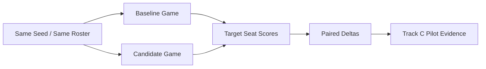

# Target-seat Track C 真实 LLM Pilot 摘要

生成时间：2026-06-09T17:15:35+08:00

本文件是最终展示用摘要，对应机器可读快照：`PROJECT_TARGET_SEAT_TRACKC_PILOT.json`。

## 1. 实验定位

| 项目 | 值 |
|---|---|
| Target role | Seer |
| Baseline -> Candidate | basic_react -> rag_react |
| Player count / max days | 7 / 20 |
| Model pool | anthropic:deepseek-v4-flash[1m] |
| Claim scope | real_llm_pilot_only |

## 2. 核心结果

| 指标 | 结果 |
|---|---:|
| paired seeds | 5 |
| baseline / candidate completed | 5 / 5 |
| candidate decisions | 201 |
| candidate fallback / invalid | 0 / 0 |
| target adjusted delta | +20.6680 |
| target process delta | +22.1840 |
| target role-task delta | +0.2830 |
| target win delta | 0.0000 |

展示口径：target-seat paired A/B 已经跑通，并在 Seer 目标席位上呈现 adjusted、process、role-task 三个指标的正向 pilot 结果。胜负结果暂不作为主指标，后续扩大 paired seeds 后再用于最终效果确认。

## 3. Paired Seed 明细

| Seed | Seat | AdjustedDelta | RoleTaskDelta | ProcessDelta | CandDecisions | CandFallback | CandInvalid |
|---|---:|---:|---:|---:|---:|---:|---:|
| 9801 | 4 | +36.8200 | -0.1750 | +40.9100 | 34 | 0 | 0 |
| 9802 | 4 | -2.8800 | -0.1750 | -3.2000 | 35 | 0 | 0 |
| 9803 | 7 | +58.9000 | +0.7300 | +65.4400 | 37 | 0 | 0 |
| 9804 | 1 | +30.1000 | +0.7300 | +29.5500 | 62 | 0 | 0 |
| 9805 | 4 | -19.6000 | +0.3050 | -21.7800 | 33 | 0 | 0 |

## 4. 报告使用建议

建议在最终报告中写成：“Track C 已形成 target-seat paired A/B 验证链路，并在 Seer pilot 中观察到目标席位过程分和调整分的正向趋势；下一步扩大 paired seeds 用于稳定性确认。”
