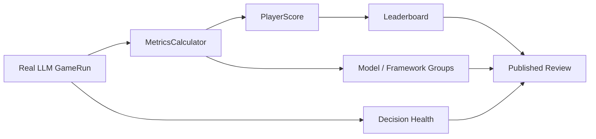

# Track B 多层复盘与 Leaderboard 展示摘要

生成时间：2026-06-09T16:19:56+08:00

本文件是最终展示用摘要，对应机器可读快照：`PROJECT_TRACK_B_LEADERBOARD_SHOWCASE.json`。

## 1. 核心结果

| 指标 | 结果 |
|---|---:|
| 完成真实 LLM 对局 | 6 |
| 整局真实决策 | 216 |
| fallback / invalid | 0 / 0 |
| 展示产物 | leaderboard、能力映射表、报告材料 |

## 2. 多层展示结构

| 展示层 | 展示价值 |
|---|---|
| 对局层 | 展示每局的胜方、天数、事件数、耗时和决策数量 |
| 模型/版本层 | 用同一套 scoring pipeline 对不同 framework 或 model 进行分组 |
| 玩家/角色层 | 展示每个席位的角色、阵营和结果，解释角色分布带来的差异 |
| 行为维度层 | 将表现拆成发言、投票、技能和调整后总分，不只看胜负 |
| 决策健康层 | 展示 fallback、invalid 和原始决策规模，保证输入可审计 |
| 复盘产物层 | 输出 leaderboard、单局报告和可用于展示的结构化材料 |

## 3. 展示口径

Track B 的价值是把一局狼人杀拆成可解释证据：谁在什么阶段做了什么、得到了什么结果、决策是否健康、复盘是否能定位关键行为。最终报告建议强调“可解释复盘能力”和“多层 leaderboard 能力”，不把小样本模型 pilot 写成正式模型排名。
