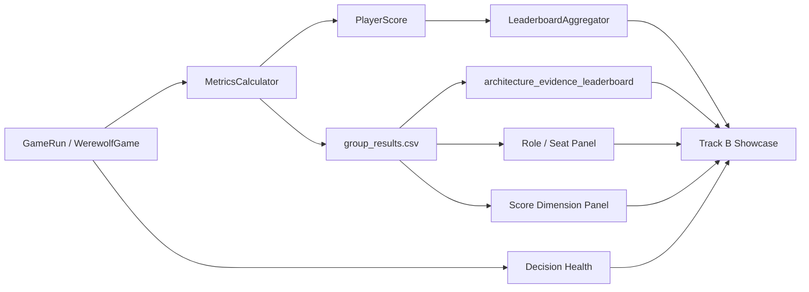

# Track B Leaderboard 多层展示实验

生成时间：2026-06-09T16:19:56+08:00

本文档汇总当前真实 LLM 输出中可用于展示 Track B 的材料。它的定位是“多层复盘、逐步评分与 leaderboard 展示”，不是 Track C 因果增益报告。

## 1. 证据定位

| 项目 | 说明 |
| --- | --- |
| 证据类型 | Track B 多层评分与 leaderboard 展示；不是 Track C 因果增益证明 |
| 完成真实 LLM 对局 | 6 |
| 失败局 | 0 |
| 整局真实决策数 | 216 |
| fallback / invalid | 0 / 0 |
| 总决策口径 | 以 game_runs.jsonl 为准；模型分组行的 decision_count 不相加 |
| Track C 字段边界 | knowledge_hit_rate 只作为知识注入痕迹展示，不作为 Track B 主评分结论，也不写成 Track C 因果增益。 |

## 2. Provider 与模型可用性

| 检查 | 状态 | Safe | 可用模型 | 失败模型 | 来源 |
| --- | --- | --- | --- | --- | --- |
| 单模型 preflight | ok | True | anthropic:deepseek-v4-flash[1m] |  | outputs/final_showcase_report/real_llm_ark_userkey_preflight.json |
| 多模型 preflight | unsafe | False | anthropic:deepseek-v4-flash[1m], anthropic:deepseek-v4-pro[1m] | anthropic:glm-5.1[1m], anthropic:kimi-k2.6[1m] | outputs/final_showcase_report/real_llm_ark_multi_model_preflight.json |

## 3. Track B 多层分析框架

Track B 的展示重点是把一局真实 LLM 对局拆成多个可解释面板。排行榜只是其中一个面板；更重要的是能同时看到对局是否完成、每个模型或框架拿到什么角色、投票/发言/技能维度如何、rubric 如何映射，以及 fallback/invalid 是否污染评分。

| 展示面板 | 分析问题 | 核心指标 | 来源 | 结论边界 |
| --- | --- | --- | --- | --- |
| 对局层 | 每一局是否完整跑完，胜方、天数、事件数、耗时和真实决策健康如何。 | winner, days, events, elapsed_s, decision_count, fallback_count, invalid_count | game_runs.jsonl | 可展示对局运行和 Track B 输入质量；不能单独推出模型优劣或 Track C 增益。 |
| 模型/版本层 | 同一 scoring pipeline 能否按 framework 或 model 分组形成 leaderboard。 | win_rate, avg_adjusted_final_score, avg_vote_score, avg_speech_score, avg_skill_score | group_results.csv / leaderboard.json | 当前 model pilot 只有 1 局且角色不均衡，只能展示分组能力。 |
| 玩家/角色席位层 | 不同模型实际拿到了哪些角色和阵营，分数解释是否受角色分布影响。 | seat_samples, roles, alignments, macro_role_win_rate, per_role_win_rates | summary.json role_distribution_audit / role_win_rates | 该层用于解释混杂因素，不用于正式模型排名结论。 |
| 评分维度层 | Agent 表现可以拆成投票、发言、技能和最终调整分，而不是只看胜负。 | avg_adjusted_final_score, avg_vote_score, avg_speech_score, avg_skill_score | group_results.csv | 维度分用于 Track B 复盘展示；胜率仍只作为辅助指标。 |
| Rubric 层 | 项目验收口径如何映射为 single_agent、multi_agent、engineering、advanced_bc 四个维度。 | rubric_total_score, single_agent, multi_agent, engineering, advanced_bc | architecture_evidence_leaderboard.json / csv | Rubric 分是展示评分，不是统计显著性检验。 |
| 决策健康层 | 真实 LLM 输出是否出现 fallback、invalid、异常失败或决策污染。 | raw_decision_count, fallback_rate, invalid_rate, failed_games | game_runs.jsonl / failures.jsonl | 该层证明输入质量和可审计性，是其他评分层的前置健康条件。 |
| 复盘展示层 | Track B 输出是否能进入可展示的榜单、rubric 表和报告材料。 | leaderboard.json, architecture_evidence_leaderboard, academic_report.md | outputs/final_showcase_report/real_experiment_model_leaderboard_ark_full_cognitive_g1_20260609/academic_report.md | 该层展示报告产物存在，不等价于人工评审一致性实验。 |

## 4. 对局层：真实 LLM 对局输入

| Scope | Seed | GameId | Framework | Winner | Days | Events | ElapsedS | Decisions | Fallback | Invalid | ModelMix |
| --- | --- | --- | --- | --- | --- | --- | --- | --- | --- | --- | --- |
| framework_pilot | 9601 | 5040d34a-9d78-498b-85a0-ebe64baaf166 | basic_react | wolf | 3 | 188 | 210.3220 | 49 | 0 | 0 | deepseek-v4-flash[1m]:49 |
| framework_pilot | 9602 | 44e010e7-71aa-40c3-82bf-d0e887393150 | basic_react | wolf | 2 | 120 | 130.3230 | 30 | 0 | 0 | deepseek-v4-flash[1m]:30 |
| framework_pilot | 9603 | 73f0529d-afed-4e3a-bb65-feaa8639b23b | basic_react | village | 2 | 120 | 105.9280 | 35 | 0 | 0 | deepseek-v4-flash[1m]:35 |
| framework_pilot | 9604 | 871d7be2-a4cf-41a9-8542-3d0e1511d93f | basic_react | wolf | 1 | 110 | 104.3600 | 23 | 0 | 0 | deepseek-v4-flash[1m]:23 |
| framework_pilot | 9605 | 23dd3c2e-41b1-4d06-adfb-881c8fbaec56 | basic_react | wolf | 2 | 166 | 190.6940 | 45 | 0 | 0 | deepseek-v4-flash[1m]:45 |
| model_pilot | 9701 | a979b8f0-eb88-471a-a921-85baabf0a7e8 | full_cognitive | wolf | 2 | 132 | 328.5910 | 34 | 0 | 0 | deepseek-v4-flash[1m]:20, deepseek-v4-pro[1m]:14 |

该层用于说明 Track B 的输入质量：当前 6 局真实 LLM 输出均有完整 game run 记录，整局真实决策数以 `game_runs.jsonl` 为准。

## 5. 模型/版本层：Framework 与 Model 分组

本批次完成了 basic_react 的 5 局真实火山 Ark 对局；后续 rag_react/full_cognitive 未完成，因此只能作为 Track B baseline 分层展示和运行健康证据，不能作为完整三框架排行榜。

| Framework | Seed | Players | WinRate | Adjusted | Vote | Speech | Skill | KnowledgeHit |
| --- | --- | --- | --- | --- | --- | --- | --- | --- |
| framework:basic_react | 9601 | 7 | 0.2857 | 36.2900 | 0.2952 | 0.6230 | 0.5333 | 0.0612 |
| framework:basic_react | 9602 | 7 | 0.2857 | 45.5700 | 0.3571 | 0.5834 | 0.5214 | 0.0000 |
| framework:basic_react | 9603 | 7 | 0.7143 | 69.1414 | 0.8286 | 0.6060 | 0.7393 | 0.0571 |
| framework:basic_react | 9604 | 7 | 0.2857 | 54.3143 | 0.2857 | 0.4065 | 0.6786 | 0.1304 |
| framework:basic_react | 9605 | 7 | 0.2857 | 40.1386 | 0.3333 | 0.7383 | 0.5964 | 0.0222 |

Model leaderboard pilot：

本模型榜单是 1 局 pilot，席位角色分布并不均衡；可展示 Track B 多层评分和模型分组能力，不能写成正式模型优劣结论。

| Model | SeatSamples | WinRate | Adjusted | Vote | Speech | Skill | KnowledgeHit | Fallback | Invalid |
| --- | --- | --- | --- | --- | --- | --- | --- | --- | --- |
| model:anthropic:deepseek-v4-flash[1m] | 4 | 0.2500 | 31.4325 | 0.5000 | 0.5813 | 0.4375 | 0.9118 | 0 | 0 |
| model:anthropic:deepseek-v4-pro[1m] | 3 | 0.3333 | 42.4267 | 0.3333 | 0.4975 | 0.6083 | 0.9118 | 0 | 0 |

该层可以展示 Track B 是否能把不同 framework 或 model 放到同一 scoring pipeline 下比较。当前数据只能说明分组和打分流程可用，不能写成正式模型优劣结论。

## 6. 玩家/角色席位层：角色分布与混杂解释

| Model | SeatSamples | Roles | Alignments | MacroRoleWinRate | MicroRoleWinRate | PerRoleWinRates |
| --- | --- | --- | --- | --- | --- | --- |
| model:anthropic:deepseek-v4-flash[1m] | 4 | {"Hunter": 1, "Seer": 1, "Villager": 1, "Werewolf": 1} | {"village": 3, "wolf": 1} | 0.2500 | 0.2500 | Hunter: samples=1, wins=0, win_rate=0.0000; Seer: samples=1, wins=0, win_rate=0.0000; Villager: samples=1, wins=0, win_rate=0.0000; Werewolf: samples=1, wins=1, win_rate=1.0000 |
| model:anthropic:deepseek-v4-pro[1m] | 3 | {"Guard": 1, "Werewolf": 1, "Witch": 1} | {"village": 2, "wolf": 1} | 0.3333 | 0.3333 | Guard: samples=1, wins=0, win_rate=0.0000; Werewolf: samples=1, wins=1, win_rate=1.0000; Witch: samples=1, wins=0, win_rate=0.0000 |

该层是 Track B 展示中很关键的一层：狼人杀的分数受角色、阵营和席位影响很大，因此模型或版本榜单必须配套展示角色分布。当前模型 pilot 中两个模型的角色并不均衡，所以只能展示“系统能分层分析”，不能写成正式模型排名。

## 7. 评分维度层：胜负之外的行为拆解

| Scope | Group | Seed | SeatSamples | WinRate | Adjusted | Vote | Speech | Skill | KnowledgeHit | Fallback | Invalid |
| --- | --- | --- | --- | --- | --- | --- | --- | --- | --- | --- | --- |
| framework_pilot | framework:basic_react | 9601 | 7 | 0.2857 | 36.2900 | 0.2952 | 0.6230 | 0.5333 | 0.0612 | 0 | 0 |
| framework_pilot | framework:basic_react | 9602 | 7 | 0.2857 | 45.5700 | 0.3571 | 0.5834 | 0.5214 | 0.0000 | 0 | 0 |
| framework_pilot | framework:basic_react | 9603 | 7 | 0.7143 | 69.1414 | 0.8286 | 0.6060 | 0.7393 | 0.0571 | 0 | 0 |
| framework_pilot | framework:basic_react | 9604 | 7 | 0.2857 | 54.3143 | 0.2857 | 0.4065 | 0.6786 | 0.1304 | 0 | 0 |
| framework_pilot | framework:basic_react | 9605 | 7 | 0.2857 | 40.1386 | 0.3333 | 0.7383 | 0.5964 | 0.0222 | 0 | 0 |
| model_pilot | model:anthropic:deepseek-v4-flash[1m] | 9701 | 4 | 0.2500 | 31.4325 | 0.5000 | 0.5813 | 0.4375 | 0.9118 | 0 | 0 |
| model_pilot | model:anthropic:deepseek-v4-pro[1m] | 9701 | 3 | 0.3333 | 42.4267 | 0.3333 | 0.4975 | 0.6083 | 0.9118 | 0 | 0 |

该层展示 Track B 的核心价值：不只给出胜负，而是把 Agent 表现拆成投票、发言、技能和调整后总分。`KnowledgeHit` 在这里只作为策略检索痕迹，不能解释为 Track C 的胜率提升。

## 8. Rubric 层：项目验收维度映射

| Rank | Group | RubricTotal | SingleAgent | MultiAgent | Engineering | AdvancedBC | SeatSamples | CoreRoleCoverage | KnowledgeHit | Fallback | Invalid |
| --- | --- | --- | --- | --- | --- | --- | --- | --- | --- | --- | --- |
| 1 | model:anthropic:deepseek-v4-pro[1m] | 76.6458 | 11.3333 | 16.0000 | 24.0000 | 25.3125 | 3 | 0.4000 | 0.9118 | 0 | 0 |
| 2 | model:anthropic:deepseek-v4-flash[1m] | 66.4792 | 12.6667 | 8.0000 | 28.0000 | 17.8125 | 4 | 0.8000 | 0.9118 | 0 | 0 |

该层把项目展示所需的验收语言映射到四类 rubric：single_agent、multi_agent、engineering 和 advanced_bc。它适合放在结项展示中说明“评分维度如何组织”，但不替代统计检验。

## 9. 决策健康层与复盘产物层

| Scope | Games | RawDecisions | Fallback | Invalid | FallbackRate | InvalidRate | AvgDays | AvgEvents | AvgElapsedS | WinnerCounts |
| --- | --- | --- | --- | --- | --- | --- | --- | --- | --- | --- |
| framework_pilot | 5 | 182 | 0 | 0 | 0.0000 | 0.0000 | 2.0000 | 140.8000 | 148.3254 | {"wolf": 4, "village": 1} |
| model_pilot | 1 | 34 | 0 | 0 | 0.0000 | 0.0000 | 2.0000 | 132.0000 | 328.5910 | {"wolf": 1} |
| aggregate | 6 | 216 | 0 | 0 | 0.0000 | 0.0000 |  |  |  | {} |

复盘产物：

| Artifact | Purpose | Exists | Source |
| --- | --- | --- | --- |
| leaderboard.json | 模型/版本榜单条目 | True | outputs/final_showcase_report/real_experiment_model_leaderboard_ark_full_cognitive_g1_20260609/leaderboard.json |
| architecture_evidence_leaderboard.json | 项目 rubric 展示分 | True | outputs/final_showcase_report/real_experiment_model_leaderboard_ark_full_cognitive_g1_20260609/architecture_evidence_leaderboard.json |
| academic_report.md | 实验报告正文材料 | True | outputs/final_showcase_report/real_experiment_model_leaderboard_ark_full_cognitive_g1_20260609/academic_report.md |

该层用于说明 Track B 展示的输入没有 fallback/invalid 污染，并且已经产出 leaderboard、rubric leaderboard 和报告材料。人工一致性、逐步高光/失误抽样仍是后续可补实验。

## 10. 可写结论与边界

可以写入报告：

| 结论 |
| --- |
| 火山 Ark 真实 LLM 对局可以进入 Track B leaderboard 流程并产出多层评分。 |
| 当前完成的真实 LLM 对局 fallback/invalid 均为 0，可作为决策健康证据。 |
| Track B 可以按模型/版本、角色席位、评分维度和 rubric 维度拆解对局质量。 |

暂不能写入报告：

| 结论 |
| --- |
| 不能写成 deepseek-v4-pro[1m] 正式优于 deepseek-v4-flash[1m]。 |
| 不能写成 full_cognitive 已在本轮 framework leaderboard 中超过 basic_react。 |
| 不能把 knowledge_hit_rate 写成 Track C 对胜率的因果提升。 |

边界说明：

| 边界 |
| --- |
| 模型 pilot 只有 1 局，且模型分到的角色不同，不能写成正式模型优劣结论。 |
| framework g5 批次只完成 basic_react 5 局；rag_react/full_cognitive 未完成，不能写成完整三框架对比。 |
| Track B leaderboard 展示的是评分、复盘和可区分能力；Track C 因果增益仍需 target-seat paired A/B。 |
| group_results 中的 decision_count 来自整局 metadata，模型分组行不可简单相加；总决策数以 game_runs.jsonl 为准。 |

## 11. 后续补充建议

| 补充项 | 建议 |
| --- | --- |
| 模型 leaderboard | 将通过 preflight 的模型扩展到每模型 5-20 局，并按角色/阵营平衡席位。 |
| framework leaderboard | 继续完成 rag_react 与 full_cognitive 的同 seed 对比，补齐三框架榜单。 |
| Track B 逐步评分 | 从 PerStepScorer 导出 speech/vote/skill step 级 score，用于展示高光、失误和 judge agreement。 |
| 角色层展示 | 按 Seer/Witch/Guard/Werewolf 等角色生成 role-normalized leaderboard。 |
