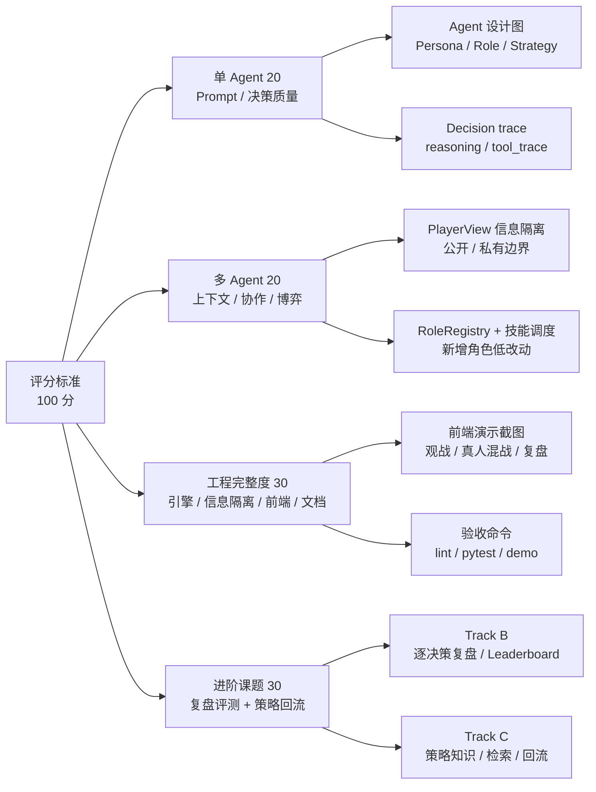

# AI Werewolf 结题交付需求与证据审计

> 状态：交付审计底稿，不是最终提交报告；未确认前不要直接作为最终材料提交。
> 生成时间：2026-06-10。
> 最近核验：2026-06-10，本地 fake LLM / 临时 SQLite / Next.js build 环境。
> 目标：把评分标准、交付物、当前证据、禁写结论和需要确认的问题拆清楚，正式报告只采用已验证且口径稳定的材料。

## 1. 交付物总清单

| 交付项 | 最终交付形态 | 当前可用证据 | 当前状态 |
|---|---|---|---|
| 代码仓库链接 | GitHub 仓库链接、最终 commit 或 tag、干净度说明 | `origin git@github.com:wxhfy/AIwerewolf.git`；README 已写 `https://github.com/wxhfy/AIwerewolf` | 需在最终提交前确认本地未提交改动是否全部进入 Git |
| 产品原型 / 前端系统链接 | 本地或公网前端地址；可选静态 showcase 入口 | Next.js 前端；`local_delivery/html_demo_showcase/index.html` | 原型已存在；是否进入 Git 或部署需确认 |
| Demo 链接 / 演示视频 | 3-5 分钟视频或可点击静态演示页 | `docs/frontend_browseract_shots/VERIFY_REPORT.md`；`docs/experiments/real_ui_llm_probe_current/` 截图 | 需确认是否需要我直接录制视频 |
| 技术文档 / 运行说明 | README、架构文档、模块设计、运行命令、验收命令 | `README.md`、`docs/ENGINEERING_ARCHITECTURE.md`、`docs/PROJECT_MODULE_DESIGN.md`、`docs/prd.md` | 已具备，需要补一个最终交付导航页 |
| 数据结果 | 数据索引、指标表、可复核 JSON、图表资产 | `outputs/final_acceptance_submit_ready/SUBMIT_READY_METRICS.md`；`docs/evidence/README.md` | 需统一使用 submit-ready 口径，避免混用旧版实验 |
| 系统截图 | 大厅、设置、对局、真人操作、复盘、dashboard、leaderboard | `docs/frontend_browseract_shots/`；`local_delivery/html_demo_showcase/assets/` | 需精选 8-12 张，不要堆无意义截图 |
| 对局日志样例 | 1 个完整游戏 JSON/JSONL、1 个可读复盘 HTML/MD、日志字段说明 | `outputs/final_showcase_report/*/game_runs.jsonl`；`local_delivery/html_demo_showcase/data/sample_game_runs.jsonl` | 需选定一局作为最终样例 |

## 2. 评分标准映射



| 评分维度 | 满分档要求 | 项目展示重点 | 建议证据 |
|---|---|---|---|
| 单 Agent 能力 20% | 角色 Prompt 精细、策略差异明显、决策可追溯、有量化评估和 bad case | `CognitiveAgent = Persona + Role + Strategy + Memory + SocialModel + AgentLoop` | `backend/agents/cognitive/` 模块图、角色策略样例、`agent_decisions.metadata`、Track B 单步评分 |
| 多 Agent 协作 20% | 公私信息分离、技能抽象、归票/站边/欺骗检测、协作机制 | `PlayerView`、狼队合法视图、投票分析、社交信任、技能调度 | `backend/engine/visibility.py`、`backend/agents/cognitive/wolf_team.py`、visibility 测试、流程图 |
| 工程完整度 30% | 全流程正确、边界处理、无泄露、前端直观、文档齐全 | 7-12 人规则引擎、警徽/PK/遗言/猎人/白狼王、人机混战、WebSocket、DB 证据链 | demo 终局、pytest、前端截图、架构文档、运行说明 |
| 进阶课题 30% | 多维评测、关键决策复盘、反事实、结构化报告、Leaderboard；或自进化闭环 | 主线采用 Track B + Track C，不强行选择“通用 Agent 自改代码” | `PROJECT_TRACK_B_LEADERBOARD_SHOWCASE`、`SUBMIT_READY_METRICS`、复盘 HTML、策略检索 A/B |

## 3. 当前已验证证据

| 类别 | 当前结果 | 证据位置 |
|---|---:|---|
| 离线完整对局 | `backend.run_demo --seed 7` 可到达 `GAME_END` | 当前监控记录；正式交付前建议保存一局固定样例 |
| API 关键测试 | 16 passed | `_TEST_ALLOW_FAKE_LLM=true LLM_PROVIDER=fake python -m pytest tests/test_api.py -q` |
| 信息隔离 smoke | 92 passed, 0 failed | `AIWEREWOLF_SKIP_DOTENV=true DATABASE_URL= _TEST_ALLOW_FAKE_LLM=true LLM_PROVIDER=fake python scripts/verify_visibility_strict.py` |
| REST / 房间 E2E smoke | passed | `python scripts/e2e_smoke.py` |
| Python lint | passed | `ruff check backend/ scripts/ tests/ configs/` |
| Python format check | passed | `ruff format --check backend/ scripts/ tests/ configs/` |
| 前端 lint | passed | `cd frontend && npm run lint` |
| 前端 build | passed | `cd frontend && npm run build` |
| 真人 UI probe | passed, 10 assertions | `node tests/ui_human_mode_probe.mjs`；输出在 ignored `docs/experiments/full_project_real_audit/` |
| 对话气泡 UI probe | passed, 12 assertions | `node tests/ui_bubble_real_probe.mjs`；输出在 ignored `docs/experiments/full_project_real_audit/` |
| Git 禁入库路径扫描 | 仅 `.env.example` / `frontend/.env.example` 命中 | `git ls-files | rg '(^|/)(\\.env|__pycache__|node_modules|\\.next|data/|models/|references/|\\.db|\\.log|\\.jsonl$)'` |
| Diff whitespace | passed | `git diff --check` |
| Track B showcase | 6 局真实 LLM、216 决策、fallback=0、invalid=0 | `outputs/track_b_showcase_current/PROJECT_TRACK_B_LEADERBOARD_SHOWCASE.json` |
| Track B DB 覆盖 | 170,399 scored steps；2,830 published reviews | `outputs/track_b_db_coverage_current/TRACK_B_DB_COVERAGE.json` |
| Track C 高精度检索 | 26 query、374 active docs；`same_role_all_mbti` P@3=1.0000、Effective@3=1.0000、nDCG@5=0.9885 | `outputs/retrieval_precision_after_high_precision_default_final/results.json` |
| 单 Agent 检索 A/B | `same_role_all_mbti` 8.13 vs no retrieval 7.33，+0.80 | `outputs/single_agent_retrieval_llm_ablation/summary.md` |
| 策略使用观测关联 | used mean 0.5847 vs unused 0.5024，差值 +0.0823，CI 不跨 0 | `outputs/track_c_usage_score_current/PROJECT_STRATEGY_USAGE_DECISION_SCORE_ANALYSIS.json` |

## 4. 最终报告可写与不可写

| 可写结论 | 写法 |
|---|---|
| 项目能完整跑通狼人杀对局 | 写固定 seed demo、阶段流、终局结果和日志样例 |
| 信息隔离是后端强约束 | 写 `GameState -> PlayerView/public snapshot`，配测试和截图 |
| Agent 有角色化策略和可追溯决策 | 写三层 Prompt、Memory/SocialModel/AgentLoop、Decision reasoning/tool trace |
| Track B 能做多维复盘和 leaderboard | 写发言/投票/技能/最终调整分，不只看胜负 |
| Track C 检索增强能提升单步决策质量 | 写检索评估、单 Agent A/B、策略使用观测关联，并标注证据边界 |
| 前端可以给非技术评委看懂 | 写大厅、对局状态、发言气泡、投票、真人操作、复盘页面 |

| 不建议写的结论 | 原因 |
|---|---|
| “Track C 已显著提升完整对局胜率” | 当前 target-seat pilot 置信区间未通过最终门禁，不能当因果结论 |
| “某个模型正式优于另一个模型” | model pilot 样本不均衡，角色分布混杂 |
| “full_cognitive 在完整 framework leaderboard 中显著优于 baseline” | 历史 framework 组完成度不均衡 |
| “所有真实 LLM 数据都可以公开提交” | `outputs/`、`docs/evidence/`、`docs/experiments/` 多为 local-only，需要筛选 |
| “未来计划”类章节 | 用户明确要求最终交付不要出现未来在做的内容；最终稿只写已完成能力和已验证边界 |

## 5. 外部评估方法对标

| 外部方法 | 核心启发 | 项目映射 |
|---|---|---|
| AgentBench | 在多轮交互环境中评估 Agent 推理、决策和长期任务表现[^1] | 用完整对局、阶段流、终局、失败类型和 strict 决策健康评估 Agent |
| SOTOPIA | 通过角色扮演、多 Agent 协作/竞争和社会目标完成度评估社交智能[^2] | 用狼人杀发言、站边、欺骗检测、信任/怀疑模型和投票协作做社交博弈评估 |
| AvalonBench | 隐身份社交推理游戏适合评估欺骗、推理、谈判和角色 Prompt[^3] | 狼人杀同属隐身份博弈；用角色专属策略、阵营胜率、关键决策复盘展示能力 |
| MultiAgentBench | 多 Agent 评估不只看任务完成，还看协作/竞争质量、里程碑 KPI 和协调协议[^4] | 用发言、投票、技能、leaderboard、wolf team 协作、role/action 分层指标评估 |
| LangSmith Evaluation | 评估流程拆成 dataset、evaluator、experiment，支持规则、人审、LLM-as-judge 和 pairwise[^5] | Track B/C 采用对局样本、规则评分、LLM judge、pairwise ranker 和 leaderboard |
| OpenAI Evals | 支持对 LLM 和 LLM 系统做自定义 eval，便于围绕业务模式建立私有评测[^6] | 用狼人杀专用 scorer、rubric leaderboard、bad case regression 做项目内 eval |
| Ragas | 检索评估强调 context precision/recall 等组件级指标[^7] | StrategyRetriever 用 P@K、Effective@K、nDCG@K、Coverage 和 leak=0 量化检索质量 |

[^1]: AgentBench: Evaluating LLMs as Agents, arXiv 2308.03688, https://arxiv.org/abs/2308.03688
[^2]: SOTOPIA: Interactive Evaluation for Social Intelligence in Language Agents, arXiv 2310.11667, https://arxiv.org/abs/2310.11667
[^3]: AvalonBench: Evaluating LLMs Playing the Game of Avalon, arXiv 2310.05036, https://arxiv.org/abs/2310.05036
[^4]: MultiAgentBench: Evaluating the Collaboration and Competition of LLM agents, arXiv 2503.01935, https://arxiv.org/abs/2503.01935
[^5]: LangSmith Evaluation concepts, https://docs.langchain.com/langsmith/evaluation-concepts
[^6]: OpenAI Evals repository, https://github.com/openai/evals
[^7]: Ragas Context Precision and Context Recall docs, https://docs.ragas.io/en/stable/concepts/metrics/available_metrics/context_precision/ and https://docs.ragas.io/en/latest/concepts/metrics/available_metrics/context_recall/

## 6. 建议最终交付结构

```text
docs/final_delivery/
├── README.md                         # 评委入口：链接、运行、演示顺序
├── FINAL_REPORT.md                   # 正式结题报告，不写未来计划
├── RUBRIC_ALIGNMENT.md               # 评分标准逐项对应证据
├── RUNBOOK.md                        # 本地运行、Docker、验收命令
├── DATA_RESULTS.md                   # submit-ready 指标和图表索引
├── DEMO_SCRIPT.md                    # 录屏脚本和讲解词
├── GAME_LOG_SAMPLE.md                # 样例对局日志说明
├── screenshots/                      # 精选截图
└── data/                             # 小体积可复核 JSON/CSV
```

正式 GitHub 交付只放小体积 Markdown、SVG/HTML 和必要 JSON/CSV；大体积截图、视频、实验 JSONL 建议放压缩包或发布附件，避免污染仓库。

## 7. 需要用户确认的问题

本节是审计底稿的确认清单，不应原样进入最终报告。

1. 最终提交平台是否只收 GitHub，还是允许附网盘/压缩包/静态站点？
2. 前端和 Demo 是否必须公网可访问？如果必须，需要确认可用部署方式。
3. 演示视频是否要我直接录制，还是只准备脚本和分镜？
4. `local_delivery/html_demo_showcase/` 是否可以整理后纳入 `docs/final_delivery/showcase/`？
5. 最终数据口径是否接受“Track C 提升单步决策质量和检索质量”，不宣称完整对局胜率显著提升？
6. 当前本地大量未提交改动是否全部保留并进入最终提交？如果不全进，需要逐文件筛选。

## 8. 下一步执行清单

| 步骤 | 产物 | 备注 |
|---|---|---|
| 1 | 最终交付目录初始化 | 只整理材料，不改核心代码 |
| 2 | 前端 build 重验 | 已通过；最终提交前如有新前端改动需再次重跑 |
| 3 | 固定一局对局日志样例 | 保存 game summary、events、reviews、关键截图 |
| 4 | 精选截图与图表 | 只保留能支撑评分点的图 |
| 5 | 生成正式报告 | 不写 future work，不写弱因果结论 |
| 6 | 运行验收命令 | lint、关键 pytest、demo、前端 build |
| 7 | Git 干净度检查 | 防止 `.env`、大文件、local-only 实验输出入库 |
