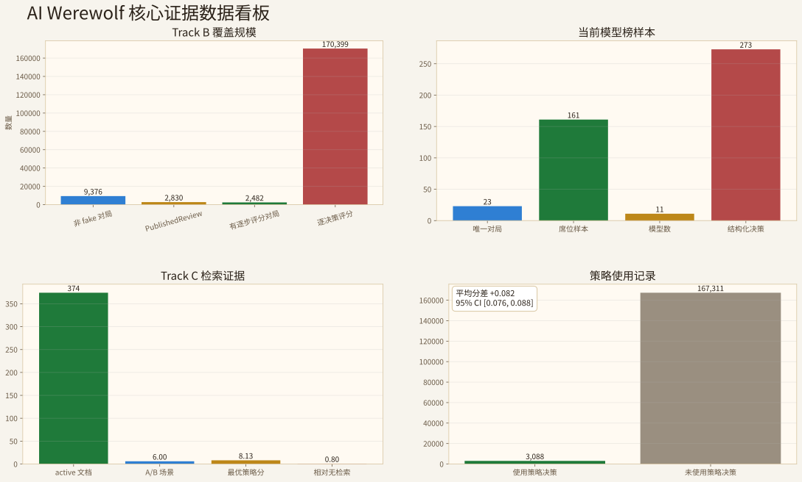
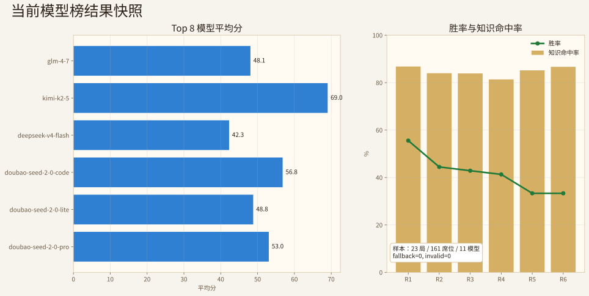
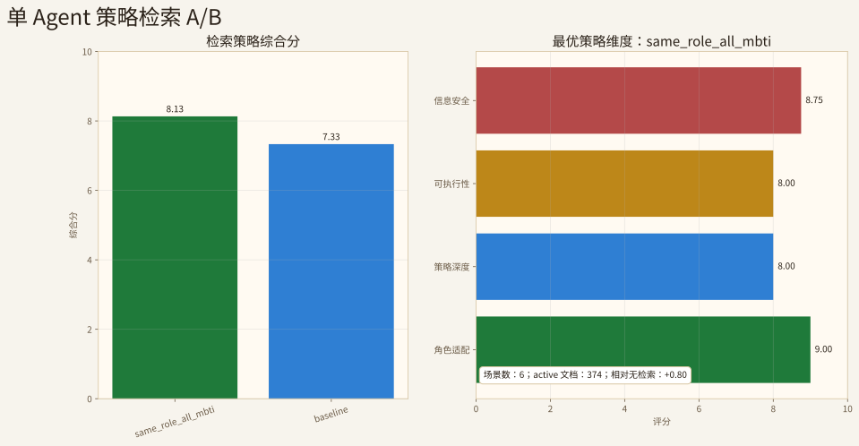
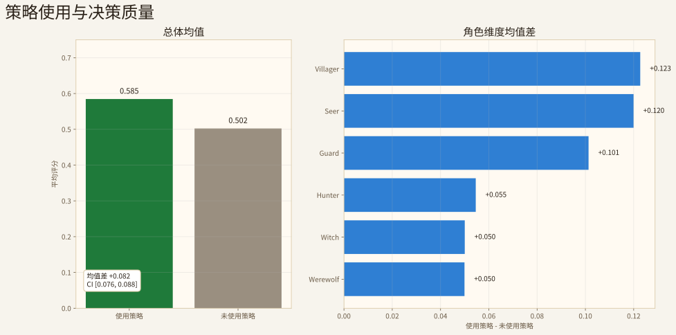

# AI WereWolf 项目成果展示报告

_面向结项展示的成果摘要，数据来自 `docs/final_delivery/evidence/` 与同目录 HTML 页面。_

## 1. 总览

AI Werewolf 已形成 Play -> Evaluate -> Evolve 的完整闭环：AI Agent 在严格信息隔离下完成狼人杀对局，Track B 将对局过程沉淀为逐决策复盘和模型榜，Track C 将复盘经验抽取为策略知识并回流到后续决策。

| 结果项 | 当前数值 | 证据 |
| --- | ---: | --- |
| Track B 非 fake 对局 | 9,376 | `evidence/TRACK_B_DB_COVERAGE.json` |
| PublishedReview | 2,830 | `evidence/TRACK_B_DB_COVERAGE.json` |
| 逐决策评分 | 170,399 | `evidence/TRACK_B_DB_COVERAGE.json` |
| 当前模型榜 | 23 局 / 161 席位 / 11 模型 | `evidence/leaderboard_data_current.json` |
| 单 Agent 检索 A/B | `same_role_all_mbti` 综合分 8.13 | `evidence/PROJECT_SINGLE_AGENT_RETRIEVAL_LLM_ABLATION.json` |
| 策略使用质量差 | +0.082，95% CI [0.076, 0.088] | `evidence/PROJECT_STRATEGY_USAGE_DECISION_SCORE_ANALYSIS.json` |

## 2. Play 层结果

Play 层由 `WerewolfGame`、阶段状态机、角色技能、行动校验和 `Visibility` 组成。后端保存完整真实状态，Agent 只接收经过 `PlayerView` 裁剪后的局部视角；前端消费后端快照，不自行推断私有信息。

`11_normal_game_process_report.html` 展示一局完整 7P 正常对局：

| 展示项 | 结果 |
| --- | --- |
| 对局 ID | `65946128-14d5-49a2-858e-6d934574b53e` |
| 终局阵营 | village |
| 完成天数 | 3 |
| 事件记录 | 184 |
| Agent 决策 | 58 |
| 终局原因 | `all_wolves_dead` |

页面展示阶段推进、席位结局、关键协作、错误操作识别结果和 Track C 策略卡产物。

## 3. Evaluate 层结果

Track B 将赛后复盘推进到单步行为层，保存 Agent 决策、事件链、逐步评分、单局全局复盘、个人复盘和模型榜。

| 覆盖指标 | 数值 |
| --- | ---: |
| 非 fake 对局 | 9,376 |
| PublishedReview | 2,830 |
| 有逐步评分的对局 | 2,482 |
| 逐决策评分 | 170,399 |
| Agent decision 原始记录 | 196,368 |
| 已匹配 Agent decision | 170,399 |
| 评分与决策匹配率 | 86.8% |

当前模型榜页面为 `03_track_b_leaderboard.html`，主口径为 23 个唯一对局、161 个席位样本和 11 个模型。

## 4. Evolve 层结果

Track C 将复盘经验治理为策略知识，策略带有角色、阶段、行动类型、质量分和生命周期状态，并由 `StrategyRetriever` 进入后续 Agent 决策上下文。

| 检索策略 | 场景数 | 平均综合分 | 角色适配 | 策略深度 | 可执行性 | 信息安全 |
| --- | ---: | ---: | ---: | ---: | ---: | ---: |
| no_retrieval | 6 | 7.33 | 8.67 | 6.83 | 7.33 | 8.33 |
| global_only | 6 | 7.00 | 7.67 | 6.50 | 7.00 | 8.00 |
| same_role_all_mbti | 6 | 8.13 | 9.00 | 8.00 | 8.00 | 8.75 |
| hybrid_role_mbti_global | 6 | 7.33 | 8.50 | 7.00 | 7.17 | 8.50 |

| 对比项 | 使用策略 | 未使用策略 | 差值 |
| --- | ---: | ---: | ---: |
| 决策数量 | 3,088 | 167,311 | - |
| 平均评分 | 0.585 | 0.502 | +0.082 |
| 中位数 | 0.525 | 0.420 | +0.105 |
| 95% CI | - | - | [0.076, 0.088] |

## 5. 交付页面

| 页面 | 文件 | 内容 |
| --- | --- | --- |
| 总入口 | [`index.html`](index.html) | 提交包入口和核心数据 |
| 提交清单 | [`00_submission_package.html`](00_submission_package.html) | 仓库链接、交付项、展示顺序 |
| 正常对局 | [`11_normal_game_process_report.html`](11_normal_game_process_report.html) | 完整 7P 对局、错误操作识别、策略卡 |
| Track B 全局复盘 | [`01_track_b_single_game_review.html`](01_track_b_single_game_review.html) | 单局证据链和关键决策 |
| Track B 个人复盘 | [`02_track_b_personal_review.html`](02_track_b_personal_review.html) | 每个角色 Agent 的个人结果 |
| Track B Leaderboard | [`03_track_b_leaderboard.html`](03_track_b_leaderboard.html) | 当前模型榜和累计覆盖 |
| Track C 进化效果 | [`04_track_c_evolution_effect.html`](04_track_c_evolution_effect.html) | 策略检索、A/B 结果和质量关联 |
| 数据结果 | [`05_data_results.html`](05_data_results.html) | 核心指标和证据文件 |
| 产品原型 | [`06_product_prototype.html`](06_product_prototype.html) | 大厅、对局页、人机混战和复盘入口 |
| 运行说明 | [`07_runbook.html`](07_runbook.html) | 后端、前端、测试和离线验收命令 |
| 系统截图 | [`08_screenshots.html`](08_screenshots.html) | 产品页面截图集合 |
| 对局日志样例 | [`09_game_log_sample.html`](09_game_log_sample.html) | JSONL 对局日志与字段展示 |
| 评分标准对齐 | [`10_rubric_alignment.html`](10_rubric_alignment.html) | 20/20/30/30 评分权重证据映射 |

## 6. 证据索引

| 证据文件 | 关键内容 |
| --- | --- |
| `TRACK_B_DB_COVERAGE.json` | 9,376 非 fake 对局、2,830 PublishedReview、170,399 逐决策评分 |
| `leaderboard_data_current.json` | 23 局、161 席位、11 模型的公开模型榜摘要 |
| `selected_game_review_summary.json` | 正常展示对局、184 事件、58 决策、角色结局、错误操作识别 |
| `PROJECT_SINGLE_AGENT_RETRIEVAL_LLM_ABLATION.json` | 6 场景检索 A/B、374 active 文档、最优策略 `same_role_all_mbti` |
| `PROJECT_STRATEGY_USAGE_DECISION_SCORE_ANALYSIS.json` | 3,088 使用策略决策、+0.082 均值差、角色拆解 |
| `sample_game_runs.jsonl` | 对局运行样例 |

## 7. 验收结果

| 验收项 | 结果 | 说明 |
| --- | --- | --- |
| Strict Mode 全链路 | 通过 | Play → Evaluate → Evolve 端到端跑通 |
| 信息隔离专项 | 92 项边界检查通过 | 覆盖身份可见性、夜间隔离、Agent 输入边界 |
| 20 局稳定性 | 连续 20 局正常完成 | 阶段推进、决策记录、DB 写入、赛后流程均稳定 |
| Track B Scoring | 27/27 决策覆盖 | 产出 PublishedReview、Evaluation、LeaderboardEntry |
| Track C 知识抽取 | 产出 99 条候选知识 | 27 per-step + 72 reflection，均写入 candidate 状态 |
| 前端构建 | 通过 | Next.js build 无报错 |
| 代码质量 | 通过 | ruff check + ruff format 无警告 |

验收命令详见 `07_runbook.html`。

## 8. 项目文档与图表

**项目文档：**

| 文档 | 路径 |
| --- | --- |
| 项目需求与设计目标 | `REQUIREMENTS.md` |
| 核心模块设计 | `docs/PROJECT_MODULE_DESIGN.md` |
| 工程架构图谱 | `docs/ENGINEERING_ARCHITECTURE.md` |
| 运行说明 | `docs/final_delivery/07_runbook.html` |

**核心图表（16 张 SVG）：**

| 图表 | 文件 |
| --- | --- |
| 核心证据数据看板 | `assets/core-evidence-dashboard.svg` |
| 系统总体架构 | `assets/system-architecture.svg` |
| 核心模块全景图 | `assets/module-map.svg` |
| Play/Evaluate/Evolve 闭环 | `assets/play-evaluate-evolve.svg` |
| 单局对局端到端流程 | `assets/game-operation-flow.svg` |
| 决策证据链 | `assets/evidence-chain.svg` |
| 决策正确性与影响力象限 | `assets/decision-quality-quadrant.svg` |
| 当前模型榜快照 | `assets/leaderboard-snapshot.svg` |
| 单角色策略检索流程 | `assets/single-role-retrieval.svg` |
| 单 Agent 检索 A/B | `assets/retrieval-ablation-chart.svg` |
| 策略使用质量关联 | `assets/strategy-usage-quality-chart.svg` |
| 角色质量提升曲线（×4） | `assets/role_quality_trend_*.svg` |

## 9. 总结

本项目完成了从规则引擎到策略回流的完整闭环：AI Agent 在严格信息隔离下完成狼人杀对局，Track B 将每一步决策记录为可追溯的评分证据，Track C 将复盘经验转化为受控检索的策略知识并通过生命周期治理确保回流质量。交付材料包含可运行代码仓库、可演示离线 HTML 包、16 张 SVG 图表和 6 份结构化证据文件。
